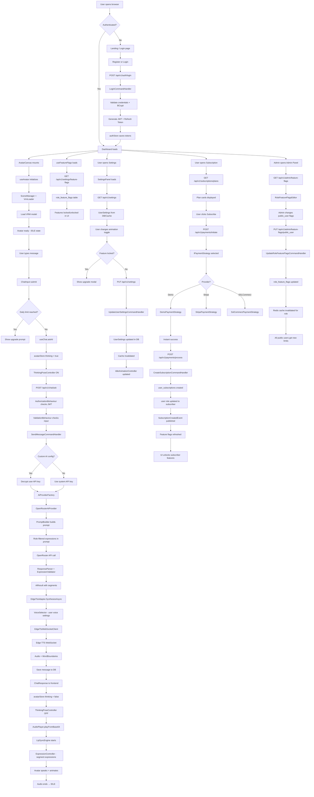

# MyAi - Complete System Architecture Document

---

## Table of Contents

1. Project Overview
2. Functional Requirements
3. Non-Functional Requirements
4. Dependencies & Tech Stack
5. Database Design
6. File Structure
7. File Details
8. API Endpoints
9. Feature List
10. System Workflow Diagram
11. Testing Plan
12. Security Guidelines
13. **Deployment & DevOps** ⭐ NEW
14. **Performance Monitoring & Logging** ⭐ NEW
15. **Error Handling Strategy** ⭐ NEW
16. **API Response Examples** ⭐ NEW
17. **Database Design (Detailed)** ⭐ NEW

---

## 1. Project Overview

MyAi একটি AI Avatar chatbot application। User browser এ একটি 3D avatar এর সাথে কথা বলতে পারে। Avatar কথা বলে, expression দেখায়, lip-sync করে। System এ তিন ধরনের user আছে। Admin সব control করে। Subscriber premium features পায়। Public user limited features পায়।

### Core Capabilities

```
├── 3D VRM Avatar display এবং animation
├── AI conversation (OpenRouter/custom API)
├── Text-to-Speech with lip-sync
├── Facial expression system
├── User role based feature access
├── Avatar full customization
├── Payment system (demo → real ready)
├── Admin control panel
└── Responsive dark-mode UI (max 1000px width)
```

---

## 2. Functional Requirements

### 2.1 User Roles & Access

```
Role Hierarchy
│
├── Admin
│   ├── সব feature access
│   ├── User management (ban, role change)
│   ├── Avatar model upload/manage
│   ├── Expression list manage
│   ├── Animation list manage
│   ├── Feature flag control per role
│   ├── Subscription plan manage
│   └── System settings control
│
├── Subscriber
│   ├── Premium AI models access
│   ├── Custom AI API key use
│   ├── Full expression list access
│   ├── Full animation list access
│   ├── Unlimited conversation history
│   ├── Avatar model selection (all)
│   ├── Voice customization (speed, pitch)
│   └── Priority response
│
└── PublicUser
    ├── Default AI model only
    ├── Limited expression set
    ├── Limited animation set
    ├── Limited conversation history (last 10)
    ├── Default avatar only
    ├── Basic voice settings
    └── Rate limited requests
```

---

### 2.2 Avatar Control System

```
Expression System
├── Admin managed expression list
├── Per-role expression access
│   ├── Public: NEUTRAL, HAPPY, SAD, SURPRISED
│   └── Subscriber + Admin: Full 12 expressions
│       (NEUTRAL, HAPPY, SAD, ANGRY, SURPRISED,
│        RELAXED, EXCITED, CONFUSED, THOUGHTFUL,
│        CONCERNED, FRIENDLY, SERIOUS)
└── User selected default expression

Animation System
├── Admin managed animation list
├── Per-role animation access
│   ├── Public: breathing only
│   └── Subscriber + Admin: full animation list
│       (breathing, head-sway, shoulder-bob,
│        hand-gesture, thinking-pose, wave)
└── User enable/disable per animation

Voice System
├── Language toggle (Bangla / English)
├── Voice selection per language
├── Speed control (Subscriber+)
│   └── 0.50 to 2.00
├── Pitch control (Subscriber+)
│   └── -50 to +50
└── Custom voice (future)
```

---

### 2.3 Custom AI API System

```
Custom AI API (Subscriber+)
├── User নিজের OpenRouter API key দিতে পারবে
├── User preferred AI model select করতে পারবে
├── System তার key দিয়ে AI call করবে
├── Key encrypted storage এ রাখা হবে
├── Key valid কিনা test করা যাবে
└── Key remove করে system default এ ফেরা যাবে
```

---

### 2.4 Payment System

```
Payment (Demo → Real Ready Architecture)
├── Subscription plans
│   ├── Monthly plan
│   └── Yearly plan
├── Demo mode
│   └── Checkout click করলে success হয়
├── Real mode (future)
│   ├── Stripe integration ready
│   ├── SSLCommerz integration ready
│   └── Provider switch config এ
└── Webhook handling structure ready
```

---

### 2.5 UI Requirements

```
UI Specifications
├── Max width: 1000px (centered)
├── Only dark mode
├── Responsive
│   ├── Desktop (≥1024px): full layout
│   ├── Tablet (768px-1023px): adjusted layout
│   └── Mobile (<768px): mobile optimized
├── Premium feel
│   ├── Smooth transitions (200-300ms)
│   ├── Micro animations
│   ├── Glassmorphism elements
│   ├── Subtle gradients
│   ├── Skeleton loaders
│   └── Toast notifications
└── Accessibility
    ├── Keyboard navigation
    ├── Screen reader support
    └── Focus indicators
```

---

### 2.6 Admin Feature Flag System

```
Feature Flags (Admin controlled)
├── Per role feature access matrix
│   ├── canUseCustomApiKey
│   ├── canAccessPremiumExpressions
│   ├── canAccessAllAnimations
│   ├── canSelectAvatarModel
│   ├── canCustomizeVoice
│   ├── maxConversationHistory
│   ├── maxMessagesPerDay
│   └── canAccessChatHistory
└── Changes apply immediately
```

---

## 3. Non-Functional Requirements

### 3.1 Performance

```
├── Avatar load time < 3 seconds
├── AI response start < 500ms (after API response)
├── API response time < 2 seconds (p95)
├── Page load < 1.5 seconds (LCP)
├── Animation: 60fps on modern hardware
└── Audio lip-sync delay < 50ms
```

### 3.2 Scalability

```
├── Horizontal scaling ready (stateless API)
├── Redis session (no sticky session needed)
├── Database connection pooling
├── CDN for static assets
└── Background job for heavy tasks
```

### 3.3 Availability

```
├── Target: 99.9% uptime
├── Health check endpoints
├── Graceful degradation
│   ├── AI down → error message, no crash
│   ├── TTS down → text response only
│   └── Storage down → no audio, text only
└── Retry logic for external APIs
```

### 3.4 Security

```
├── JWT RS256 signing
├── Refresh token rotation
├── Rate limiting per role
├── Input validation all layers
├── XSS prevention
├── CSRF protection
├── SQL injection prevention
├── API key encryption at rest
└── HTTPS only
```

---

## 4. Dependencies & Tech Stack

### 4.1 Backend (.NET 10)

```
Core Framework
├── Microsoft.AspNetCore (Web API)
├── MediatR (CQRS + Mediator pattern)
└── FluentValidation (Input validation)

Database
├── Microsoft.EntityFrameworkCore (ORM)
├── Npgsql.EntityFrameworkCore.PostgreSQL (PostgreSQL driver)
├── EFCore.NamingConventions (snake_case naming)
└── Microsoft.EntityFrameworkCore.Tools (Migrations)

Caching
└── StackExchange.Redis (Redis client)

Authentication
├── Microsoft.AspNetCore.Authentication.JwtBearer
├── System.IdentityModel.Tokens.Jwt
└── BCrypt.Net-Next (Password hashing)

Mapping
└── AutoMapper (DTO mapping)

Logging
├── Serilog.AspNetCore
├── Serilog.Sinks.Console
└── Serilog.Sinks.File

Storage
└── Azure.Storage.Blobs / AWSSDK.S3

HTTP Client
└── Microsoft.Extensions.Http (IHttpClientFactory)

Background Jobs
└── Hangfire (Background job processing)

Documentation
└── Swashbuckle.AspNetCore (Swagger/OpenAPI)

Security
└── Microsoft.AspNetCore.DataProtection (API key encryption)
```

---

### 4.2 Frontend (Next.js 14)

```
Core Framework
├── next@14 (App Router)
├── react@18
└── typescript@5

3D Avatar
├── three@0.160 (3D engine)
├── @pixiv/three-vrm@2 (VRM support)
└── @types/three (TypeScript types)

State Management
└── zustand@4 (Lightweight state)

HTTP Client
└── axios (API calls)

Form & Validation
├── react-hook-form (Form management)
└── zod (Schema validation)

UI Utilities
├── tailwindcss (Utility CSS)
├── clsx (Conditional classes)
└── framer-motion (Animations)

Icons
└── lucide-react (Icon set)

Payment (Demo)
└── Custom demo payment handler

Testing
├── jest (Unit testing)
├── @testing-library/react (Component testing)
└── playwright (E2E testing)
```

---

### 4.3 Infrastructure

```
Database
└── PostgreSQL 16

Cache
└── Redis 7

Storage
└── Azure Blob Storage / AWS S3

Reverse Proxy
└── Nginx

Container
└── Docker + Docker Compose

CI/CD
└── GitHub Actions
```

---

## 5. Database Design

### 5.1 Complete Table List

```
Tables
├── users
├── refresh_tokens
├── avatar_models
├── expressions
├── animations
├── user_settings
├── user_custom_ai_configs
├── conversations
├── messages
├── subscription_plans
├── user_subscriptions
├── payment_transactions
├── role_feature_flags
├── system_settings
└── audit_logs
```

---

### 5.2 Table Details

#### **users**

```
users
├── id                  UUID            PK, DEFAULT gen_random_uuid()
├── email               VARCHAR(255)    UNIQUE, NOT NULL
├── password_hash       VARCHAR(500)    NOT NULL
├── display_name        VARCHAR(100)    NOT NULL
├── role                VARCHAR(20)     NOT NULL, DEFAULT 'public_user'
│                                       (admin, subscriber, public_user)
├── status              VARCHAR(20)     NOT NULL, DEFAULT 'active'
│                                       (active, inactive, banned)
├── email_verified      BOOLEAN         NOT NULL, DEFAULT false
├── email_verified_at   TIMESTAMP       NULL
├── created_at          TIMESTAMP       NOT NULL, DEFAULT NOW()
├── updated_at          TIMESTAMP       NOT NULL, DEFAULT NOW()
└── last_login_at       TIMESTAMP       NULL

Indexes
├── idx_users_email         → email (UNIQUE)
├── idx_users_role          → role
└── idx_users_status        → status
```

---

#### **refresh_tokens**

```
refresh_tokens
├── id                  UUID            PK
├── user_id             UUID            FK → users.id, NOT NULL
├── token               VARCHAR(500)    UNIQUE, NOT NULL
├── expires_at          TIMESTAMP       NOT NULL
├── is_revoked          BOOLEAN         NOT NULL, DEFAULT false
├── revoked_at          TIMESTAMP       NULL
├── created_by_ip       VARCHAR(50)     NULL
├── replaced_by_token   VARCHAR(500)    NULL
└── created_at          TIMESTAMP       NOT NULL, DEFAULT NOW()

Indexes
├── idx_refresh_tokens_user_id    → user_id
├── idx_refresh_tokens_token      → token (UNIQUE)
└── idx_refresh_tokens_expires    → expires_at
```

---

#### **avatar_models**

```
avatar_models
├── id                  UUID            PK
├── name                VARCHAR(100)    NOT NULL
├── description         TEXT            NULL
├── file_url            VARCHAR(1000)   NOT NULL
├── thumbnail_url       VARCHAR(1000)   NULL
├── file_size_bytes     BIGINT          NULL
├── min_role            VARCHAR(20)     NOT NULL, DEFAULT 'public_user'
│                                       (public_user, subscriber, admin)
├── is_default          BOOLEAN         NOT NULL, DEFAULT false
├── is_active           BOOLEAN         NOT NULL, DEFAULT true
├── sort_order          INT             NOT NULL, DEFAULT 0
├── created_at          TIMESTAMP       NOT NULL, DEFAULT NOW()
└── updated_at          TIMESTAMP       NOT NULL, DEFAULT NOW()

Indexes
├── idx_avatar_models_is_active   → is_active
└── idx_avatar_models_min_role    → min_role
```

---

#### **expressions**

```
expressions
├── id                  UUID            PK
├── name                VARCHAR(50)     UNIQUE, NOT NULL
│                                       (NEUTRAL, HAPPY, SAD, ...)
├── display_name        VARCHAR(100)    NOT NULL
├── description         TEXT            NULL
├── min_role            VARCHAR(20)     NOT NULL, DEFAULT 'public_user'
│                                       (public_user, subscriber, admin)
├── is_active           BOOLEAN         NOT NULL, DEFAULT true
├── sort_order          INT             NOT NULL, DEFAULT 0
├── created_at          TIMESTAMP       NOT NULL, DEFAULT NOW()
└── updated_at          TIMESTAMP       NOT NULL, DEFAULT NOW()

Indexes
├── idx_expressions_name          → name (UNIQUE)
├── idx_expressions_min_role      → min_role
└── idx_expressions_is_active     → is_active
```

---

#### **animations**

```
animations
├── id                  UUID            PK
├── name                VARCHAR(50)     UNIQUE, NOT NULL
│                                       (breathing, head-sway, ...)
├── display_name        VARCHAR(100)    NOT NULL
├── description         TEXT            NULL
├── min_role            VARCHAR(20)     NOT NULL, DEFAULT 'public_user'
├── is_active           BOOLEAN         NOT NULL, DEFAULT true
├── sort_order          INT             NOT NULL, DEFAULT 0
├── created_at          TIMESTAMP       NOT NULL, DEFAULT NOW()
└── updated_at          TIMESTAMP       NOT NULL, DEFAULT NOW()

Indexes
├── idx_animations_name           → name (UNIQUE)
├── idx_animations_min_role       → min_role
└── idx_animations_is_active      → is_active
```

---

#### **user_settings**

```
user_settings
├── user_id                 UUID            PK, FK → users.id
├── avatar_model_id         UUID            FK → avatar_models.id, NULL
│
│   ── Language & Voice ──
├── preferred_language      VARCHAR(10)     NOT NULL, DEFAULT 'bn'
├── voice_name              VARCHAR(100)    NOT NULL, DEFAULT 'bn-BD-NabanitaNeural'
├── voice_speed             DECIMAL(3,2)    NOT NULL, DEFAULT 1.00
├── voice_pitch             SMALLINT        NOT NULL, DEFAULT 0
│
│   ── Avatar Display ──
├── default_expression      VARCHAR(20)     NOT NULL, DEFAULT 'FRIENDLY'
├── theme_preference        VARCHAR(20)     NOT NULL, DEFAULT 'dark'
├── show_subtitles          BOOLEAN         NOT NULL, DEFAULT true
├── auto_play_audio         BOOLEAN         NOT NULL, DEFAULT true
│
│   ── Animation ──
├── enabled_animations      JSONB           NOT NULL, DEFAULT '["breathing"]'
│                                           (user enabled animation list)
├── blink_enabled           BOOLEAN         NOT NULL, DEFAULT true
├── blink_frequency         VARCHAR(20)     NOT NULL, DEFAULT 'normal'
├── thinking_pose_enabled   BOOLEAN         NOT NULL, DEFAULT true
│
│   ── Audit ──
├── created_at              TIMESTAMP       NOT NULL, DEFAULT NOW()
└── updated_at              TIMESTAMP       NOT NULL, DEFAULT NOW()

JSONB Structure: enabled_animations
["breathing", "head-sway", "thinking-pose"]
```

---

#### **user_custom_ai_configs**

```
user_custom_ai_configs
├── id                      UUID            PK
├── user_id                 UUID            UNIQUE, FK → users.id, NOT NULL
├── provider_name           VARCHAR(50)     NOT NULL, DEFAULT 'openrouter'
├── encrypted_api_key       VARCHAR(1000)   NOT NULL
│                                           (AES encrypted)
├── preferred_model         VARCHAR(200)    NULL
│                                           (e.g. google/gemini-2.0-flash)
├── is_active               BOOLEAN         NOT NULL, DEFAULT true
├── last_verified_at        TIMESTAMP       NULL
├── created_at              TIMESTAMP       NOT NULL, DEFAULT NOW()
└── updated_at              TIMESTAMP       NOT NULL, DEFAULT NOW()

Indexes
└── idx_user_custom_ai_user_id    → user_id (UNIQUE)
```

---

#### **conversations**

```
conversations
├── id                  UUID            PK
├── user_id             UUID            FK → users.id, NOT NULL
├── title               VARCHAR(200)    NULL
├── message_count       INT             NOT NULL, DEFAULT 0
├── is_deleted          BOOLEAN         NOT NULL, DEFAULT false
├── deleted_at          TIMESTAMP       NULL
├── created_at          TIMESTAMP       NOT NULL, DEFAULT NOW()
└── updated_at          TIMESTAMP       NOT NULL, DEFAULT NOW()

Indexes
├── idx_conversations_user_id         → user_id
├── idx_conversations_user_deleted    → (user_id, is_deleted)
└── idx_conversations_created_at      → created_at DESC
```

---

#### **messages**

```
messages
├── id                      UUID            PK
├── conversation_id         UUID            FK → conversations.id, NOT NULL
├── role                    VARCHAR(20)     NOT NULL
│                                           (user, assistant)
├── content                 TEXT            NOT NULL
├── script                  TEXT            NULL
├── language                VARCHAR(10)     NOT NULL
├── expression_segments     JSONB           NULL
├── audio_url               VARCHAR(1000)   NULL
├── audio_duration_ms       INT             NULL
├── audio_content_type      VARCHAR(50)     NULL
├── word_boundaries         JSONB           NULL
├── tokens_used             INT             NULL
├── ai_model_used           VARCHAR(200)    NULL
├── created_at              TIMESTAMP       NOT NULL, DEFAULT NOW()

Indexes
├── idx_messages_conversation_id      → conversation_id
├── idx_messages_conv_created         → (conversation_id, created_at)
└── idx_messages_role                 → role

JSONB: expression_segments
[
  { "expression": "HAPPY", "text": "আমি ভালো আছি" },
  { "expression": "FRIENDLY", "text": "তোমার সাথে কথা বলতে ভালো লাগছে" }
]

JSONB: word_boundaries
[
  {
    "word": "আমি",
    "start_time_ms": 0,
    "duration_ms": 250,
    "text_offset": 0,
    "word_length": 3
  }
]
```

---

#### **subscription_plans**

```
subscription_plans
├── id                  UUID            PK
├── name                VARCHAR(100)    NOT NULL
│                                       (Basic Monthly, Pro Yearly)
├── role_granted        VARCHAR(20)     NOT NULL
│                                       (subscriber)
├── billing_cycle       VARCHAR(20)     NOT NULL
│                                       (monthly, yearly)
├── price_amount        DECIMAL(10,2)   NOT NULL
├── price_currency      VARCHAR(10)     NOT NULL, DEFAULT 'BDT'
├── description         TEXT            NULL
├── features            JSONB           NOT NULL, DEFAULT '[]'
│                                       (feature list for display)
├── is_active           BOOLEAN         NOT NULL, DEFAULT true
├── sort_order          INT             NOT NULL, DEFAULT 0
├── created_at          TIMESTAMP       NOT NULL, DEFAULT NOW()
└── updated_at          TIMESTAMP       NOT NULL, DEFAULT NOW()

JSONB: features
[
  "Custom AI API Key",
  "Full Expression Access",
  "All Animations",
  "Unlimited History"
]
```

---

#### **user_subscriptions**

```
user_subscriptions
├── id                  UUID            PK
├── user_id             UUID            FK → users.id, NOT NULL
├── plan_id             UUID            FK → subscription_plans.id, NOT NULL
├── status              VARCHAR(20)     NOT NULL
│                                       (active, expired, cancelled)
├── started_at          TIMESTAMP       NOT NULL
├── expires_at          TIMESTAMP       NOT NULL
├── cancelled_at        TIMESTAMP       NULL
├── created_at          TIMESTAMP       NOT NULL, DEFAULT NOW()
└── updated_at          TIMESTAMP       NOT NULL, DEFAULT NOW()

Indexes
├── idx_user_subscriptions_user_id    → user_id
├── idx_user_subscriptions_status     → status
└── idx_user_subscriptions_expires    → expires_at
```

---

#### **payment_transactions**

```
payment_transactions
├── id                      UUID            PK
├── user_id                 UUID            FK → users.id, NOT NULL
├── plan_id                 UUID            FK → subscription_plans.id, NOT NULL
├── subscription_id         UUID            FK → user_subscriptions.id, NULL
├── amount                  DECIMAL(10,2)   NOT NULL
├── currency                VARCHAR(10)     NOT NULL, DEFAULT 'BDT'
├── status                  VARCHAR(20)     NOT NULL
│                                           (pending, success, failed, refunded)
├── payment_provider        VARCHAR(50)     NOT NULL
│                                           (demo, stripe, sslcommerz)
├── provider_transaction_id VARCHAR(500)    NULL
│                                           (provider এর transaction id)
├── provider_response       JSONB           NULL
│                                           (full provider response)
├── created_at              TIMESTAMP       NOT NULL, DEFAULT NOW()
└── updated_at              TIMESTAMP       NOT NULL, DEFAULT NOW()

Indexes
├── idx_payment_transactions_user_id      → user_id
├── idx_payment_transactions_status       → status
└── idx_payment_transactions_provider_tid → provider_transaction_id
```

---

#### **role_feature_flags**

```
role_feature_flags
├── id                          UUID            PK
├── role                        VARCHAR(20)     UNIQUE, NOT NULL
│                                               (admin, subscriber, public_user)
├── can_use_custom_api_key      BOOLEAN         NOT NULL, DEFAULT false
├── can_access_all_expressions  BOOLEAN         NOT NULL, DEFAULT false
├── can_access_all_animations   BOOLEAN         NOT NULL, DEFAULT false
├── can_select_avatar_model     BOOLEAN         NOT NULL, DEFAULT false
├── can_customize_voice         BOOLEAN         NOT NULL, DEFAULT false
├── can_access_chat_history     BOOLEAN         NOT NULL, DEFAULT true
├── max_conversation_history    INT             NOT NULL, DEFAULT 10
│                                               (-1 = unlimited)
├── max_messages_per_day        INT             NOT NULL, DEFAULT 50
│                                               (-1 = unlimited)
├── updated_at                  TIMESTAMP       NOT NULL, DEFAULT NOW()

Default Data
├── admin:       সব true, unlimited
├── subscriber:  সব true, unlimited history, 500/day
└── public_user: সব false, 10 history, 50/day
```

---

#### **system_settings**

```
system_settings
├── key                 VARCHAR(100)    PK
│                                       (default_ai_model, maintenance_mode, etc.)
├── value               TEXT            NOT NULL
├── description         TEXT            NULL
├── updated_by          UUID            FK → users.id, NULL
└── updated_at          TIMESTAMP       NOT NULL, DEFAULT NOW()

Default Entries
├── default_ai_model          → "google/gemini-2.0-flash-001:free"
├── default_ai_provider       → "openrouter"
├── maintenance_mode          → "false"
├── registration_enabled      → "true"
└── max_message_length        → "500"
```

---

#### **audit_logs**

```
audit_logs
├── id              UUID            PK
├── user_id         UUID            NULL
├── action          VARCHAR(100)    NOT NULL
├── entity_type     VARCHAR(100)    NULL
├── entity_id       UUID            NULL
├── old_values      JSONB           NULL
├── new_values      JSONB           NULL
├── ip_address      VARCHAR(50)     NULL
├── user_agent      VARCHAR(500)    NULL
└── created_at      TIMESTAMP       NOT NULL, DEFAULT NOW()

Indexes
├── idx_audit_logs_user_id      → user_id
├── idx_audit_logs_action       → action
├── idx_audit_logs_entity       → (entity_type, entity_id)
└── idx_audit_logs_created_at   → created_at DESC
```

---

### 5.3 Full ER Diagram

```
┌──────────────────────────────────────────────────────────────────────┐
│                              users                                    │
│  id | email | password_hash | display_name | role | status | ...     │
└─────┬───────────────┬──────────────┬──────────────┬──────────────────┘
      │               │              │              │
      │ 1:1           │ 1:N          │ 1:N          │ 1:N
      ▼               ▼              ▼              ▼
┌─────────────┐ ┌──────────────┐ ┌──────────────┐ ┌──────────────────┐
│user_settings│ │refresh_tokens│ │conversations │ │user_subscriptions│
│             │ │              │ │              │ │                  │
│user_id (PK) │ │user_id (FK)  │ │user_id (FK)  │ │user_id (FK)      │
│avatar_model │ │token         │ │title         │ │plan_id (FK)      │
│_id (FK)     │ │expires_at    │ │message_count │ │status            │
│language     │ │is_revoked    │ │is_deleted    │ │started_at        │
│voice_name   │ └──────────────┘ └──────┬───────┘ │expires_at        │
│voice_speed  │                         │          └────────┬─────────┘
│voice_pitch  │                         │ 1:N               │ N:1
│animations   │                         ▼                   ▼
│blink_enabled│                  ┌──────────────┐  ┌────────────────────┐
│theme        │                  │   messages   │  │ subscription_plans │
└──────┬──────┘                  │              │  │                    │
       │ N:1                     │conv_id (FK)  │  │name                │
       ▼                         │role          │  │billing_cycle       │
┌─────────────────┐              │content       │  │price_amount        │
│  avatar_models  │              │language      │  │features (JSONB)    │
│                 │              │expr_segments │  └────────────────────┘
│name             │              │audio_url     │
│file_url         │              │word_bounds   │
│thumbnail_url    │              └──────────────┘
│min_role         │
│is_default       │    ┌─────────────────────────┐
└─────────────────┘    │   user_custom_ai_configs │
                       │                          │
┌─────────────────┐    │user_id (FK, UNIQUE)      │
│   expressions   │    │encrypted_api_key         │
│                 │    │preferred_model           │
│name             │    │is_active                 │
│min_role         │    └─────────────────────────┘
│is_active        │
└─────────────────┘    ┌──────────────────────────┐
                       │   payment_transactions    │
┌─────────────────┐    │                          │
│   animations    │    │user_id (FK)              │
│                 │    │plan_id (FK)              │
│name             │    │amount                    │
│min_role         │    │payment_provider          │
│is_active        │    │status                    │
└─────────────────┘    │provider_response (JSONB) │
                       └──────────────────────────┘

┌──────────────────────┐    ┌──────────────────┐
│  role_feature_flags  │    │  system_settings  │
│                      │    │                  │
│role (PK)             │    │key (PK)          │
│can_use_custom_api    │    │value             │
│can_all_expressions   │    │description       │
│can_all_animations    │    └──────────────────┘
│max_history           │
│max_messages_per_day  │    ┌──────────────────┐
└──────────────────────┘    │   audit_logs     │
                            │                  │
                            │user_id           │
                            │action            │
                            │entity_type       │
                            │old_values (JSONB)│
                            │new_values (JSONB)│
                            └──────────────────┘
```

---

### 5.4 Redis Cache Structure

```
Redis Keys
│
├── session:{userId}
│   Value: { role, permissions, settings_snapshot }
│   TTL: 30 minutes
│
├── ratelimit:{userId_or_ip}:{endpoint}
│   Value: request count
│   TTL: 1 minute
│
├── settings:{userId}
│   Value: UserSettingsDto JSON
│   TTL: 15 minutes
│
├── feature_flags:{role}
│   Value: RoleFeatureFlagsDto JSON
│   TTL: 60 minutes
│
├── avatar_models:active
│   Value: AvatarModelDto[] JSON
│   TTL: 60 minutes
│
├── expressions:{role}
│   Value: ExpressionDto[] JSON
│   TTL: 60 minutes
│
├── animations:{role}
│   Value: AnimationDto[] JSON
│   TTL: 60 minutes
│
├── subscription_plans:active
│   Value: SubscriptionPlanDto[] JSON
│   TTL: 60 minutes
│
└── conversations:{userId}:page:{n}
    Value: PaginatedList JSON
    TTL: 5 minutes
```

---

## 6. File Structure

```
MyAi/
│
├── src/
│   ├── MyAi.Api/
│   │   ├── Controllers/
│   │   │   ├── AuthController.cs
│   │   │   ├── UserController.cs
│   │   │   ├── ConversationController.cs
│   │   │   ├── ChatController.cs
│   │   │   ├── SettingsController.cs
│   │   │   ├── AvatarController.cs
│   │   │   ├── ExpressionController.cs
│   │   │   ├── AnimationController.cs
│   │   │   ├── SubscriptionController.cs
│   │   │   ├── PaymentController.cs
│   │   │   ├── AdminController.cs
│   │   │   └── HealthController.cs
│   │   │
│   │   ├── Middleware/
│   │   │   ├── GlobalExceptionHandlerMiddleware.cs
│   │   │   ├── RequestLoggingMiddleware.cs
│   │   │   ├── RateLimitingMiddleware.cs
│   │   │   └── CorrelationIdMiddleware.cs
│   │   │
│   │   ├── Filters/
│   │   │   ├── ValidateModelFilter.cs
│   │   │   └── AuthorizeResourceFilter.cs
│   │   │
│   │   ├── Extensions/
│   │   │   ├── ServiceCollectionExtensions.cs
│   │   │   └── ApplicationBuilderExtensions.cs
│   │   │
│   │   ├── Program.cs
│   │   ├── appsettings.json
│   │   ├── appsettings.Development.json
│   │   ├── appsettings.Production.json
│   │   └── MyAi.Api.csproj
│   │
│   ├── MyAi.Application/
│   │   ├── Features/
│   │   │   ├── Auth/
│   │   │   │   ├── Commands/
│   │   │   │   │   ├── RegisterUserCommand.cs
│   │   │   │   │   ├── RegisterUserCommandHandler.cs
│   │   │   │   │   ├── LoginCommand.cs
│   │   │   │   │   ├── LoginCommandHandler.cs
│   │   │   │   │   ├── RefreshTokenCommand.cs
│   │   │   │   │   └── RefreshTokenCommandHandler.cs
│   │   │   │   └── Validators/
│   │   │   │       ├── RegisterUserCommandValidator.cs
│   │   │   │       └── LoginCommandValidator.cs
│   │   │   │
│   │   │   ├── Chat/
│   │   │   │   ├── Commands/
│   │   │   │   │   ├── SendMessageCommand.cs
│   │   │   │   │   └── SendMessageCommandHandler.cs
│   │   │   │   ├── Queries/
│   │   │   │   │   ├── GetConversationHistoryQuery.cs
│   │   │   │   │   └── GetConversationHistoryQueryHandler.cs
│   │   │   │   └── Validators/
│   │   │   │       └── SendMessageCommandValidator.cs
│   │   │   │
│   │   │   ├── Conversation/
│   │   │   │   ├── Commands/
│   │   │   │   │   ├── CreateConversationCommand.cs
│   │   │   │   │   ├── CreateConversationCommandHandler.cs
│   │   │   │   │   ├── DeleteConversationCommand.cs
│   │   │   │   │   └── DeleteConversationCommandHandler.cs
│   │   │   │   └── Queries/
│   │   │   │       ├── GetUserConversationsQuery.cs
│   │   │   │       └── GetUserConversationsQueryHandler.cs
│   │   │   │
│   │   │   ├── User/
│   │   │   │   ├── Commands/
│   │   │   │   │   ├── UpdateUserProfileCommand.cs
│   │   │   │   │   └── UpdateUserProfileCommandHandler.cs
│   │   │   │   └── Queries/
│   │   │   │       ├── GetUserProfileQuery.cs
│   │   │   │       └── GetUserProfileQueryHandler.cs
│   │   │   │
│   │   │   ├── Settings/
│   │   │   │   ├── Commands/
│   │   │   │   │   ├── UpdateUserSettingsCommand.cs
│   │   │   │   │   └── UpdateUserSettingsCommandHandler.cs
│   │   │   │   └── Queries/
│   │   │   │       ├── GetUserSettingsQuery.cs
│   │   │   │       └── GetUserSettingsQueryHandler.cs
│   │   │   │
│   │   │   ├── Avatar/
│   │   │   │   ├── Commands/
│   │   │   │   │   ├── SelectAvatarModelCommand.cs
│   │   │   │   │   └── SelectAvatarModelCommandHandler.cs
│   │   │   │   └── Queries/
│   │   │   │       ├── GetAvailableAvatarModelsQuery.cs
│   │   │   │       └── GetAvailableAvatarModelsQueryHandler.cs
│   │   │   │
│   │   │   ├── CustomAi/
│   │   │   │   ├── Commands/
│   │   │   │   │   ├── SaveCustomAiConfigCommand.cs
│   │   │   │   │   ├── SaveCustomAiConfigCommandHandler.cs
│   │   │   │   │   ├── RemoveCustomAiConfigCommand.cs
│   │   │   │   │   └── RemoveCustomAiConfigCommandHandler.cs
│   │   │   │   └── Queries/
│   │   │   │       ├── GetCustomAiConfigQuery.cs
│   │   │   │       ├── GetCustomAiConfigQueryHandler.cs
│   │   │   │       ├── TestCustomAiKeyQuery.cs
│   │   │   │       └── TestCustomAiKeyQueryHandler.cs
│   │   │   │
│   │   │   ├── Subscription/
│   │   │   │   ├── Commands/
│   │   │   │   │   ├── CreateSubscriptionCommand.cs
│   │   │   │   │   └── CreateSubscriptionCommandHandler.cs
│   │   │   │   └── Queries/
│   │   │   │       ├── GetSubscriptionPlansQuery.cs
│   │   │   │       ├── GetSubscriptionPlansQueryHandler.cs
│   │   │   │       ├── GetUserSubscriptionQuery.cs
│   │   │   │       └── GetUserSubscriptionQueryHandler.cs
│   │   │   │
│   │   │   ├── Payment/
│   │   │   │   ├── Commands/
│   │   │   │   │   ├── InitiatePaymentCommand.cs
│   │   │   │   │   ├── InitiatePaymentCommandHandler.cs
│   │   │   │   │   ├── ProcessPaymentCommand.cs
│   │   │   │   │   └── ProcessPaymentCommandHandler.cs
│   │   │   │   └── Strategies/
│   │   │   │       ├── IPaymentStrategy.cs
│   │   │   │       ├── DemoPaymentStrategy.cs
│   │   │   │       ├── StripePaymentStrategy.cs
│   │   │   │       └── SslCommerzPaymentStrategy.cs
│   │   │   │
│   │   │   └── Admin/
│   │   │       ├── Commands/
│   │   │       │   ├── UpdateRoleFeatureFlagsCommand.cs
│   │   │       │   ├── UpdateRoleFeatureFlagsCommandHandler.cs
│   │   │       │   ├── UpdateSystemSettingCommand.cs
│   │   │       │   ├── UpdateSystemSettingCommandHandler.cs
│   │   │       │   ├── UpdateUserRoleCommand.cs
│   │   │       │   └── UpdateUserRoleCommandHandler.cs
│   │   │       └── Queries/
│   │   │           ├── GetAllUsersQuery.cs
│   │   │           ├── GetAllUsersQueryHandler.cs
│   │   │           ├── GetRoleFeatureFlagsQuery.cs
│   │   │           └── GetRoleFeatureFlagsQueryHandler.cs
│   │   │
│   │   ├── Common/
│   │   │   ├── Interfaces/
│   │   │   │   ├── ICurrentUserService.cs
│   │   │   │   ├── IDateTimeProvider.cs
│   │   │   │   ├── ICacheService.cs
│   │   │   │   └── IEventPublisher.cs
│   │   │   ├── Behaviours/
│   │   │   │   ├── ValidationBehaviour.cs
│   │   │   │   ├── LoggingBehaviour.cs
│   │   │   │   ├── CachingBehaviour.cs
│   │   │   │   └── AuthorizationBehaviour.cs
│   │   │   ├── Exceptions/
│   │   │   │   ├── NotFoundException.cs
│   │   │   │   ├── ValidationException.cs
│   │   │   │   ├── UnauthorizedException.cs
│   │   │   │   ├── ForbiddenException.cs
│   │   │   │   └── ConflictException.cs
│   │   │   ├── Models/
│   │   │   │   ├── Result.cs
│   │   │   │   ├── PaginatedList.cs
│   │   │   │   └── PagedRequest.cs
│   │   │   └── Constants/
│   │   │       ├── CacheKeys.cs
│   │   │       ├── RoleConstants.cs
│   │   │       ├── PolicyConstants.cs
│   │   │       └── ErrorMessages.cs
│   │   │
│   │   └── MyAi.Application.csproj
│   │
│   ├── MyAi.Domain/
│   │   ├── Entities/
│   │   │   ├── User.cs
│   │   │   ├── Conversation.cs
│   │   │   ├── Message.cs
│   │   │   ├── UserSettings.cs
│   │   │   ├── AvatarModel.cs
│   │   │   ├── Expression.cs
│   │   │   ├── Animation.cs
│   │   │   ├── UserCustomAiConfig.cs
│   │   │   ├── SubscriptionPlan.cs
│   │   │   ├── UserSubscription.cs
│   │   │   ├── PaymentTransaction.cs
│   │   │   ├── RoleFeatureFlags.cs
│   │   │   ├── SystemSetting.cs
│   │   │   ├── RefreshToken.cs
│   │   │   └── AuditLog.cs
│   │   │
│   │   ├── ValueObjects/
│   │   │   ├── Email.cs
│   │   │   ├── ExpressionSegment.cs
│   │   │   ├── VoiceSettings.cs
│   │   │   ├── AnimationSettings.cs
│   │   │   └── AudioMetadata.cs
│   │   │
│   │   ├── Enums/
│   │   │   ├── UserRole.cs
│   │   │   ├── UserStatus.cs
│   │   │   ├── MessageRole.cs
│   │   │   ├── Language.cs
│   │   │   ├── ExpressionType.cs
│   │   │   ├── AvatarState.cs
│   │   │   ├── BillingCycle.cs
│   │   │   ├── SubscriptionStatus.cs
│   │   │   ├── PaymentStatus.cs
│   │   │   └── PaymentProvider.cs
│   │   │
│   │   ├── Events/
│   │   │   ├── Base/
│   │   │   │   └── DomainEvent.cs
│   │   │   ├── UserRegisteredEvent.cs
│   │   │   ├── UserRoleChangedEvent.cs
│   │   │   ├── ConversationStartedEvent.cs
│   │   │   ├── MessageSentEvent.cs
│   │   │   ├── SettingsChangedEvent.cs
│   │   │   ├── SubscriptionCreatedEvent.cs
│   │   │   └── PaymentCompletedEvent.cs
│   │   │
│   │   ├── Exceptions/
│   │   │   ├── DomainException.cs
│   │   │   ├── InvalidEmailException.cs
│   │   │   └── InvalidExpressionException.cs
│   │   │
│   │   ├── Interfaces/
│   │   │   ├── IEntity.cs
│   │   │   ├── IAuditableEntity.cs
│   │   │   └── ISoftDeletable.cs
│   │   │
│   │   └── MyAi.Domain.csproj
│   │
│   └── MyAi.Infrastructure/
│       ├── Persistence/
│       │   ├── Context/
│       │   │   ├── ApplicationDbContext.cs
│       │   │   └── ApplicationDbContextFactory.cs
│       │   ├── Configurations/
│       │   │   ├── UserEntityConfiguration.cs
│       │   │   ├── ConversationEntityConfiguration.cs
│       │   │   ├── MessageEntityConfiguration.cs
│       │   │   ├── UserSettingsEntityConfiguration.cs
│       │   │   ├── AvatarModelEntityConfiguration.cs
│       │   │   ├── ExpressionEntityConfiguration.cs
│       │   │   ├── AnimationEntityConfiguration.cs
│       │   │   ├── UserCustomAiConfigEntityConfiguration.cs
│       │   │   ├── SubscriptionPlanEntityConfiguration.cs
│       │   │   ├── UserSubscriptionEntityConfiguration.cs
│       │   │   ├── PaymentTransactionEntityConfiguration.cs
│       │   │   ├── RoleFeatureFlagsEntityConfiguration.cs
│       │   │   └── SystemSettingEntityConfiguration.cs
│       │   ├── Repositories/
│       │   │   ├── Base/
│       │   │   │   └── BaseRepository.cs
│       │   │   ├── UserRepository.cs
│       │   │   ├── ConversationRepository.cs
│       │   │   ├── MessageRepository.cs
│       │   │   ├── SettingsRepository.cs
│       │   │   ├── AvatarModelRepository.cs
│       │   │   ├── ExpressionRepository.cs
│       │   │   ├── AnimationRepository.cs
│       │   │   ├── CustomAiConfigRepository.cs
│       │   │   ├── SubscriptionRepository.cs
│       │   │   ├── PaymentRepository.cs
│       │   │   └── FeatureFlagsRepository.cs
│       │   ├── Decorators/
│       │   │   ├── CachedUserRepository.cs
│       │   │   ├── CachedConversationRepository.cs
│       │   │   └── CachedFeatureFlagsRepository.cs
│       │   ├── Interceptors/
│       │   │   └── AuditableEntityInterceptor.cs
│       │   └── Migrations/
│       │
│       ├── AI/
│       │   ├── Abstractions/
│       │   │   ├── IAiProvider.cs
│       │   │   └── BaseAiProvider.cs
│       │   ├── Factories/
│       │   │   └── AiProviderFactory.cs
│       │   ├── OpenRouter/
│       │   │   ├── OpenRouterAiProvider.cs
│       │   │   ├── OpenRouterHttpClient.cs
│       │   │   ├── OpenRouterPromptBuilder.cs
│       │   │   ├── OpenRouterResponseParser.cs
│       │   │   └── Models/
│       │   │       ├── OpenRouterRequest.cs
│       │   │       ├── OpenRouterResponse.cs
│       │   │       └── OpenRouterMessage.cs
│       │   └── Shared/
│       │       ├── ExpressionValidator.cs
│       │       └── ExpressionMapper.cs
│       │
│       ├── TTS/
│       │   ├── Abstractions/
│       │   │   ├── ITtsProvider.cs
│       │   │   └── BaseTtsProvider.cs
│       │   ├── Factories/
│       │   │   └── TtsProviderFactory.cs
│       │   ├── EdgeTts/
│       │   │   ├── EdgeTtsAdapter.cs
│       │   │   ├── EdgeTtsWebSocketClient.cs
│       │   │   ├── EdgeTtsMessageBuilder.cs
│       │   │   └── Models/
│       │   │       ├── EdgeTtsRequest.cs
│       │   │       ├── EdgeTtsResponse.cs
│       │   │       └── WordBoundaryData.cs
│       │   └── Shared/
│       │       ├── VoiceSelector.cs
│       │       └── AudioConverter.cs
│       │
│       ├── Storage/
│       │   ├── Abstractions/
│       │   │   └── IStorageService.cs
│       │   ├── Factories/
│       │   │   └── StorageServiceFactory.cs
│       │   ├── Blob/
│       │   │   ├── BlobStorageService.cs
│       │   │   └── BlobStorageConfiguration.cs
│       │   └── Local/
│       │       └── LocalStorageService.cs
│       │
│       ├── Caching/
│       │   ├── Abstractions/
│       │   │   └── ICacheService.cs
│       │   ├── Redis/
│       │   │   ├── RedisCacheService.cs
│       │   │   ├── RedisConnectionFactory.cs
│       │   │   └── RedisConfiguration.cs
│       │   └── Memory/
│       │       └── MemoryCacheService.cs
│       │
│       ├── Identity/
│       │   ├── JwtTokenGenerator.cs
│       │   ├── RefreshTokenGenerator.cs
│       │   ├── PasswordHasher.cs
│       │   ├── ApiKeyEncryptionService.cs
│       │   ├── CurrentUserService.cs
│       │   └── Configuration/
│       │       └── JwtConfiguration.cs
│       │
│       ├── Payment/
│       │   ├── Demo/
│       │   │   └── DemoPaymentService.cs
│       │   ├── Stripe/
│       │   │   └── StripePaymentService.cs
│       │   └── SslCommerz/
│       │       └── SslCommerzPaymentService.cs
│       │
│       ├── Email/
│       │   ├── Abstractions/
│       │   │   └── IEmailService.cs
│       │   ├── SmtpEmailService.cs
│       │   ├── EmailConfiguration.cs
│       │   └── Templates/
│       │       ├── WelcomeEmailTemplate.html
│       │       └── PasswordResetEmailTemplate.html
│       │
│       ├── Events/
│       │   ├── Publishers/
│       │   │   └── DomainEventPublisher.cs
│       │   └── Handlers/
│       │       ├── UserRegisteredEventHandler.cs
│       │       ├── UserRoleChangedEventHandler.cs
│       │       ├── MessageSentEventHandler.cs
│       │       ├── SettingsChangedEventHandler.cs
│       │       ├── SubscriptionCreatedEventHandler.cs
│       │       └── PaymentCompletedEventHandler.cs
│       │
│       ├── BackgroundJobs/
│       │   ├── AudioCleanupJob.cs
│       │   ├── ExpiredSubscriptionJob.cs
│       │   └── RefreshTokenCleanupJob.cs
│       │
│       ├── Logging/
│       │   ├── SerilogConfiguration.cs
│       │   └── LogEnricher.cs
│       │
│       └── MyAi.Infrastructure.csproj
│
├── web/
│   └── src/
│       ├── app/
│       │   ├── (auth)/
│       │   │   ├── login/
│       │   │   │   └── page.tsx
│       │   │   ├── register/
│       │   │   │   └── page.tsx
│       │   │   └── layout.tsx
│       │   │
│       │   ├── (dashboard)/
│       │   │   ├── page.tsx
│       │   │   ├── conversations/
│       │   │   │   ├── page.tsx
│       │   │   │   └── [id]/
│       │   │   │       └── page.tsx
│       │   │   ├── settings/
│       │   │   │   └── page.tsx
│       │   │   ├── profile/
│       │   │   │   └── page.tsx
│       │   │   ├── subscription/
│       │   │   │   └── page.tsx
│       │   │   ├── payment/
│       │   │   │   ├── checkout/
│       │   │   │   │   └── page.tsx
│       │   │   │   └── success/
│       │   │   │       └── page.tsx
│       │   │   ├── admin/
│       │   │   │   ├── page.tsx
│       │   │   │   ├── users/
│       │   │   │   │   └── page.tsx
│       │   │   │   ├── avatars/
│       │   │   │   │   └── page.tsx
│       │   │   │   ├── expressions/
│       │   │   │   │   └── page.tsx
│       │   │   │   ├── animations/
│       │   │   │   │   └── page.tsx
│       │   │   │   ├── feature-flags/
│       │   │   │   │   └── page.tsx
│       │   │   │   └── system-settings/
│       │   │   │       └── page.tsx
│       │   │   └── layout.tsx
│       │   │
│       │   ├── layout.tsx
│       │   ├── page.tsx
│       │   ├── globals.css
│       │   └── providers.tsx
│       │
│       ├── components/
│       │   ├── avatar/
│       │   │   ├── AvatarCanvas.tsx
│       │   │   ├── AvatarControls.tsx
│       │   │   ├── AvatarLoader.tsx
│       │   │   ├── ExpressionIndicator.tsx
│       │   │   └── ThinkingIndicator.tsx
│       │   │
│       │   ├── chat/
│       │   │   ├── ChatInput.tsx
│       │   │   ├── ChatMessage.tsx
│       │   │   ├── ChatHistory.tsx
│       │   │   └── ConversationList.tsx
│       │   │
│       │   ├── settings/
│       │   │   ├── SettingsPanel.tsx
│       │   │   ├── AvatarModelSelector.tsx
│       │   │   ├── ExpressionSelector.tsx
│       │   │   ├── AnimationToggleList.tsx
│       │   │   ├── VoiceSettingsForm.tsx
│       │   │   ├── CustomAiApiForm.tsx
│       │   │   └── ThemeToggle.tsx
│       │   │
│       │   ├── subscription/
│       │   │   ├── PlanCard.tsx
│       │   │   ├── PlanComparison.tsx
│       │   │   └── SubscriptionStatus.tsx
│       │   │
│       │   ├── payment/
│       │   │   ├── CheckoutForm.tsx
│       │   │   └── PaymentSuccess.tsx
│       │   │
│       │   ├── admin/
│       │   │   ├── UserTable.tsx
│       │   │   ├── RoleFeatureFlagsEditor.tsx
│       │   │   ├── AvatarModelManager.tsx
│       │   │   ├── ExpressionManager.tsx
│       │   │   ├── AnimationManager.tsx
│       │   │   └── SystemSettingsEditor.tsx
│       │   │
│       │   ├── auth/
│       │   │   ├── LoginForm.tsx
│       │   │   ├── RegisterForm.tsx
│       │   │   └── AuthGuard.tsx
│       │   │
│       │   ├── ui/
│       │   │   ├── Button.tsx
│       │   │   ├── Input.tsx
│       │   │   ├── Select.tsx
│       │   │   ├── Toggle.tsx
│       │   │   ├── Slider.tsx
│       │   │   ├── Modal.tsx
│       │   │   ├── Toast.tsx
│       │   │   ├── Loader.tsx
│       │   │   ├── SkeletonLoader.tsx
│       │   │   ├── Card.tsx
│       │   │   ├── Badge.tsx
│       │   │   ├── Tooltip.tsx
│       │   │   └── ProgressBar.tsx
│       │   │
│       │   └── layout/
│       │       ├── Header.tsx
│       │       ├── Sidebar.tsx
│       │       └── AppShell.tsx
│       │
│       ├── lib/
│       │   ├── avatar/
│       │   │   ├── core/
│       │   │   │   ├── SceneManager.ts
│       │   │   │   ├── CameraController.ts
│       │   │   │   ├── LightingManager.ts
│       │   │   │   └── VrmLoader.ts
│       │   │   ├── animation/
│       │   │   │   ├── ExpressionController.ts
│       │   │   │   ├── LipSyncEngine.ts
│       │   │   │   ├── BlinkController.ts
│       │   │   │   ├── ThinkingPoseController.ts
│       │   │   │   └── IdleAnimationController.ts
│       │   │   ├── audio/
│       │   │   │   ├── AudioPlayer.ts
│       │   │   │   ├── AudioDecoder.ts
│       │   │   │   └── VisemeMapper.ts
│       │   │   ├── state/
│       │   │   │   ├── AvatarStateManager.ts
│       │   │   │   └── AvatarStateMachine.ts
│       │   │   └── utils/
│       │   │       ├── MathUtils.ts
│       │   │       └── AnimationUtils.ts
│       │   └── utils/
│       │       ├── ErrorHandler.ts
│       │       ├── Logger.ts
│       │       └── Validators.ts
│       │
│       ├── services/
│       │   ├── api/
│       │   │   ├── ApiClient.ts
│       │   │   ├── AuthApiService.ts
│       │   │   ├── ChatApiService.ts
│       │   │   ├── ConversationApiService.ts
│       │   │   ├── UserApiService.ts
│       │   │   ├── SettingsApiService.ts
│       │   │   ├── AvatarApiService.ts
│       │   │   ├── ExpressionApiService.ts
│       │   │   ├── AnimationApiService.ts
│       │   │   ├── SubscriptionApiService.ts
│       │   │   ├── PaymentApiService.ts
│       │   │   └── AdminApiService.ts
│       │   └── storage/
│       │       └── LocalStorageService.ts
│       │
│       ├── hooks/
│       │   ├── useAvatar.ts
│       │   ├── useChat.ts
│       │   ├── useAuth.ts
│       │   ├── useSettings.ts
│       │   ├── useConversations.ts
│       │   ├── useSubscription.ts
│       │   ├── useFeatureFlags.ts
│       │   └── useAdmin.ts
│       │
│       ├── store/
│       │   ├── authStore.ts
│       │   ├── chatStore.ts
│       │   ├── avatarStore.ts
│       │   ├── settingsStore.ts
│       │   ├── subscriptionStore.ts
│       │   └── uiStore.ts
│       │
│       ├── types/
│       │   ├── avatar.ts
│       │   ├── chat.ts
│       │   ├── user.ts
│       │   ├── settings.ts
│       │   ├── subscription.ts
│       │   ├── payment.ts
│       │   ├── admin.ts
│       │   └── api.ts
│       │
│       ├── constants/
│       │   ├── expressions.ts
│       │   ├── animations.ts
│       │   ├── voices.ts
│       │   └── routes.ts
│       │
│       └── config/
│           ├── api.config.ts
│           └── avatar.config.ts
│
└── tests/
    ├── MyAi.Api.Tests/
    ├── MyAi.Application.Tests/
    ├── MyAi.Domain.Tests/
    └── MyAi.Infrastructure.Tests/
```

---

## 7. Key File Details

তুমি ঠিকই বলেছ। আমি শুধু কিছু key files এর details দিয়েছিলাম, সব files এর details দিইনি। এখন **সব backend files এর details** দিচ্ছি।

---

# Complete Backend File Details

---

## MyAi.Api Layer

---

### `Controllers/AuthController.cs`

**a. কাজ:**
Authentication এর সব HTTP endpoint handle করে। Registration, login, token refresh এবং logout। Controller শুধু HTTP boundary, business logic নেই।

**b. Functions:**

1. **`RegisterAsync(RegisterRequest request, CancellationToken ct)`**
   - RegisterUserCommand তৈরি করে MediatR এ send করে
   - Success হলে 201 Created এবং TokenResponse return করে
   - Duplicate email হলে 409 Conflict return করে
   - Invalid data হলে 400 Bad Request return করে

2. **`LoginAsync(LoginRequest request, CancellationToken ct)`**
   - LoginCommand MediatR এ send করে
   - Success হলে 200 OK এবং TokenResponse return করে
   - Wrong credentials হলে 401 Unauthorized return করে

3. **`RefreshTokenAsync(RefreshTokenRequest request, CancellationToken ct)`**
   - RefreshTokenCommand MediatR এ send করে
   - নতুন access token এবং refresh token return করে
   - Invalid/expired refresh token হলে 401 return করে

4. **`LogoutAsync(CancellationToken ct)`**
   - Current user এর refresh token revoke করে
   - 204 No Content return করে

**c. Function connections:**
- `RegisterAsync` → `RegisterUserCommandHandler`
- `LoginAsync` → `LoginCommandHandler`
- `RefreshTokenAsync` → `RefreshTokenCommandHandler`
- `LogoutAsync` → `RefreshTokenCommandHandler`

**d. File connections:**
- `RegisterUserCommand.cs`, `LoginCommand.cs`, `RefreshTokenCommand.cs`
- `RegisterRequest.cs`, `LoginRequest.cs`, `TokenResponse.cs`
- `GlobalExceptionHandlerMiddleware.cs`

---

### `Controllers/UserController.cs`

**a. কাজ:**
Authenticated user এর profile fetch এবং update করার HTTP endpoint।

**b. Functions:**

1. **`GetProfileAsync(CancellationToken ct)`**
   - Current user এর profile return করে
   - JWT থেকে userId নেয়
   - 200 OK এবং UserProfileDto return করে

2. **`UpdateProfileAsync(UpdateProfileRequest request, CancellationToken ct)`**
   - Display name update করে
   - UpdateUserProfileCommand MediatR এ send করে
   - Updated profile return করে

**c. Function connections:**
- `GetProfileAsync` → `GetUserProfileQueryHandler`
- `UpdateProfileAsync` → `UpdateUserProfileCommandHandler`

**d. File connections:**
- `GetUserProfileQuery.cs`, `UpdateUserProfileCommand.cs`
- `UserProfileDto.cs`, `UpdateProfileRequest.cs`
- `ICurrentUserService.cs`

---

### `Controllers/ConversationController.cs`

**a. কাজ:**
User এর conversation list এবং message history HTTP এ expose করে।

**b. Functions:**

1. **`GetConversationsAsync(PagedRequest request, CancellationToken ct)`**
   - Authenticated user এর conversation list return করে
   - Paginated response দেয়

2. **`GetConversationMessagesAsync(Guid conversationId, PagedRequest request, CancellationToken ct)`**
   - Specific conversation এর messages return করে
   - Ownership validate করে

3. **`CreateConversationAsync(CancellationToken ct)`**
   - নতুন conversation তৈরি করে
   - ConversationDto return করে

4. **`DeleteConversationAsync(Guid conversationId, CancellationToken ct)`**
   - Conversation soft delete করে
   - Ownership check করে
   - 204 No Content return করে

**c. Function connections:**
- `GetConversationsAsync` → `GetUserConversationsQueryHandler`
- `GetConversationMessagesAsync` → `GetConversationHistoryQueryHandler`
- `CreateConversationAsync` → `CreateConversationCommandHandler`
- `DeleteConversationAsync` → `DeleteConversationCommandHandler`

**d. File connections:**
- `GetUserConversationsQuery.cs`, `GetConversationHistoryQuery.cs`
- `CreateConversationCommand.cs`, `DeleteConversationCommand.cs`
- `ConversationDto.cs`, `MessageDto.cs`

---

### `Controllers/ChatController.cs`

**a. কাজ:**
AI chat এর main HTTP endpoint। User message নেয়, AI + TTS response combined করে frontend এ পাঠায়।

**b. Functions:**

1. **`AskAsync(ChatRequest request, CancellationToken ct)`**
   - Authenticated user এর message নেয়
   - Daily limit check করে
   - SendMessageCommand MediatR এ send করে
   - Combined ChatResponse return করে
   - Cancellation handle করে 499 return করে

2. **`StopAsync(CancellationToken ct)`**
   - Active generation cancel signal পাঠায়
   - 204 No Content return করে

**c. Function connections:**
- `AskAsync` → `SendMessageCommandHandler`
- `StopAsync` → cancellation token propagation

**d. File connections:**
- `SendMessageCommand.cs`, `ChatRequest.cs`, `ChatResponse.cs`
- `GlobalExceptionHandlerMiddleware.cs`
- `RateLimitingMiddleware.cs`

---

### `Controllers/SettingsController.cs`

**a. কাজ:**
User এর avatar settings CRUD। Voice, animation, theme, language সব settings এখানে।

**b. Functions:**

1. **`GetSettingsAsync(CancellationToken ct)`**
   - Current user এর full settings return করে
   - VoiceSettings, AnimationSettings সহ

2. **`UpdateSettingsAsync(UpdateSettingsRequest request, CancellationToken ct)`**
   - Partial update support করে
   - Feature flag check করে locked settings reject করে
   - Updated settings return করে

3. **`GetFeatureFlagsAsync(CancellationToken ct)`**
   - Current user এর role অনুযায়ী feature access flags return করে
   - Frontend UI lock/unlock এর জন্য

**c. Function connections:**
- `GetSettingsAsync` → `GetUserSettingsQueryHandler`
- `UpdateSettingsAsync` → `UpdateUserSettingsCommandHandler`
- `GetFeatureFlagsAsync` → `GetRoleFeatureFlagsQueryHandler`

**d. File connections:**
- `UserSettingsDto.cs`, `UpdateSettingsRequest.cs`
- `GetUserSettingsQuery.cs`, `UpdateUserSettingsCommand.cs`
- `RoleFeatureFlags.cs`

---

### `Controllers/AvatarController.cs`

**a. কাজ:**
Available avatar model list এবং user এর selected avatar manage করে।

**b. Functions:**

1. **`GetAvailableModelsAsync(CancellationToken ct)`**
   - User role অনুযায়ী accessible avatar model list return করে
   - Thumbnail URL, name, metadata সহ

2. **`SelectAvatarModelAsync(SelectAvatarRequest request, CancellationToken ct)`**
   - User এর selected avatar model update করে
   - Feature flag check করে
   - Invalid model id হলে 404 return করে

**c. Function connections:**
- `GetAvailableModelsAsync` → `GetAvailableAvatarModelsQueryHandler`
- `SelectAvatarModelAsync` → `SelectAvatarModelCommandHandler`

**d. File connections:**
- `AvatarModelDto.cs`, `SelectAvatarRequest.cs`
- `GetAvailableAvatarModelsQuery.cs`, `SelectAvatarModelCommand.cs`
- `RoleFeatureFlags.cs`

---

### `Controllers/ExpressionController.cs`

**a. কাজ:**
User role অনুযায়ী accessible expression list return করে।

**b. Functions:**

1. **`GetAccessibleExpressionsAsync(CancellationToken ct)`**
   - User role check করে accessible expressions return করে
   - PublicUser: 4 expressions
   - Subscriber/Admin: 12 expressions
   - Expression name, display name, description সহ

**c. Function connections:**
- `GetAccessibleExpressionsAsync` → `ExpressionRepository`
- Role check → `RoleFeatureFlags`

**d. File connections:**
- `ExpressionRepository.cs`, `RoleFeatureFlags.cs`
- `Expression.cs` entity

---

### `Controllers/AnimationController.cs`

**a. কাজ:**
User role অনুযায়ী accessible animation list return করে।

**b. Functions:**

1. **`GetAccessibleAnimationsAsync(CancellationToken ct)`**
   - User role check করে accessible animations return করে
   - PublicUser: breathing only
   - Subscriber/Admin: full list
   - Animation name, display name সহ

**c. Function connections:**
- `GetAccessibleAnimationsAsync` → `AnimationRepository`
- Role check → `RoleFeatureFlags`

**d. File connections:**
- `AnimationRepository.cs`, `RoleFeatureFlags.cs`
- `Animation.cs` entity

---

### `Controllers/SubscriptionController.cs`

**a. কাজ:**
Subscription plan list এবং user এর current subscription status।

**b. Functions:**

1. **`GetPlansAsync(CancellationToken ct)`**
   - Active subscription plan list return করে
   - Price, features, billing cycle সহ

2. **`GetCurrentSubscriptionAsync(CancellationToken ct)`**
   - Current user এর active subscription return করে
   - Expiry date, status সহ
   - Subscription নেই হলে null return করে

**c. Function connections:**
- `GetPlansAsync` → `GetSubscriptionPlansQueryHandler`
- `GetCurrentSubscriptionAsync` → `GetUserSubscriptionQueryHandler`

**d. File connections:**
- `SubscriptionPlanDto.cs`, `UserSubscriptionDto.cs`
- `GetSubscriptionPlansQuery.cs`, `GetUserSubscriptionQuery.cs`

---

### `Controllers/PaymentController.cs`

**a. কাজ:**
Payment initiation, processing এবং webhook handling। Demo mode এ instant success।

**b. Functions:**

1. **`InitiatePaymentAsync(InitiatePaymentRequest request, CancellationToken ct)`**
   - Payment session শুরু করে
   - Provider নির্বাচন করে (demo/stripe/sslcommerz)
   - Checkout URL বা session data return করে

2. **`ProcessPaymentAsync(ProcessPaymentRequest request, CancellationToken ct)`**
   - Payment result process করে
   - Success হলে subscription তৈরি করে
   - User role subscriber করে
   - Transaction record করে

3. **`HandleWebhookAsync(string provider, CancellationToken ct)`**
   - External provider webhook receive করে
   - Signature verify করে
   - Payment status update করে

**c. Function connections:**
- `InitiatePaymentAsync` → `InitiatePaymentCommandHandler`
- `ProcessPaymentAsync` → `ProcessPaymentCommandHandler`
- `HandleWebhookAsync` → `ProcessPaymentCommandHandler`

**d. File connections:**
- `IPaymentStrategy.cs`, `DemoPaymentStrategy.cs`
- `StripePaymentStrategy.cs`, `SslCommerzPaymentStrategy.cs`
- `PaymentTransaction.cs`, `UserSubscription.cs`

---

### `Controllers/AdminController.cs`

**a. কাজ:**
Admin only endpoints। User management, feature flags, system settings, avatar/expression/animation management।

**b. Functions:**

1. **`GetAllUsersAsync(PagedRequest request, CancellationToken ct)`**
   - All users list return করে
   - Role, status filter support করে

2. **`UpdateUserRoleAsync(Guid userId, UpdateUserRoleRequest request, CancellationToken ct)`**
   - User role change করে
   - Admin নিজের role change করতে পারবে না

3. **`UpdateUserStatusAsync(Guid userId, UpdateUserStatusRequest request, CancellationToken ct)`**
   - User ban/unban করে

4. **`GetFeatureFlagsAsync(CancellationToken ct)`**
   - সব role এর feature flags return করে

5. **`UpdateFeatureFlagsAsync(string role, UpdateRoleFeatureFlagsRequest request, CancellationToken ct)`**
   - Role এর feature flags update করে
   - Redis cache invalidate করে

6. **`GetAvatarModelsAsync(CancellationToken ct)`**
   - সব avatar models return করে (active এবং inactive)

7. **`CreateAvatarModelAsync(CreateAvatarModelRequest request, CancellationToken ct)`**
   - নতুন avatar model upload করে
   - File storage এ save করে

8. **`UpdateAvatarModelAsync(Guid id, UpdateAvatarModelRequest request, CancellationToken ct)`**
   - Avatar model metadata update করে

9. **`GetExpressionsAsync(CancellationToken ct)`**
   - সব expressions return করে

10. **`UpdateExpressionAsync(Guid id, UpdateExpressionRequest request, CancellationToken ct)`**
    - Expression min_role বা status update করে

11. **`GetAnimationsAsync(CancellationToken ct)`**
    - সব animations return করে

12. **`UpdateAnimationAsync(Guid id, UpdateAnimationRequest request, CancellationToken ct)`**
    - Animation min_role বা status update করে

13. **`GetSystemSettingsAsync(CancellationToken ct)`**
    - সব system settings return করে

14. **`UpdateSystemSettingAsync(string key, UpdateSystemSettingRequest request, CancellationToken ct)`**
    - Specific system setting update করে

**c. Function connections:**
- সব functions → respective CommandHandler/QueryHandler
- `UpdateFeatureFlagsAsync` → `RedisCacheService.RemoveAsync`

**d. File connections:**
- `GetAllUsersQuery.cs`, `UpdateUserRoleCommand.cs`
- `UpdateRoleFeatureFlagsCommand.cs`, `UpdateSystemSettingCommand.cs`
- `RoleFeatureFlags.cs`, `SystemSetting.cs`
- `AuditLog.cs`

---

### `Controllers/HealthController.cs`

**a. কাজ:**
System health status expose করে। Load balancer এবং monitoring এই endpoint check করে।

**b. Functions:**

1. **`GetLivenessAsync()`**
   - Process alive কিনা শুধু check করে
   - Simple 200 OK return করে

2. **`GetReadinessAsync(CancellationToken ct)`**
   - Database connection check করে
   - Redis connection check করে
   - Detailed health report return করে

**c. Function connections:**
- `GetReadinessAsync` → `ApplicationDbContext`, `RedisConnectionFactory`

**d. File connections:**
- `ApplicationDbContext.cs`, `RedisConnectionFactory.cs`

---

### `Middleware/GlobalExceptionHandlerMiddleware.cs`

**a. কাজ:**
Chain of Responsibility pattern এ সব unhandled exception centrally catch করে consistent error response তৈরি করে।

**b. Functions:**

1. **`InvokeAsync(HttpContext context, RequestDelegate next)`**
   - Next middleware call করে
   - Exception হলে catch করে HandleExceptionAsync call করে

2. **`HandleExceptionAsync(HttpContext context, Exception exception)`**
   - Exception type অনুযায়ী status code নির্ধারণ করে
   - Consistent error JSON response তৈরি করে
   - Correlation ID response header এ রাখে

3. **`MapExceptionToStatusCode(Exception exception)`**
   - NotFoundException → 404
   - ValidationException → 400
   - UnauthorizedException → 401
   - ForbiddenException → 403
   - ConflictException → 409
   - OperationCanceledException → 499
   - Unknown → 500

4. **`CreateErrorResponse(string message, string correlationId)`**
   - Standard error response object তৈরি করে
   - Stack trace production এ hide করে

**c. Function connections:**
- `MapExceptionToStatusCode` → সব exception types
- সব controller এর উপরে কাজ করে

**d. File connections:**
- `NotFoundException.cs`, `ValidationException.cs`
- `UnauthorizedException.cs`, `ForbiddenException.cs`
- `ConflictException.cs`, `CorrelationIdMiddleware.cs`

---

### `Middleware/RequestLoggingMiddleware.cs`

**a. কাজ:**
প্রতিটি HTTP request এবং response structured log করে।

**b. Functions:**

1. **`InvokeAsync(HttpContext context, RequestDelegate next)`**
   - Request start timestamp নেয়
   - Next middleware call করে
   - Response status এবং duration log করে

2. **`LogRequest(HttpContext context)`**
   - Method, path, user agent, IP address log করে
   - UserId log করে (authenticated হলে)

3. **`LogResponse(HttpContext context, long durationMs)`**
   - Status code, duration log করে
   - 2000ms এর বেশি হলে warning log করে

4. **`GetUserId(HttpContext context)`**
   - JWT claims থেকে user id extract করে

**c. Function connections:**
- সব controller request এই middleware দিয়ে যায়
- `CorrelationIdMiddleware` আগে run করে correlation id সেট করে

**d. File connections:**
- `SerilogConfiguration.cs`, `CorrelationIdMiddleware.cs`

---

### `Middleware/RateLimitingMiddleware.cs`

**a. কাজ:**
Redis based sliding window algorithm দিয়ে rate limiting। Role অনুযায়ী ভিন্ন limit।

**b. Functions:**

1. **`InvokeAsync(HttpContext context, RequestDelegate next)`**
   - Rate limit key তৈরি করে
   - Redis এ count check করে
   - Limit exceed হলে 429 return করে
   - Header এ remaining requests রাখে

2. **`BuildRateLimitKey(HttpContext context)`**
   - Authenticated: userId + endpoint
   - Anonymous: IP + endpoint

3. **`GetRateLimitForRole(string role)`**
   - Admin → unlimited
   - Subscriber → 500/day on chat
   - PublicUser → 50/day on chat
   - Default → 10/minute

4. **`AddRateLimitHeaders(HttpContext context, int remaining, DateTimeOffset resetAt)`**
   - X-RateLimit-Limit header set করে
   - X-RateLimit-Remaining header set করে
   - X-RateLimit-Reset header set করে

5. **`IsRateLimitedEndpoint(string path)`**
   - শুধু chat endpoint rate limit করে

**c. Function connections:**
- `GetRateLimitForRole` → `RoleConstants`
- `InvokeAsync` → `RedisCacheService`

**d. File connections:**
- `RedisCacheService.cs`, `RoleConstants.cs`
- `ICurrentUserService.cs`

---

### `Middleware/CorrelationIdMiddleware.cs`

**a. কাজ:**
প্রতিটি request এ unique correlation ID assign করে distributed tracing এর জন্য।

**b. Functions:**

1. **`InvokeAsync(HttpContext context, RequestDelegate next)`**
   - Request header এ X-Correlation-ID আছে কিনা check করে
   - না থাকলে নতুন GUID তৈরি করে
   - HttpContext.Items এ store করে
   - Response header এ রাখে
   - Next middleware call করে

**c. Function connections:**
- `RequestLoggingMiddleware` correlation ID use করে
- `GlobalExceptionHandlerMiddleware` error response এ include করে

**d. File connections:**
- `RequestLoggingMiddleware.cs`
- `GlobalExceptionHandlerMiddleware.cs`

---

### `Filters/ValidateModelFilter.cs`

**a. কাজ:**
Controller action এ ModelState valid কিনা check করে। Invalid হলে 400 return করে।

**b. Functions:**

1. **`OnActionExecuting(ActionExecutingContext context)`**
   - ModelState.IsValid check করে
   - Invalid হলে structured 400 response return করে
   - Errors list include করে

**c. Function connections:**
- সব controller action এর আগে run করে

**d. File connections:**
- সব Controller files
- `GlobalExceptionHandlerMiddleware.cs`

---

### `Filters/AuthorizeResourceFilter.cs`

**a. কাজ:**
Resource ownership validate করে। User শুধু নিজের resource access করতে পারে।

**b. Functions:**

1. **`OnAuthorizationAsync(AuthorizationFilterContext context)`**
   - Route parameter থেকে resource id নেয়
   - Resource owner userId check করে
   - Admin হলে bypass করে
   - Unauthorized হলে 403 return করে

**c. Function connections:**
- Conversation, Message endpoints এ apply হয়

**d. File connections:**
- `ICurrentUserService.cs`
- `ConversationRepository.cs`

---

### `Extensions/ServiceCollectionExtensions.cs`

**a. কাজ:**
DI registration centrally এখানে। Program.cs clean রাখার জন্য।

**b. Functions:**

1. **`AddApplicationServices(this IServiceCollection services)`**
   - MediatR register করে
   - FluentValidation register করে
   - AutoMapper register করে
   - Behaviours register করে

2. **`AddInfrastructureServices(this IServiceCollection services, IConfiguration config)`**
   - DbContext register করে
   - Redis register করে
   - Repository গুলো register করে
   - AI provider register করে
   - TTS provider register করে
   - Storage service register করে
   - Email service register করে
   - Identity services register করে
   - Payment strategies register করে

3. **`AddApiServices(this IServiceCollection services, IConfiguration config)`**
   - Controllers register করে
   - Swagger register করে
   - Authentication/Authorization register করে
   - Rate limiting register করে
   - CORS register করে

**c. Function connections:**
- `Program.cs` এই extensions call করে

**d. File connections:**
- `Program.cs`
- সব Infrastructure service files

---

### `Extensions/ApplicationBuilderExtensions.cs`

**a. কাজ:**
Middleware pipeline configuration centrally এখানে।

**b. Functions:**

1. **`UseApiMiddleware(this IApplicationBuilder app)`**
   - CorrelationId middleware add করে
   - RequestLogging middleware add করে
   - GlobalExceptionHandler middleware add করে
   - RateLimiting middleware add করে
   - Authentication middleware add করে
   - Authorization middleware add করে

2. **`UseSwaggerInDevelopment(this IApplicationBuilder app, IWebHostEnvironment env)`**
   - Development only Swagger UI enable করে

**c. Function connections:**
- `Program.cs` এই extensions call করে

**d. File connections:**
- `Program.cs`
- সব Middleware files

---

### `Program.cs`

**a. কাজ:**
Application composition root। সব services register করে, middleware pipeline configure করে, app start করে।

**b. Functions/Operations:**

1. **Builder তৈরি**
   - WebApplication.CreateBuilder call করে

2. **`AddApplicationServices()`**
   - Application layer services register করে

3. **`AddInfrastructureServices()`**
   - Infrastructure services register করে

4. **`AddApiServices()`**
   - API layer services register করে

5. **`UseApiMiddleware()`**
   - Middleware pipeline configure করে

6. **Database migration**
   - Startup এ pending migrations apply করে

7. **Seed data**
   - Default data (roles, expressions, animations) seed করে

8. **`app.Run()`**
   - Web server start করে

**c. Function connections:**
- `ServiceCollectionExtensions` এবং `ApplicationBuilderExtensions` call করে

**d. File connections:**
- `ServiceCollectionExtensions.cs`
- `ApplicationBuilderExtensions.cs`
- `appsettings.json`

---

## MyAi.Application Layer

---

### `Features/Auth/Commands/RegisterUserCommand.cs`

**a. কাজ:**
User registration intent represent করে। Data only, logic নেই।

**b. Properties:**
- `Email`: user email
- `Password`: plain password (handler এ hash হবে)
- `DisplayName`: user display name

**c. Function connections:**
- `RegisterUserCommandHandler` এই command process করে
- `RegisterUserCommandValidator` validate করে

**d. File connections:**
- `RegisterUserCommandHandler.cs`
- `RegisterUserCommandValidator.cs`
- `AuthController.cs`

---

### `Features/Auth/Commands/RegisterUserCommandHandler.cs`

**a. কাজ:**
User registration workflow। Email check, password hash, user create, default settings, token generate।

**b. Functions:**

1. **`HandleAsync(RegisterUserCommand command, CancellationToken ct)`**
   - Email already exists check করে
   - Password BCrypt hash করে
   - User entity তৈরি করে DB এ save করে
   - Default UserSettings তৈরি করে
   - Default avatar assign করে
   - UserRegisteredEvent publish করে
   - JWT + Refresh token generate করে
   - TokenResponse return করে

2. **`CreateDefaultSettings(Guid userId)`**
   - Default language, voice, animation settings তৈরি করে

3. **`AssignDefaultAvatar(Guid userId)`**
   - is_default=true avatar model find করে assign করে

**c. Function connections:**
- `HandleAsync` → `IUserRepository.ExistsByEmailAsync`
- `HandleAsync` → `IPasswordHasher.Hash`
- `HandleAsync` → `IUserRepository.AddAsync`
- `HandleAsync` → `ISettingsRepository.AddAsync`
- `HandleAsync` → `IEventPublisher.PublishAsync`
- `HandleAsync` → `IJwtTokenGenerator.GenerateAccessToken`
- `HandleAsync` → `IRefreshTokenGenerator.Generate`

**d. File connections:**
- `UserRepository.cs`, `SettingsRepository.cs`
- `PasswordHasher.cs`, `JwtTokenGenerator.cs`
- `RefreshTokenGenerator.cs`, `DomainEventPublisher.cs`
- `UserRegisteredEvent.cs`, `TokenResponse.cs`

---

### `Features/Auth/Commands/LoginCommandHandler.cs`

**a. কাজ:**
Login credential validate করে token generate করে।

**b. Functions:**

1. **`HandleAsync(LoginCommand command, CancellationToken ct)`**
   - Email দিয়ে user find করে
   - User not found হলে UnauthorizedException throw করে
   - BCrypt দিয়ে password verify করে
   - Wrong password হলে UnauthorizedException throw করে
   - Banned/inactive user হলে UnauthorizedException throw করে
   - LastLoginAt update করে
   - JWT + Refresh token generate করে
   - TokenResponse return করে

**c. Function connections:**
- `HandleAsync` → `IUserRepository.FindByEmailAsync`
- `HandleAsync` → `IPasswordHasher.Verify`
- `HandleAsync` → `IJwtTokenGenerator.GenerateAccessToken`
- `HandleAsync` → `IRefreshTokenGenerator.Generate`

**d. File connections:**
- `UserRepository.cs`, `PasswordHasher.cs`
- `JwtTokenGenerator.cs`, `RefreshTokenGenerator.cs`
- `UnauthorizedException.cs`

---

### `Features/Auth/Commands/RefreshTokenCommandHandler.cs`

**a. কাজ:**
Refresh token validate করে নতুন token pair generate করে।

**b. Functions:**

1. **`HandleAsync(RefreshTokenCommand command, CancellationToken ct)`**
   - Refresh token DB এ find করে
   - Expired বা revoked হলে UnauthorizedException throw করে
   - Old token revoke করে
   - নতুন access token এবং refresh token generate করে
   - ReplacedByToken field update করে
   - TokenResponse return করে

**c. Function connections:**
- `HandleAsync` → `IUserRepository.FindRefreshTokenAsync`
- `HandleAsync` → `IJwtTokenGenerator.GenerateAccessToken`
- `HandleAsync` → `IRefreshTokenGenerator.Generate`

**d. File connections:**
- `UserRepository.cs`, `RefreshToken.cs`
- `JwtTokenGenerator.cs`, `RefreshTokenGenerator.cs`

---

### `Features/Auth/Validators/RegisterUserCommandValidator.cs`

**a. কাজ:**
Registration data validate করে FluentValidation দিয়ে।

**b. Functions:**

1. **`RegisterUserCommandValidator()`**
   - Email format validate করে
   - Password minimum 8 character enforce করে
   - Password complexity rules enforce করে
   - DisplayName required এবং max length check করে

**c. Function connections:**
- `ValidationBehaviour` এই validator call করে

**d. File connections:**
- `RegisterUserCommand.cs`, `ValidationBehaviour.cs`

---

### `Features/Auth/Validators/LoginCommandValidator.cs`

**a. কাজ:**
Login data validate করে।

**b. Functions:**

1. **`LoginCommandValidator()`**
   - Email required এবং format check করে
   - Password required check করে

**c. Function connections:**
- `ValidationBehaviour` এই validator call করে

**d. File connections:**
- `LoginCommand.cs`, `ValidationBehaviour.cs`

---

### `Features/Chat/Commands/SendMessageCommand.cs`

**a. কাজ:**
Message send এর intent represent করে।

**b. Properties:**
- `UserId`: sender user id
- `ConversationId`: target conversation id
- `Message`: user text
- `Language`: bn বা en

**c. Function connections:**
- `SendMessageCommandHandler` process করে
- `SendMessageCommandValidator` validate করে

**d. File connections:**
- `SendMessageCommandHandler.cs`
- `SendMessageCommandValidator.cs`
- `ChatController.cs`

---

### `Features/Chat/Commands/SendMessageCommandHandler.cs`

**a. কাজ:**
Facade pattern এ AI + TTS + DB সব coordinate করে।

**b. Functions:**

1. **`HandleAsync(SendMessageCommand command, CancellationToken ct)`**
   - Conversation exist এবং ownership validate করে
   - Daily message limit check করে
   - User message DB এ save করে
   - Custom AI config আছে কিনা check করে
   - AI provider select করে request পাঠায়
   - TTS synthesize করে
   - Assistant message DB এ save করে
   - MessageSentEvent publish করে
   - Combined ChatResponse return করে

2. **`ValidateConversationOwnership(Guid conversationId, Guid userId, CancellationToken ct)`**
   - Conversation user এর কিনা check করে
   - না হলে ForbiddenException throw করে

3. **`CheckDailyLimit(Guid userId, string role, CancellationToken ct)`**
   - Role অনুযায়ী daily limit check করে
   - Exceed হলে exception throw করে

4. **`SelectAiProvider(Guid userId, CancellationToken ct)`**
   - User custom AI config আছে কিনা check করে
   - থাকলে decrypted key দিয়ে custom provider return করে
   - না থাকলে system default provider return করে

5. **`BuildChatResponse(AiResult aiResult, TtsResult ttsResult)`**
   - AI এবং TTS result ChatResponse এ map করে

**c. Function connections:**
- `HandleAsync` → `IConversationRepository.GetByIdAsync`
- `HandleAsync` → `ICustomAiConfigRepository.GetByUserIdAsync`
- `HandleAsync` → `IAiProviderFactory.Create`
- `HandleAsync` → `ITtsProviderFactory.Create`
- `HandleAsync` → `IMessageRepository.AddAsync`
- `HandleAsync` → `IEventPublisher.PublishAsync`

**d. File connections:**
- `ConversationRepository.cs`, `MessageRepository.cs`
- `CustomAiConfigRepository.cs`, `ApiKeyEncryptionService.cs`
- `AiProviderFactory.cs`, `TtsProviderFactory.cs`
- `ChatResponse.cs`, `MessageSentEvent.cs`

---

### `Features/Chat/Commands/SendMessageCommandValidator.cs`

**a. কাজ:**
Chat message validate করে।

**b. Functions:**

1. **`SendMessageCommandValidator()`**
   - Message required check করে
   - Message max length 500 character enforce করে
   - Language valid value check করে (bn/en)
   - ConversationId valid GUID check করে

**c. Function connections:**
- `ValidationBehaviour` এই validator call করে

**d. File connections:**
- `SendMessageCommand.cs`, `ValidationBehaviour.cs`

---

### `Features/Chat/Queries/GetConversationHistoryQueryHandler.cs`

**a. কাজ:**
Specific conversation এর message history return করে।

**b. Functions:**

1. **`HandleAsync(GetConversationHistoryQuery query, CancellationToken ct)`**
   - Conversation ownership validate করে
   - Role অনুযায়ী history limit check করে
   - Paginated message list return করে

**c. Function connections:**
- `HandleAsync` → `IConversationRepository.GetByIdAsync`
- `HandleAsync` → `IMessageRepository.GetByConversationIdAsync`
- `HandleAsync` → `IFeatureFlagsRepository.GetByRoleAsync`

**d. File connections:**
- `ConversationRepository.cs`, `MessageRepository.cs`
- `FeatureFlagsRepository.cs`, `MessageDto.cs`

---

### `Features/Conversation/Commands/CreateConversationCommandHandler.cs`

**a. কাজ:**
নতুন conversation তৈরি করে।

**b. Functions:**

1. **`HandleAsync(CreateConversationCommand command, CancellationToken ct)`**
   - Conversation entity তৈরি করে
   - DB এ save করে
   - ConversationStartedEvent publish করে
   - ConversationDto return করে

**c. Function connections:**
- `HandleAsync` → `IConversationRepository.AddAsync`
- `HandleAsync` → `IEventPublisher.PublishAsync`

**d. File connections:**
- `ConversationRepository.cs`, `ConversationStartedEvent.cs`
- `ConversationDto.cs`

---

### `Features/Conversation/Commands/DeleteConversationCommandHandler.cs`

**a. কাজ:**
Conversation soft delete করে।

**b. Functions:**

1. **`HandleAsync(DeleteConversationCommand command, CancellationToken ct)`**
   - Conversation find করে
   - Ownership validate করে
   - Soft delete করে (is_deleted = true)
   - Cache invalidate করে

**c. Function connections:**
- `HandleAsync` → `IConversationRepository.GetByIdAsync`
- `HandleAsync` → `IConversationRepository.UpdateAsync`
- `HandleAsync` → `ICacheService.RemoveAsync`

**d. File connections:**
- `ConversationRepository.cs`, `RedisCacheService.cs`
- `ForbiddenException.cs`

---

### `Features/Conversation/Queries/GetUserConversationsQueryHandler.cs`

**a. কাজ:**
User এর conversation list return করে।

**b. Functions:**

1. **`HandleAsync(GetUserConversationsQuery query, CancellationToken ct)`**
   - User এর conversations paginated return করে
   - Role অনুযায়ী history limit apply করে
   - Cache থেকে return করে (available হলে)

**c. Function connections:**
- `HandleAsync` → `CachedConversationRepository.GetUserConversationsAsync`
- `HandleAsync` → `IFeatureFlagsRepository.GetByRoleAsync`

**d. File connections:**
- `CachedConversationRepository.cs`
- `FeatureFlagsRepository.cs`, `ConversationDto.cs`

---

### `Features/User/Commands/UpdateUserProfileCommandHandler.cs`

**a. কাজ:**
User display name update করে।

**b. Functions:**

1. **`HandleAsync(UpdateUserProfileCommand command, CancellationToken ct)`**
   - User find করে
   - DisplayName update করে
   - DB save করে
   - Audit log রাখে
   - Updated UserProfileDto return করে

**c. Function connections:**
- `HandleAsync` → `IUserRepository.GetByIdAsync`
- `HandleAsync` → `IUserRepository.UpdateAsync`

**d. File connections:**
- `UserRepository.cs`, `UserProfileDto.cs`
- `AuditLog.cs`

---

### `Features/User/Queries/GetUserProfileQueryHandler.cs`

**a. কাজ:**
Current user এর profile return করে।

**b. Functions:**

1. **`HandleAsync(GetUserProfileQuery query, CancellationToken ct)`**
   - User find করে
   - Current subscription status include করে
   - UserProfileDto return করে

**c. Function connections:**
- `HandleAsync` → `IUserRepository.GetByIdAsync`
- `HandleAsync` → `ISubscriptionRepository.GetActiveByUserIdAsync`

**d. File connections:**
- `UserRepository.cs`, `SubscriptionRepository.cs`
- `UserProfileDto.cs`

---

### `Features/Settings/Commands/UpdateUserSettingsCommandHandler.cs`

**a. কাজ:**
User settings update করে। Feature flag check করে locked settings reject করে।

**b. Functions:**

1. **`HandleAsync(UpdateUserSettingsCommand command, CancellationToken ct)`**
   - Current settings load করে
   - Feature flags load করে
   - Locked settings validate করে
   - Settings update করে DB save করে
   - Cache invalidate করে
   - SettingsChangedEvent publish করে
   - Updated UserSettingsDto return করে

2. **`ValidateFeatureAccess(UpdateUserSettingsCommand command, RoleFeatureFlags flags)`**
   - Voice customization locked হলে speed/pitch change reject করে
   - Avatar model selection locked হলে model change reject করে
   - Animation access locked হলে premium animations reject করে

3. **`ApplyChanges(UserSettings settings, UpdateUserSettingsCommand command)`**
   - Non-null fields update করে
   - Null fields skip করে

**c. Function connections:**
- `HandleAsync` → `ISettingsRepository.GetByUserIdAsync`
- `HandleAsync` → `IFeatureFlagsRepository.GetByRoleAsync`
- `HandleAsync` → `ISettingsRepository.UpdateAsync`
- `HandleAsync` → `ICacheService.RemoveAsync`
- `HandleAsync` → `IEventPublisher.PublishAsync`

**d. File connections:**
- `SettingsRepository.cs`, `FeatureFlagsRepository.cs`
- `RedisCacheService.cs`, `SettingsChangedEvent.cs`
- `UserSettingsDto.cs`, `ForbiddenException.cs`

---

### `Features/Settings/Queries/GetUserSettingsQueryHandler.cs`

**a. কাজ:**
User settings return করে। Cache first।

**b. Functions:**

1. **`HandleAsync(GetUserSettingsQuery query, CancellationToken ct)`**
   - Cache check করে
   - Cache miss হলে DB থেকে load করে
   - Cache store করে
   - UserSettingsDto return করে

**c. Function connections:**
- `HandleAsync` → `ICacheService.GetAsync`
- `HandleAsync` → `ISettingsRepository.GetByUserIdAsync`
- `HandleAsync` → `ICacheService.SetAsync`

**d. File connections:**
- `SettingsRepository.cs`, `RedisCacheService.cs`
- `CacheKeys.cs`, `UserSettingsDto.cs`

---

### `Features/Avatar/Commands/SelectAvatarModelCommandHandler.cs`

**a. কাজ:**
User এর avatar model selection update করে।

**b. Functions:**

1. **`HandleAsync(SelectAvatarModelCommand command, CancellationToken ct)`**
   - Avatar model exist এবং active check করে
   - Feature flag check করে (can_select_avatar_model)
   - User role vs model min_role check করে
   - UserSettings এ avatar_model_id update করে
   - Cache invalidate করে

**c. Function connections:**
- `HandleAsync` → `IAvatarModelRepository.GetByIdAsync`
- `HandleAsync` → `IFeatureFlagsRepository.GetByRoleAsync`
- `HandleAsync` → `ISettingsRepository.UpdateAsync`

**d. File connections:**
- `AvatarModelRepository.cs`, `FeatureFlagsRepository.cs`
- `SettingsRepository.cs`, `ForbiddenException.cs`

---

### `Features/Avatar/Queries/GetAvailableAvatarModelsQueryHandler.cs`

**a. কাজ:**
User role অনুযায়ী accessible avatar models return করে।

**b. Functions:**

1. **`HandleAsync(GetAvailableAvatarModelsQuery query, CancellationToken ct)`**
   - Cache check করে
   - User role নেয়
   - Role অনুযায়ী accessible models filter করে
   - AvatarModelDto list return করে

**c. Function connections:**
- `HandleAsync` → `ICacheService.GetAsync`
- `HandleAsync` → `IAvatarModelRepository.GetActiveAsync`

**d. File connections:**
- `AvatarModelRepository.cs`, `RedisCacheService.cs`
- `AvatarModelDto.cs`

---

### `Features/CustomAi/Commands/SaveCustomAiConfigCommandHandler.cs`

**a. কাজ:**
User এর custom AI API key save করে।

**b. Functions:**

1. **`HandleAsync(SaveCustomAiConfigCommand command, CancellationToken ct)`**
   - Feature flag check করে (can_use_custom_api_key)
   - API key format validate করে
   - Key encrypt করে
   - DB এ save করে (upsert)
   - last_verified_at update করে

**c. Function connections:**
- `HandleAsync` → `IFeatureFlagsRepository.GetByRoleAsync`
- `HandleAsync` → `IApiKeyEncryptionService.Encrypt`
- `HandleAsync` → `ICustomAiConfigRepository.UpsertAsync`

**d. File connections:**
- `FeatureFlagsRepository.cs`, `ApiKeyEncryptionService.cs`
- `CustomAiConfigRepository.cs`, `ForbiddenException.cs`

---

### `Features/CustomAi/Commands/RemoveCustomAiConfigCommandHandler.cs`

**a. কাজ:**
User এর custom AI config remove করে system default এ ফেরে।

**b. Functions:**

1. **`HandleAsync(RemoveCustomAiConfigCommand command, CancellationToken ct)`**
   - Config find করে
   - Delete করে
   - Success message return করে

**c. Function connections:**
- `HandleAsync` → `ICustomAiConfigRepository.GetByUserIdAsync`
- `HandleAsync` → `ICustomAiConfigRepository.DeleteAsync`

**d. File connections:**
- `CustomAiConfigRepository.cs`

---

### `Features/CustomAi/Queries/TestCustomAiKeyQueryHandler.cs`

**a. কাজ:**
User এর custom API key valid কিনা test করে।

**b. Functions:**

1. **`HandleAsync(TestCustomAiKeyQuery query, CancellationToken ct)`**
   - Stored encrypted key decrypt করে
   - OpenRouter API test call করে
   - Valid হলে success return করে
   - Invalid হলে error detail return করে

**c. Function connections:**
- `HandleAsync` → `ICustomAiConfigRepository.GetByUserIdAsync`
- `HandleAsync` → `IApiKeyEncryptionService.Decrypt`
- `HandleAsync` → `IOpenRouterHttpClient.TestKeyAsync`

**d. File connections:**
- `CustomAiConfigRepository.cs`, `ApiKeyEncryptionService.cs`
- `OpenRouterHttpClient.cs`

---

### `Features/Subscription/Commands/CreateSubscriptionCommandHandler.cs`

**a. কাজ:**
Payment success এর পরে subscription তৈরি করে user role update করে।

**b. Functions:**

1. **`HandleAsync(CreateSubscriptionCommand command, CancellationToken ct)`**
   - Plan find করে
   - Existing active subscription check করে
   - UserSubscription entity তৈরি করে
   - Expiry date calculate করে
   - DB এ save করে
   - User role subscriber করে
   - SubscriptionCreatedEvent publish করে
   - Feature flags cache invalidate করে

**c. Function connections:**
- `HandleAsync` → `ISubscriptionRepository.GetActiveByUserIdAsync`
- `HandleAsync` → `ISubscriptionRepository.AddAsync`
- `HandleAsync` → `IUserRepository.UpdateRoleAsync`
- `HandleAsync` → `IEventPublisher.PublishAsync`
- `HandleAsync` → `ICacheService.RemoveAsync`

**d. File connections:**
- `SubscriptionRepository.cs`, `UserRepository.cs`
- `RedisCacheService.cs`, `SubscriptionCreatedEvent.cs`
- `UserSubscription.cs`

---

### `Features/Payment/Commands/InitiatePaymentCommandHandler.cs`

**a. কাজ:**
Payment session শুরু করে provider select করে।

**b. Functions:**

1. **`HandleAsync(InitiatePaymentCommand command, CancellationToken ct)`**
   - Plan find করে
   - Active subscription already আছে কিনা check করে
   - Payment provider select করে (config থেকে)
   - IPaymentStrategy.InitiateAsync call করে
   - Pending transaction record করে
   - Checkout data return করে

2. **`SelectPaymentStrategy(string provider)`**
   - Provider name অনুযায়ী strategy return করে
   - Demo, Stripe, SSLCommerz

**c. Function connections:**
- `HandleAsync` → `ISubscriptionRepository.GetActiveByUserIdAsync`
- `HandleAsync` → `IPaymentRepository.AddAsync`
- `SelectPaymentStrategy` → `IPaymentStrategy` implementations

**d. File connections:**
- `IPaymentStrategy.cs`, `DemoPaymentStrategy.cs`
- `StripePaymentStrategy.cs`, `SslCommerzPaymentStrategy.cs`
- `PaymentRepository.cs`, `SubscriptionRepository.cs`

---

### `Features/Payment/Commands/ProcessPaymentCommandHandler.cs`

**a. কাজ:**
Payment result process করে subscription activate করে।

**b. Functions:**

1. **`HandleAsync(ProcessPaymentCommand command, CancellationToken ct)`**
   - Transaction find করে
   - Provider এর payment strategy দিয়ে verify করে
   - Success হলে transaction status update করে
   - CreateSubscriptionCommand dispatch করে
   - Response return করে

**c. Function connections:**
- `HandleAsync` → `IPaymentRepository.GetByIdAsync`
- `HandleAsync` → `IPaymentStrategy.ProcessAsync`
- `HandleAsync` → `CreateSubscriptionCommandHandler`

**d. File connections:**
- `PaymentRepository.cs`, `IPaymentStrategy.cs`
- `CreateSubscriptionCommand.cs`

---

### `Features/Payment/Strategies/IPaymentStrategy.cs`

**a. কাজ:**
Strategy pattern এ সব payment provider এর contract।

**b. Functions:**

1. **`InitiateAsync(PaymentRequest request, CancellationToken ct)`**
   - Payment session শুরু করে checkout data return করে

2. **`ProcessAsync(PaymentCallback callback, CancellationToken ct)`**
   - Payment result verify করে success/failure return করে

3. **`RefundAsync(string transactionId, CancellationToken ct)`**
   - Refund initiate করে

4. **`GetProviderName()`**
   - Provider name string return করে

**c. Function connections:**
- `DemoPaymentStrategy`, `StripePaymentStrategy`, `SslCommerzPaymentStrategy` এই interface implement করে

**d. File connections:**
- `DemoPaymentStrategy.cs`, `StripePaymentStrategy.cs`
- `SslCommerzPaymentStrategy.cs`
- `InitiatePaymentCommandHandler.cs`

---

### `Features/Payment/Strategies/DemoPaymentStrategy.cs`

**a. কাজ:**
Demo payment। Click করলেই success। Real provider এর মতো same interface follow করে।

**b. Functions:**

1. **`InitiateAsync(PaymentRequest request, CancellationToken ct)`**
   - Fake session id তৈরি করে
   - Demo checkout URL return করে

2. **`ProcessAsync(PaymentCallback callback, CancellationToken ct)`**
   - সবসময় PaymentResult.Success return করে

3. **`RefundAsync(string transactionId, CancellationToken ct)`**
   - Demo refund success return করে

4. **`GetProviderName()`**
   - "demo" return করে

**c. Function connections:**
- `IPaymentStrategy` implement করে
- `InitiatePaymentCommandHandler` এই strategy use করে

**d. File connections:**
- `IPaymentStrategy.cs`
- `InitiatePaymentCommandHandler.cs`

---

### `Features/Payment/Strategies/StripePaymentStrategy.cs`

**a. কাজ:**
Stripe payment provider integration। Structure ready, real implementation পরে।

**b. Functions:**

1. **`InitiateAsync(PaymentRequest request, CancellationToken ct)`**
   - Stripe checkout session তৈরি করবে
   - Stripe hosted page URL return করবে

2. **`ProcessAsync(PaymentCallback callback, CancellationToken ct)`**
   - Stripe webhook signature verify করবে
   - Payment status check করবে

3. **`RefundAsync(string transactionId, CancellationToken ct)`**
   - Stripe refund API call করবে

4. **`GetProviderName()`**
   - "stripe" return করে

**c. Function connections:**
- `IPaymentStrategy` implement করে

**d. File connections:**
- `IPaymentStrategy.cs`

---

### `Features/Payment/Strategies/SslCommerzPaymentStrategy.cs`

**a. কাজ:**
SSLCommerz payment provider integration। Structure ready, real implementation পরে।

**b. Functions:**

1. **`InitiateAsync(PaymentRequest request, CancellationToken ct)`**
   - SSLCommerz session তৈরি করবে
   - Payment gateway URL return করবে

2. **`ProcessAsync(PaymentCallback callback, CancellationToken ct)`**
   - SSLCommerz IPN validate করবে
   - Payment verify করবে

3. **`RefundAsync(string transactionId, CancellationToken ct)`**
   - SSLCommerz refund API call করবে

4. **`GetProviderName()`**
   - "sslcommerz" return করে

**c. Function connections:**
- `IPaymentStrategy` implement করে

**d. File connections:**
- `IPaymentStrategy.cs`

---

### `Features/Admin/Commands/UpdateRoleFeatureFlagsCommandHandler.cs`

**a. কাজ:**
Admin role feature flags update করে। Redis cache invalidate করে সব user এ apply হয়।

**b. Functions:**

1. **`HandleAsync(UpdateRoleFeatureFlagsCommand command, CancellationToken ct)`**
   - Role valid কিনা check করে
   - Flags update করে DB save করে
   - Redis cache invalidate করে ওই role এর জন্য
   - Audit log রাখে
   - Updated flags return করে

**c. Function connections:**
- `HandleAsync` → `IFeatureFlagsRepository.GetByRoleAsync`
- `HandleAsync` → `IFeatureFlagsRepository.UpdateAsync`
- `HandleAsync` → `ICacheService.RemoveAsync`

**d. File connections:**
- `FeatureFlagsRepository.cs`, `RedisCacheService.cs`
- `CacheKeys.cs`, `AuditLog.cs`

---

### `Features/Admin/Commands/UpdateUserRoleCommandHandler.cs`

**a. কাজ:**
Admin user role change করে।

**b. Functions:**

1. **`HandleAsync(UpdateUserRoleCommand command, CancellationToken ct)`**
   - User find করে
   - Admin নিজের role change করতে পারবে না check করে
   - Role update করে
   - UserRoleChangedEvent publish করে
   - Audit log রাখে

**c. Function connections:**
- `HandleAsync` → `IUserRepository.GetByIdAsync`
- `HandleAsync` → `IUserRepository.UpdateAsync`
- `HandleAsync` → `IEventPublisher.PublishAsync`

**d. File connections:**
- `UserRepository.cs`, `UserRoleChangedEvent.cs`
- `AuditLog.cs`

---

### `Features/Admin/Commands/UpdateSystemSettingCommandHandler.cs`

**a. কাজ:**
System setting key-value update করে।

**b. Functions:**

1. **`HandleAsync(UpdateSystemSettingCommand command, CancellationToken ct)`**
   - Setting find করে
   - Value update করে
   - Cache invalidate করে
   - Audit log রাখে

**c. Function connections:**
- `HandleAsync` → `ISystemSettingRepository.GetByKeyAsync`
- `HandleAsync` → `ISystemSettingRepository.UpdateAsync`
- `HandleAsync` → `ICacheService.RemoveAsync`

**d. File connections:**
- `SystemSetting.cs`, `RedisCacheService.cs`
- `AuditLog.cs`

---

### `Common/Behaviours/ValidationBehaviour.cs`

**a. কাজ:**
MediatR pipeline। প্রতিটি command handler এর আগে validation run করে।

**b. Functions:**

1. **`HandleAsync(TRequest request, RequestHandlerDelegate<TResponse> next, CancellationToken ct)`**
   - Registered validators খোঁজে
   - Validation run করে
   - Error থাকলে ValidationException throw করে
   - Error না থাকলে next call করে

**c. Function connections:**
- সব CommandValidator এর আগে run হয়
- `GlobalExceptionHandlerMiddleware` ValidationException catch করে

**d. File connections:**
- সব `*Validator.cs` files
- `ValidationException.cs`

---

### `Common/Behaviours/LoggingBehaviour.cs`

**a. কাজ:**
MediatR pipeline। Command/query এর start, end, duration log করে।

**b. Functions:**

1. **`HandleAsync(TRequest request, RequestHandlerDelegate<TResponse> next, CancellationToken ct)`**
   - Command name এবং start time log করে
   - Handler call করে
   - Duration log করে
   - Exception হলে error log করে rethrow করে

**c. Function connections:**
- সব Command এবং Query handler এর আগে এবং পরে

**d. File connections:**
- `SerilogConfiguration.cs`

---

### `Common/Behaviours/CachingBehaviour.cs`

**a. কাজ:**
MediatR pipeline। ICacheable query result cache করে।

**b. Functions:**

1. **`HandleAsync(TRequest request, RequestHandlerDelegate<TResponse> next, CancellationToken ct)`**
   - ICacheable implement করা কিনা check করে
   - Cache check করে
   - Hit হলে cached result return করে
   - Miss হলে handler call করে result cache করে

**c. Function connections:**
- ICacheable implement করা Query handler গুলোর আগে

**d. File connections:**
- `RedisCacheService.cs`, `MemoryCacheService.cs`

---

### `Common/Behaviours/AuthorizationBehaviour.cs`

**a. কাজ:**
MediatR pipeline। Command এর required role check করে।

**b. Functions:**

1. **`HandleAsync(TRequest request, RequestHandlerDelegate<TResponse> next, CancellationToken ct)`**
   - IRequireRole implement করা কিনা check করে
   - Current user role check করে
   - Role না থাকলে ForbiddenException throw করে
   - থাকলে next call করে

**c. Function connections:**
- Role restricted Command গুলোর আগে run হয়

**d. File connections:**
- `ICurrentUserService.cs`, `ForbiddenException.cs`
- `RoleConstants.cs`

---

### `Common/Models/Result.cs`

**a. কাজ:**
Operation result wrapper। Exception throw না করে success/failure represent করে।

**b. Functions:**

1. **`Success<T>(T value)`**
   - Successful result তৈরি করে

2. **`Failure(string error)`**
   - Failed result তৈরি করে

3. **`IsSuccess`**
   - Success কিনা check করে

**c. Function connections:**
- Payment strategy return type হিসেবে ব্যবহার হয়

**d. File connections:**
- `IPaymentStrategy.cs`
- Payment command handlers

---

### `Common/Models/PaginatedList.cs`

**a. কাজ:**
Paginated response wrapper।

**b. Functions:**

1. **`Create<T>(List<T> items, int totalCount, int pageNumber, int pageSize)`**
   - Paginated list তৈরি করে
   - TotalPages, HasNextPage, HasPreviousPage calculate করে

**c. Function connections:**
- Conversation এবং Message query handlers use করে

**d. File connections:**
- `GetUserConversationsQueryHandler.cs`
- `GetConversationHistoryQueryHandler.cs`

---

## MyAi.Domain Layer

---

### `Entities/User.cs`

**a. কাজ:**
User domain entity। Identity, role, status encapsulate করে।

**b. Functions:**

1. **`Create(string email, string passwordHash, string displayName)`**
   - Static factory। User entity তৈরি করে।
   - UserRegisteredEvent raise করে

2. **`UpdateProfile(string displayName)`**
   - Display name validate করে update করে

3. **`ChangeRole(UserRole newRole)`**
   - Role update করে
   - UserRoleChangedEvent raise করে

4. **`SetLastLogin(DateTime loginAt)`**
   - Last login update করে

5. **`Deactivate()`**
   - Status Inactive করে

6. **`Ban()`**
   - Status Banned করে

**c. Function connections:**
- `Create` → `UserRegisteredEvent` raise
- `ChangeRole` → `UserRoleChangedEvent` raise
- `RegisterUserCommandHandler` Create call করে

**d. File connections:**
- `UserRegisteredEvent.cs`, `UserRoleChangedEvent.cs`
- `UserSettings.cs`, `UserRepository.cs`

---

### `Entities/Conversation.cs`

**a. কাজ:**
Chat session domain entity।

**b. Functions:**

1. **`Create(Guid userId, string? title)`**
   - Conversation তৈরি করে
   - ConversationStartedEvent raise করে

2. **`AddMessage(Message message)`**
   - Message count increment করে
   - UpdatedAt refresh করে
   - MessageSentEvent raise করে

3. **`UpdateTitle(string title)`**
   - Title update করে

4. **`SoftDelete()`**
   - IsDeleted true করে, DeletedAt set করে

**c. Function connections:**
- `AddMessage` → `MessageSentEvent` raise
- `SendMessageCommandHandler` এই methods call করে

**d. File connections:**
- `Message.cs`, `ConversationStartedEvent.cs`
- `MessageSentEvent.cs`, `ConversationRepository.cs`

---

### `Entities/Message.cs`

**a. কাজ:**
Individual message domain entity। User এবং assistant উভয় message এই entity।

**b. Functions:**

1. **`CreateUserMessage(Guid conversationId, string content, Language language)`**
   - User message তৈরি করে

2. **`CreateAssistantMessage(Guid conversationId, string content, string script, Language language, List<ExpressionSegment> segments, AudioMetadata audio)`**
   - AI response message তৈরি করে
   - Expression segments এবং audio metadata include করে

**c. Function connections:**
- `SendMessageCommandHandler` এই factories call করে

**d. File connections:**
- `ExpressionSegment.cs`, `AudioMetadata.cs`
- `MessageRepository.cs`

---

### `Entities/UserSettings.cs`

**a. কাজ:**
User avatar preferences entity।

**b. Functions:**

1. **`CreateDefault(Guid userId)`**
   - Default settings তৈরি করে

2. **`UpdateVoiceSettings(VoiceSettings voiceSettings)`**
   - Voice update করে, SettingsChangedEvent raise করে

3. **`UpdateAnimationSettings(AnimationSettings animationSettings)`**
   - Animation preferences update করে

4. **`UpdateLanguage(Language language)`**
   - Language update করে

5. **`UpdateTheme(ThemePreference theme)`**
   - Theme update করে

6. **`SelectAvatarModel(Guid avatarModelId)`**
   - Avatar model update করে

7. **`UpdateEnabledAnimations(List<string> animations)`**
   - Enabled animations list update করে

**c. Function connections:**
- `UpdateVoiceSettings` → `SettingsChangedEvent` raise
- `UpdateUserSettingsCommandHandler` এই methods call করে

**d. File connections:**
- `VoiceSettings.cs`, `AnimationSettings.cs`
- `SettingsChangedEvent.cs`, `SettingsRepository.cs`

---

### `Entities/AvatarModel.cs`

**a. কাজ:**
Avatar model metadata entity।

**b. Functions:**

1. **`Create(string name, string fileUrl, string thumbnailUrl, UserRole minRole)`**
   - Avatar model entity তৈরি করে

2. **`Activate()`**
   - Model active করে

3. **`Deactivate()`**
   - Model inactive করে

4. **`IsAccessibleByRole(UserRole role)`**
   - User role এই model access করতে পারে কিনা check করে

**c. Function connections:**
- `IsAccessibleByRole` → `GetAvailableAvatarModelsQueryHandler` use করে

**d. File connections:**
- `AvatarModelRepository.cs`, `UserRole.cs`

---

### `Entities/Expression.cs`

**a. কাজ:**
Expression metadata entity। Admin manage করে।

**b. Functions:**

1. **`Create(string name, string displayName, UserRole minRole)`**
   - Expression entity তৈরি করে

2. **`UpdateMinRole(UserRole minRole)`**
   - Minimum required role update করে

3. **`IsAccessibleByRole(UserRole role)`**
   - Role access check করে

**c. Function connections:**
- `ExpressionRepository` এই entity use করে
- `ExpressionController` query করে

**d. File connections:**
- `ExpressionRepository.cs`, `UserRole.cs`

---

### `Entities/Animation.cs`

**a. কাজ:**
Animation metadata entity। Admin manage করে।

**b. Functions:**

1. **`Create(string name, string displayName, UserRole minRole)`**
   - Animation entity তৈরি করে

2. **`UpdateMinRole(UserRole minRole)`**
   - Minimum required role update করে

3. **`IsAccessibleByRole(UserRole role)`**
   - Role access check করে

**c. Function connections:**
- `AnimationRepository` এই entity use করে

**d. File connections:**
- `AnimationRepository.cs`, `UserRole.cs`

---

### `Entities/UserCustomAiConfig.cs`

**a. কাজ:**
User custom AI API configuration entity।

**b. Functions:**

1. **`Create(Guid userId, string provider, string encryptedApiKey, string? preferredModel)`**
   - Config entity তৈরি করে

2. **`UpdateKey(string encryptedApiKey)`**
   - API key update করে

3. **`UpdateModel(string preferredModel)`**
   - Preferred model update করে

4. **`MarkVerified()`**
   - last_verified_at update করে

5. **`Deactivate()`**
   - is_active false করে

**c. Function connections:**
- `SaveCustomAiConfigCommandHandler` এই entity তৈরি করে
- `SendMessageCommandHandler` config load করে

**d. File connections:**
- `CustomAiConfigRepository.cs`, `ApiKeyEncryptionService.cs`

---

### `Entities/SubscriptionPlan.cs`

**a. কাজ:**
Subscription plan entity। Admin manage করে।

**b. Functions:**

1. **`Create(string name, UserRole roleGranted, BillingCycle cycle, decimal price, string currency)`**
   - Plan entity তৈরি করে

2. **`CalculateExpiryDate(DateTime startDate)`**
   - BillingCycle অনুযায়ী expiry date calculate করে
   - Monthly: +30 days
   - Yearly: +365 days

3. **`Deactivate()`**
   - Plan inactive করে

**c. Function connections:**
- `CreateSubscriptionCommandHandler` এই entity use করে

**d. File connections:**
- `SubscriptionRepository.cs`, `BillingCycle.cs`

---

### `Entities/UserSubscription.cs`

**a. কাজ:**
User এর active subscription entity।

**b. Functions:**

1. **`Create(Guid userId, Guid planId, DateTime startDate, DateTime expiresAt)`**
   - Subscription entity তৈরি করে
   - SubscriptionCreatedEvent raise করে

2. **`Cancel()`**
   - Subscription cancel করে

3. **`IsActive()`**
   - Subscription active এবং not expired কিনা check করে

**c. Function connections:**
- `CreateSubscriptionCommandHandler` এই entity তৈরি করে

**d. File connections:**
- `SubscriptionRepository.cs`, `SubscriptionCreatedEvent.cs`

---

### `Entities/PaymentTransaction.cs`

**a. কাজ:**
Payment transaction record entity।

**b. Functions:**

1. **`Create(Guid userId, Guid planId, decimal amount, string currency, PaymentProvider provider)`**
   - Transaction entity তৈরি করে (pending status)

2. **`MarkSuccess(string providerTransactionId, object providerResponse)`**
   - Status success করে, provider details store করে

3. **`MarkFailed(object providerResponse)`**
   - Status failed করে

**c. Function connections:**
- `InitiatePaymentCommandHandler` Create call করে
- `ProcessPaymentCommandHandler` MarkSuccess/MarkFailed call করে

**d. File connections:**
- `PaymentRepository.cs`, `PaymentProvider.cs`

---

### `Entities/RoleFeatureFlags.cs`

**a. কাজ:**
Role এর feature access flags entity।

**b. Functions:**

1. **`CreateDefault(UserRole role)`**
   - Role অনুযায়ী default flags তৈরি করে

2. **`Update(UpdateRoleFeatureFlagsCommand command)`**
   - Flag values update করে

3. **`IsFeatureEnabled(string featureName)`**
   - Specific feature enabled কিনা return করে

**c. Function connections:**
- `UpdateRoleFeatureFlagsCommandHandler` Update call করে
- `ValidateFeatureAccess` এই entity check করে

**d. File connections:**
- `FeatureFlagsRepository.cs`
- `UpdateRoleFeatureFlagsCommandHandler.cs`

---

### `Entities/SystemSetting.cs`

**a. কাজ:**
System wide key-value setting entity।

**b. Functions:**

1. **`Create(string key, string value, string? description)`**
   - Setting entity তৈরি করে

2. **`UpdateValue(string value, Guid updatedBy)`**
   - Value update করে, updatedBy track করে

**c. Function connections:**
- `UpdateSystemSettingCommandHandler` UpdateValue call করে

**d. File connections:**
- `SystemSetting.cs` (DB table mapped)

---

### `Entities/RefreshToken.cs`

**a. কাজ:**
JWT refresh token entity।

**b. Functions:**

1. **`Create(Guid userId, string token, DateTime expiresAt, string? ip)`**
   - Refresh token entity তৈরি করে

2. **`Revoke(string? replacedByToken)`**
   - Token revoke করে
   - ReplacedByToken store করে

3. **`IsActive()`**
   - Not revoked এবং not expired check করে

**c. Function connections:**
- `RefreshTokenGenerator` Create call করে
- `RefreshTokenCommandHandler` Revoke call করে

**d. File connections:**
- `UserRepository.cs`, `RefreshTokenGenerator.cs`

---

### `Entities/AuditLog.cs`

**a. কাজ:**
Audit trail entity। Sensitive operations log করে।

**b. Functions:**

1. **`Create(Guid? userId, string action, string? entityType, Guid? entityId, object? oldValues, object? newValues, string? ip)`**
   - Audit log entry তৈরি করে

**c. Function connections:**
- Admin command handlers এই entity তৈরি করে

**d. File connections:**
- Admin command handlers সব

---

### `ValueObjects/Email.cs`

**a. কাজ:**
Email immutable value object। Format validation encapsulate করে।

**b. Functions:**

1. **`Create(string email)`**
   - Email validate করে Email value object তৈরি করে
   - Invalid হলে InvalidEmailException throw করে

2. **`Equals(object? obj)`**
   - Value equality check করে

**c. Function connections:**
- `User.Create` এই value object use করে

**d. File connections:**
- `User.cs`, `InvalidEmailException.cs`

---

### `ValueObjects/ExpressionSegment.cs`

**a. কাজ:**
Expression + text segment immutable value object।

**b. Functions:**

1. **`Create(string expression, string text)`**
   - Validate করে ExpressionSegment তৈরি করে
   - Invalid expression হলে normalize করে

2. **`Equals(object? obj)`**
   - Value equality check করে

**c. Function connections:**
- `ExpressionValidator` দিয়ে validate হয়
- `Message.CreateAssistantMessage` এই value object list নেয়

**d. File connections:**
- `ExpressionValidator.cs`, `Message.cs`

---

### `ValueObjects/VoiceSettings.cs`

**a. কাজ:**
TTS voice preference immutable value object।

**b. Functions:**

1. **`Create(Language language, string voiceName, float speed, int pitch)`**
   - Validate করে VoiceSettings তৈরি করে
   - Speed range 0.50-2.00 validate করে
   - Pitch range -50 to +50 validate করে

2. **`WithSpeed(float speed)`**
   - নতুন speed দিয়ে নতুন instance return করে

3. **`WithPitch(int pitch)`**
   - নতুন pitch দিয়ে নতুন instance return করে

**c. Function connections:**
- `UserSettings.UpdateVoiceSettings` এই value object নেয়
- `VoiceSelector` এই value object use করে

**d. File connections:**
- `UserSettings.cs`, `VoiceSelector.cs`

---

### `ValueObjects/AnimationSettings.cs`

**a. কাজ:**
Animation preferences immutable value object।

**b. Functions:**

1. **`Create(bool blinkEnabled, string blinkFrequency, bool thinkingPoseEnabled, List<string> enabledAnimations)`**
   - Validate করে AnimationSettings তৈরি করে

2. **`WithBlinkEnabled(bool enabled)`**
   - Blink toggle করে নতুন instance return করে

**c. Function connections:**
- `UserSettings.UpdateAnimationSettings` এই value object নেয়

**d. File connections:**
- `UserSettings.cs`

---

### `ValueObjects/AudioMetadata.cs`

**a. কাজ:**
Audio file metadata immutable value object।

**b. Functions:**

1. **`Create(string audioUrl, int durationMs, string contentType, List<WordBoundary> wordBoundaries)`**
   - Audio metadata তৈরি করে

**c. Function connections:**
- `Message.CreateAssistantMessage` এই value object নেয়

**d. File connections:**
- `Message.cs`

---

### `Events/Base/DomainEvent.cs`

**a. কাজ:**
সব domain event এর base abstract class।

**b. Properties:**
- `EventId`: unique event id
- `OccurredAt`: event timestamp
- `EventType`: event type name

**c. Function connections:**
- সব domain event এই class extend করে

**d. File connections:**
- `UserRegisteredEvent.cs`, `MessageSentEvent.cs`
- `SettingsChangedEvent.cs` এবং অন্যান্য events

---

### `Events/UserRegisteredEvent.cs`

**a. কাজ:**
User registration হলে এই event raise হয়। Welcome email trigger করে।

**b. Properties:**
- `UserId`, `Email`, `DisplayName`

**c. Function connections:**
- `User.Create` raise করে
- `UserRegisteredEventHandler` handle করে

**d. File connections:**
- `User.cs`, `UserRegisteredEventHandler.cs`

---

### `Events/UserRoleChangedEvent.cs`

**a. কাজ:**
User role change হলে এই event raise হয়।

**b. Properties:**
- `UserId`, `OldRole`, `NewRole`

**c. Function connections:**
- `User.ChangeRole` raise করে
- `UserRoleChangedEventHandler` handle করে

**d. File connections:**
- `User.cs`, `UserRoleChangedEventHandler.cs`

---

### `Events/MessageSentEvent.cs`

**a. কাজ:**
Message send হলে এই event raise হয়।

**b. Properties:**
- `MessageId`, `ConversationId`, `UserId`, `Role`

**c. Function connections:**
- `Conversation.AddMessage` raise করে
- `MessageSentEventHandler` handle করে

**d. File connections:**
- `Conversation.cs`, `MessageSentEventHandler.cs`

---

### `Events/SettingsChangedEvent.cs`

**a. কাজ:**
Settings change হলে এই event raise হয়।

**b. Properties:**
- `UserId`, `ChangedFields`

**c. Function connections:**
- `UserSettings.UpdateVoiceSettings` raise করে
- `SettingsChangedEventHandler` handle করে

**d. File connections:**
- `UserSettings.cs`, `SettingsChangedEventHandler.cs`

---

### `Events/SubscriptionCreatedEvent.cs`

**a. কাজ:**
Subscription তৈরি হলে এই event raise হয়।

**b. Properties:**
- `UserId`, `PlanId`, `ExpiresAt`

**c. Function connections:**
- `UserSubscription.Create` raise করে
- `SubscriptionCreatedEventHandler` handle করে

**d. File connections:**
- `UserSubscription.cs`, `SubscriptionCreatedEventHandler.cs`

---

### `Events/PaymentCompletedEvent.cs`

**a. কাজ:**
Payment complete হলে এই event raise হয়।

**b. Properties:**
- `TransactionId`, `UserId`, `PlanId`, `Amount`, `Provider`

**c. Function connections:**
- `ProcessPaymentCommandHandler` publish করে
- `PaymentCompletedEventHandler` handle করে

**d. File connections:**
- `ProcessPaymentCommandHandler.cs`
- `PaymentCompletedEventHandler.cs`

---

## MyAi.Infrastructure Layer

---

### `Persistence/Context/ApplicationDbContext.cs`

**a. কাজ:**
EF Core DbContext। সব entity DbSet রাখে। Soft delete global filter। Audit fields auto-set।

**b. Functions:**

1. **`OnModelCreating(ModelBuilder modelBuilder)`**
   - সব entity configuration apply করে
   - Global soft delete filter apply করে

2. **`SaveChangesAsync(CancellationToken ct)`**
   - Override। Audit fields (created_at, updated_at) auto-set করে।
   - AuditableEntityInterceptor call হয়

**c. Function connections:**
- সব Repository এই context use করে

**d. File connections:**
- সব `*EntityConfiguration.cs`
- `AuditableEntityInterceptor.cs`
- সব Repository files

---

### `Persistence/Repositories/Base/BaseRepository.cs`

**a. কাজ:**
Generic repository। Common CRUD সব repository inherit করে।

**b. Functions:**

1. **`GetByIdAsync(Guid id, CancellationToken ct)`**
   - Primary key দিয়ে entity find করে

2. **`GetAllAsync(CancellationToken ct)`**
   - সব entity return করে

3. **`AddAsync(T entity, CancellationToken ct)`**
   - Entity add করে save করে

4. **`UpdateAsync(T entity, CancellationToken ct)`**
   - Entity update করে save করে

5. **`DeleteAsync(Guid id, CancellationToken ct)`**
   - Soft delete করে

6. **`ExistsAsync(Guid id, CancellationToken ct)`**
   - Entity exist check করে

**c. Function connections:**
- সব specific repository এই base extend করে

**d. File connections:**
- `ApplicationDbContext.cs`
- সব specific repository files

---

### `Persistence/Repositories/UserRepository.cs`

**a. কাজ:**
User specific repository operations।

**b. Functions:**

1. **`FindByEmailAsync(string email, CancellationToken ct)`**
   - Email দিয়ে user find করে

2. **`ExistsByEmailAsync(string email, CancellationToken ct)`**
   - Email already registered কিনা check করে

3. **`UpdateRoleAsync(Guid userId, UserRole role, CancellationToken ct)`**
   - User role update করে

4. **`FindRefreshTokenAsync(string token, CancellationToken ct)`**
   - Refresh token find করে

5. **`GetPagedAsync(PagedRequest request, CancellationToken ct)`**
   - Paginated user list return করে (admin use)

**c. Function connections:**
- `LoginCommandHandler` FindByEmailAsync call করে
- `RegisterUserCommandHandler` ExistsByEmailAsync call করে

**d. File connections:**
- `BaseRepository.cs`, `ApplicationDbContext.cs`
- `User.cs`, `RefreshToken.cs`

---

### `Persistence/Repositories/ConversationRepository.cs`

**a. কাজ:**
Conversation specific repository।

**b. Functions:**

1. **`GetUserConversationsAsync(Guid userId, PagedRequest request, CancellationToken ct)`**
   - User এর conversations paginated return করে
   - Deleted filter করে

2. **`GetWithMessagesAsync(Guid id, CancellationToken ct)`**
   - Conversation এবং messages include করে

**c. Function connections:**
- `GetUserConversationsQueryHandler` call করে
- `CachedConversationRepository` wrap করে

**d. File connections:**
- `BaseRepository.cs`, `ApplicationDbContext.cs`
- `Conversation.cs`

---

### `Persistence/Repositories/MessageRepository.cs`

**a. কাজ:**
Message specific repository।

**b. Functions:**

1. **`GetByConversationIdAsync(Guid conversationId, PagedRequest request, CancellationToken ct)`**
   - Conversation এর messages paginated return করে

2. **`GetDailyCountAsync(Guid userId, CancellationToken ct)`**
   - User এর today এর message count return করে

**c. Function connections:**
- `GetConversationHistoryQueryHandler` call করে
- `SendMessageCommandHandler` daily count check করে

**d. File connections:**
- `BaseRepository.cs`, `ApplicationDbContext.cs`
- `Message.cs`

---

### `Persistence/Repositories/SettingsRepository.cs`

**a. কাজ:**
User settings specific repository।

**b. Functions:**

1. **`GetByUserIdAsync(Guid userId, CancellationToken ct)`**
   - User id দিয়ে settings find করে

2. **`UpsertAsync(UserSettings settings, CancellationToken ct)`**
   - Insert or update করে

**c. Function connections:**
- `GetUserSettingsQueryHandler` call করে
- `UpdateUserSettingsCommandHandler` call করে

**d. File connections:**
- `BaseRepository.cs`, `ApplicationDbContext.cs`
- `UserSettings.cs`

---

### `Persistence/Repositories/AvatarModelRepository.cs`

**a. কাজ:**
Avatar model repository।

**b. Functions:**

1. **`GetActiveAsync(CancellationToken ct)`**
   - Active models return করে

2. **`GetDefaultAsync(CancellationToken ct)`**
   - Default model return করে

**c. Function connections:**
- `GetAvailableAvatarModelsQueryHandler` call করে
- `RegisterUserCommandHandler` default model নেয়

**d. File connections:**
- `BaseRepository.cs`, `AvatarModel.cs`

---

### `Persistence/Repositories/ExpressionRepository.cs`

**a. কাজ:**
Expression repository।

**b. Functions:**

1. **`GetByMinRoleAsync(UserRole maxRole, CancellationToken ct)`**
   - Role অনুযায়ী accessible expressions return করে

2. **`GetAllActiveAsync(CancellationToken ct)`**
   - সব active expressions return করে (admin use)

**c. Function connections:**
- `ExpressionController` call করে

**d. File connections:**
- `BaseRepository.cs`, `Expression.cs`

---

### `Persistence/Repositories/AnimationRepository.cs`

**a. কাজ:**
Animation repository।

**b. Functions:**

1. **`GetByMinRoleAsync(UserRole maxRole, CancellationToken ct)`**
   - Role অনুযায়ী accessible animations return করে

2. **`GetAllActiveAsync(CancellationToken ct)`**
   - সব active animations return করে (admin use)

**c. Function connections:**
- `AnimationController` call করে

**d. File connections:**
- `BaseRepository.cs`, `Animation.cs`

---

### `Persistence/Repositories/CustomAiConfigRepository.cs`

**a. কাজ:**
Custom AI config repository।

**b. Functions:**

1. **`GetByUserIdAsync(Guid userId, CancellationToken ct)`**
   - User id দিয়ে config find করে

2. **`UpsertAsync(UserCustomAiConfig config, CancellationToken ct)`**
   - Insert or update করে

3. **`DeleteByUserIdAsync(Guid userId, CancellationToken ct)`**
   - User এর config delete করে

**c. Function connections:**
- `SaveCustomAiConfigCommandHandler` call করে
- `SendMessageCommandHandler` call করে

**d. File connections:**
- `BaseRepository.cs`, `UserCustomAiConfig.cs`

---

### `Persistence/Repositories/SubscriptionRepository.cs`

**a. কাজ:**
Subscription repository।

**b. Functions:**

1. **`GetActiveByUserIdAsync(Guid userId, CancellationToken ct)`**
   - User এর active subscription find করে

2. **`GetPlanByIdAsync(Guid planId, CancellationToken ct)`**
   - Plan details find করে

3. **`GetActivePlansAsync(CancellationToken ct)`**
   - সব active plans return করে

**c. Function connections:**
- `CreateSubscriptionCommandHandler` call করে
- `GetUserSubscriptionQueryHandler` call করে

**d. File connections:**
- `BaseRepository.cs`, `UserSubscription.cs`, `SubscriptionPlan.cs`

---

### `Persistence/Repositories/PaymentRepository.cs`

**a. কাজ:**
Payment transaction repository।

**b. Functions:**

1. **`GetByIdAsync(Guid id, CancellationToken ct)`**
   - Transaction find করে

2. **`AddAsync(PaymentTransaction transaction, CancellationToken ct)`**
   - Transaction record করে

3. **`UpdateAsync(PaymentTransaction transaction, CancellationToken ct)`**
   - Status update করে

**c. Function connections:**
- `InitiatePaymentCommandHandler` call করে
- `ProcessPaymentCommandHandler` call করে

**d. File connections:**
- `BaseRepository.cs`, `PaymentTransaction.cs`

---

### `Persistence/Repositories/FeatureFlagsRepository.cs`

**a. কাজ:**
Role feature flags repository।

**b. Functions:**

1. **`GetByRoleAsync(string role, CancellationToken ct)`**
   - Role এর flags return করে

2. **`GetAllAsync(CancellationToken ct)`**
   - সব role এর flags return করে (admin use)

3. **`UpdateAsync(RoleFeatureFlags flags, CancellationToken ct)`**
   - Flags update করে

**c. Function connections:**
- `UpdateUserSettingsCommandHandler` call করে
- `CachedFeatureFlagsRepository` wrap করে

**d. File connections:**
- `BaseRepository.cs`, `RoleFeatureFlags.cs`
- `CachedFeatureFlagsRepository.cs`

---

### `Persistence/Decorators/CachedConversationRepository.cs`

**a. কাজ:**
Decorator + Proxy pattern। ConversationRepository wrap করে caching add করে।

**b. Functions:**

1. **`GetUserConversationsAsync(Guid userId, PagedRequest request, CancellationToken ct)`**
   - Cache check করে, miss হলে DB call করে cache store করে

2. **`GetByIdAsync(Guid id, CancellationToken ct)`**
   - Single conversation cache করে

3. **`SaveMessageAsync(Message message, CancellationToken ct)`**
   - Real repository call করে related cache invalidate করে

**c. Function connections:**
- `ConversationRepository` wrap করে
- `ICacheService` use করে

**d. File connections:**
- `ConversationRepository.cs`, `RedisCacheService.cs`
- `CacheKeys.cs`

---

### `Persistence/Decorators/CachedUserRepository.cs`

**a. কাজ:**
UserRepository wrap করে user cache করে।

**b. Functions:**

1. **`GetByIdAsync(Guid id, CancellationToken ct)`**
   - User cache করে

2. **`FindByEmailAsync(string email, CancellationToken ct)`**
   - Email lookup cache করে

3. **`UpdateAsync(User user, CancellationToken ct)`**
   - Update করে cache invalidate করে

**c. Function connections:**
- `UserRepository` wrap করে
- `RedisCacheService` use করে

**d. File connections:**
- `UserRepository.cs`, `RedisCacheService.cs`

---

### `Persistence/Decorators/CachedFeatureFlagsRepository.cs`

**a. কাজ:**
FeatureFlagsRepository wrap করে flags cache করে।

**b. Functions:**

1. **`GetByRoleAsync(string role, CancellationToken ct)`**
   - Role flags cache করে। TTL 60 minutes।

2. **`UpdateAsync(RoleFeatureFlags flags, CancellationToken ct)`**
   - Update করে cache invalidate করে

**c. Function connections:**
- `FeatureFlagsRepository` wrap করে
- `RedisCacheService` use করে

**d. File connections:**
- `FeatureFlagsRepository.cs`, `RedisCacheService.cs`
- `CacheKeys.cs`

---

### `Persistence/Interceptors/AuditableEntityInterceptor.cs`

**a. কাজ:**
EF Core interceptor। SaveChanges এ audit fields auto-set করে।

**b. Functions:**

1. **`SavingChangesAsync(DbContextEventData eventData, InterceptionResult<int> result, CancellationToken ct)`**
   - Added entity তে created_at এবং updated_at set করে
   - Modified entity তে updated_at set করে

**c. Function connections:**
- `ApplicationDbContext.SaveChangesAsync` automatically call হয়

**d. File connections:**
- `ApplicationDbContext.cs`

---

### `AI/Abstractions/BaseAiProvider.cs`

**a. কাজ:**
Template Method pattern। AI provider flow define করে।

**b. Functions:**

1. **`ProcessAsync(AiRequest request, CancellationToken ct)`**
   - Template method: ValidateRequest → BuildPrompt → SendRequest → ParseResponse → ValidateResult

2. **`ValidateRequest(AiRequest request)`**
   - Abstract। Subclass implement করে।

3. **`BuildPrompt(AiRequest request)`**
   - Abstract। Subclass implement করে।

4. **`SendRequestAsync(object payload, CancellationToken ct)`**
   - Abstract। Subclass implement করে।

5. **`ParseResponse(string responseBody)`**
   - Abstract। Subclass implement করে।

6. **`ValidateAndNormalizeResult(AiResult result)`**
   - Common validation। Expression segments normalize করে।

**c. Function connections:**
- `OpenRouterAiProvider` extend করে

**d. File connections:**
- `IAiProvider.cs`, `OpenRouterAiProvider.cs`

---

### `AI/Factories/AiProviderFactory.cs`

**a. কাজ:**
Factory pattern। Config অনুযায়ী AI provider তৈরি করে।

**b. Functions:**

1. **`Create(string providerName, string? customApiKey)`**
   - Provider name এবং optional custom key নিয়ে IAiProvider return করে
   - Custom key থাকলে custom configured provider return করে

2. **`RegisterProvider(string name, Func<string?, IAiProvider> factory)`**
   - নতুন provider register করার সুযোগ

**c. Function connections:**
- `SendMessageCommandHandler` এই factory use করে

**d. File connections:**
- `IAiProvider.cs`, `OpenRouterAiProvider.cs`
- `SendMessageCommandHandler.cs`

---

### `AI/OpenRouter/OpenRouterAiProvider.cs`

**a. কাজ:**
OpenRouter specific AI provider। BaseAiProvider extend করে।

**b. Functions:**

1. **`ValidateRequest(AiRequest request)`**
   - API key configured কিনা check করে
   - Message empty কিনা check করে

2. **`BuildPrompt(AiRequest request)`**
   - `OpenRouterPromptBuilder` call করে

3. **`SendRequestAsync(object payload, CancellationToken ct)`**
   - `OpenRouterHttpClient` দিয়ে API call করে

4. **`ParseResponse(string responseBody)`**
   - `OpenRouterResponseParser` call করে

5. **`NormalizeLanguage(string language)`**
   - bn/en normalize করে

**c. Function connections:**
- `BuildPrompt` → `OpenRouterPromptBuilder`
- `SendRequestAsync` → `OpenRouterHttpClient`
- `ParseResponse` → `OpenRouterResponseParser`

**d. File connections:**
- `BaseAiProvider.cs`, `OpenRouterPromptBuilder.cs`
- `OpenRouterResponseParser.cs`, `OpenRouterHttpClient.cs`

---

### `AI/OpenRouter/OpenRouterPromptBuilder.cs`

**a. কাজ:**
Builder pattern। System prompt এবং user prompt তৈরি করে।

**b. Functions:**

1. **`BuildSystemPrompt(Language language, List<string> accessibleExpressions)`**
   - Avatar role, personality, language rules, expression rules combine করে
   - User accessible expressions only include করে

2. **`BuildUserPrompt(string message, Language language)`**
   - User message এবং language instruction combine করে

3. **`BuildExpressionRules(List<string> expressions)`**
   - Accessible expression list দিয়ে rules তৈরি করে

4. **`BuildLanguageRules(Language language)`**
   - Bangla বা English rules তৈরি করে

5. **`BuildResponseSchema()`**
   - JSON output schema তৈরি করে

**c. Function connections:**
- `OpenRouterAiProvider.BuildPrompt` call করে
- `ExpressionValidator.GetSupportedExpressions` expression list নেয়

**d. File connections:**
- `OpenRouterAiProvider.cs`, `ExpressionValidator.cs`

---

### `AI/OpenRouter/OpenRouterResponseParser.cs`

**a. কাজ:**
Raw API response parse করে domain AiResult তে convert করে।

**b. Functions:**

1. **`ParseResponse(string responseBody, Language language)`**
   - JSON deserialize করে
   - Content extract করে
   - Segments parse করে
   - Clean reply তৈরি করে

2. **`ExtractContent(JsonElement root)`**
   - choices[0].message.content extract করে

3. **`ParseSegments(string jsonContent)`**
   - Code fence remove করে
   - Segment JSON deserialize করে

4. **`CreateFallbackResult(string rawContent, Language language)`**
   - Parse fail হলে fallback তৈরি করে

5. **`NormalizeExpression(string expression)`**
   - Expression uppercase এবং trim করে

**c. Function connections:**
- `OpenRouterAiProvider.ParseResponse` call করে
- `ExpressionValidator.Normalize` use করে

**d. File connections:**
- `OpenRouterAiProvider.cs`, `ExpressionValidator.cs`
- `ExpressionSegment.cs`

---

### `AI/OpenRouter/OpenRouterHttpClient.cs`

**a. কাজ:**
OpenRouter API HTTP communication।

**b. Functions:**

1. **`SendCompletionRequestAsync(OpenRouterRequest request, CancellationToken ct)`**
   - Bearer token header set করে
   - POST request পাঠায়
   - Error হলে exception throw করে

2. **`TestKeyAsync(string apiKey, CancellationToken ct)`**
   - API key valid কিনা test request পাঠায়

3. **`BuildRequestUri()`**
   - Base URL + path combine করে

4. **`ReadErrorBodyAsync(HttpResponseMessage response)`**
   - Error body read করে

**c. Function connections:**
- `OpenRouterAiProvider.SendRequestAsync` call করে
- `TestCustomAiKeyQueryHandler` TestKeyAsync call করে

**d. File connections:**
- `OpenRouterAiProvider.cs`, `OpenRouterRequest.cs`
- `OpenRouterResponse.cs`

---

### `AI/Shared/ExpressionValidator.cs`

**a. কাজ:**
Expression validation single source of truth।

**b. Functions:**

1. **`IsSupported(string expression)`**
   - Canonical list এ আছে কিনা check করে

2. **`Normalize(string expression)`**
   - Valid হলে uppercase return করে, invalid হলে NEUTRAL

3. **`GetSupportedExpressions()`**
   - Full supported list return করে

4. **`IsSafeText(string text)`**
   - Text usable কিনা check করে

5. **`NormalizeSegments(IEnumerable<ExpressionSegment> segments)`**
   - Segments clean করে

**c. Function connections:**
- `OpenRouterPromptBuilder` expression list নেয়
- `OpenRouterResponseParser` normalize করে
- `ExpressionSegment.Create` validate করে

**d. File connections:**
- `OpenRouterPromptBuilder.cs`, `OpenRouterResponseParser.cs`
- `ExpressionSegment.cs`, `ExpressionType.cs`

---

### `AI/Shared/ExpressionMapper.cs`

**a. কাজ:**
Expression name থেকে VRM expression name এ map করে।

**b. Functions:**

1. **`MapToVrmExpression(string expression)`**
   - System expression name VRM compatible name এ convert করে

2. **`GetMappingDictionary()`**
   - Full mapping dictionary return করে

**c. Function connections:**
- Frontend এর expression mapping এর সাথে consistent থাকতে হবে

**d. File connections:**
- `ExpressionValidator.cs`

---

### `TTS/Abstractions/BaseTtsProvider.cs`

**a. কাজ:**
Template Method। TTS provider flow define করে।

**b. Functions:**

1. **`SynthesizeAsync(string text, Language language, CancellationToken ct)`**
   - Template method: ValidateInput → SelectVoice → SynthesizeInternal → BuildResult

2. **`ValidateInput(string text, Language language)`**
   - Abstract। Subclass implement করে।

3. **`SelectVoice(Language language)`**
   - Abstract। Subclass implement করে।

4. **`SynthesizeInternalAsync(TtsRequest request, CancellationToken ct)`**
   - Abstract। Subclass implement করে।

5. **`BuildTtsResult(TtsSynthesisData data)`**
   - Common result building।

**c. Function connections:**
- `EdgeTtsAdapter` extend করে

**d. File connections:**
- `ITtsProvider.cs`, `EdgeTtsAdapter.cs`

---

### `TTS/Factories/TtsProviderFactory.cs`

**a. কাজ:**
Factory pattern। TTS provider তৈরি করে।

**b. Functions:**

1. **`Create(string providerName)`**
   - Provider name অনুযায়ী ITtsProvider return করে

**c. Function connections:**
- `SendMessageCommandHandler` এই factory use করে

**d. File connections:**
- `ITtsProvider.cs`, `EdgeTtsAdapter.cs`

---

### `TTS/EdgeTts/EdgeTtsAdapter.cs`

**a. কাজ:**
Adapter pattern। EdgeTTS protocol কে domain ITtsProvider এ adapt করে।

**b. Functions:**

1. **`ValidateInput(string text, Language language)`**
   - Text length, empty check

2. **`SelectVoice(Language language)`**
   - VoiceSelector call করে

3. **`SynthesizeInternalAsync(TtsRequest request, CancellationToken ct)`**
   - EdgeTtsWebSocketClient call করে

4. **`MapToTtsResult(EdgeTtsResponse response)`**
   - EdgeTTS response কে domain TtsResult এ convert করে

**c. Function connections:**
- `BaseTtsProvider` template এই steps call করে
- `EdgeTtsWebSocketClient.SynthesizeAsync` call করে
- `VoiceSelector.SelectVoice` call করে

**d. File connections:**
- `BaseTtsProvider.cs`, `EdgeTtsWebSocketClient.cs`
- `VoiceSelector.cs`, `AudioConverter.cs`

---

### `TTS/EdgeTts/EdgeTtsWebSocketClient.cs`

**a. কাজ:**
Edge TTS WebSocket protocol low-level implementation।

**b. Functions:**

1. **`SynthesizeAsync(EdgeTtsRequest request, CancellationToken ct)`**
   - Full synthesis করে result return করে

2. **`ConnectAsync(string requestId, CancellationToken ct)`**
   - WebSocket connect করে

3. **`SendSpeechConfigAsync(string requestId, string voice)`**
   - Config message পাঠায়

4. **`SendSsmlAsync(string requestId, string text, string voice)`**
   - SSML message পাঠায়

5. **`ReceiveMessagesAsync(CancellationToken ct)`**
   - Response loop চালায়

6. **`ParseAudioChunk(byte[] data)`**
   - Audio collect করে

7. **`ParseWordBoundary(string data)`**
   - Word timing extract করে

8. **`ConvertTicksToMilliseconds(long ticks)`**
   - Ticks convert করে

9. **`EscapeXml(string text)`**
   - SSML safe text তৈরি করে

10. **`CloseSocketSafelyAsync()`**
    - Socket cleanup করে

**c. Function connections:**
- `EdgeTtsAdapter.SynthesizeInternalAsync` call করে

**d. File connections:**
- `EdgeTtsAdapter.cs`, `EdgeTtsRequest.cs`
- `EdgeTtsResponse.cs`, `WordBoundaryData.cs`

---

### `TTS/EdgeTts/EdgeTtsMessageBuilder.cs`

**a. কাজ:**
Edge TTS WebSocket protocol message format তৈরি করে।

**b. Functions:**

1. **`BuildSpeechConfigMessage(string requestId, string outputFormat)`**
   - Speech config message string তৈরি করে

2. **`BuildSsmlMessage(string requestId, string text, string voice)`**
   - SSML wrapped message তৈরি করে

3. **`BuildEndOfStreamMessage(string requestId)`**
   - Stream end signal তৈরি করে

**c. Function connections:**
- `EdgeTtsWebSocketClient` এই builder use করে

**d. File connections:**
- `EdgeTtsWebSocketClient.cs`

---

### `TTS/Shared/VoiceSelector.cs`

**a. কাজ:**
Strategy pattern। Language অনুযায়ী voice select করে।

**b. Functions:**

1. **`SelectVoice(Language language)`**
   - Bangla → bn-BD-NabanitaNeural
   - English → en-US-JennyNeural

2. **`SelectVoiceBySettings(VoiceSettings settings)`**
   - User custom voice settings অনুযায়ী select করে

3. **`NormalizeLanguage(string language)`**
   - Language normalize করে

4. **`IsBangla(Language language)`**
   - Bangla detect করে

5. **`IsEnglish(Language language)`**
   - English detect করে

**c. Function connections:**
- `EdgeTtsAdapter.SelectVoice` call করে

**d. File connections:**
- `EdgeTtsAdapter.cs`, `Language.cs`, `VoiceSettings.cs`

---

### `TTS/Shared/AudioConverter.cs`

**a. কাজ:**
Audio data conversion utilities।

**b. Functions:**

1. **`ToBase64(byte[] audioBytes)`**
   - Audio bytes Base64 string এ convert করে

2. **`CalculateDurationMs(List<WordBoundaryData> boundaries)`**
   - Word boundaries থেকে total duration calculate করে

3. **`NormalizeContentType(string contentType)`**
   - Audio MIME type normalize করে

**c. Function connections:**
- `EdgeTtsAdapter.MapToTtsResult` call করে

**d. File connections:**
- `EdgeTtsAdapter.cs`, `WordBoundaryData.cs`

---

### `Storage/Abstractions/IStorageService.cs`

**a. কাজ:**
Storage provider contract। OCP মানে।

**b. Functions:**

1. **`UploadAsync(BlobUploadRequest request, CancellationToken ct)`**
   - File upload করে URL return করে

2. **`GetSignedUrlAsync(string path, TimeSpan expiry)`**
   - Signed URL return করে

3. **`DeleteAsync(string path, CancellationToken ct)`**
   - File delete করে

4. **`ExistsAsync(string path, CancellationToken ct)`**
   - File exist check করে

**c. Function connections:**
- `BlobStorageService` এবং `LocalStorageService` implement করে

**d. File connections:**
- `BlobStorageService.cs`, `LocalStorageService.cs`
- `StorageServiceFactory.cs`

---

### `Storage/Factories/StorageServiceFactory.cs`

**a. কাজ:**
Factory pattern। Config অনুযায়ী storage service তৈরি করে।

**b. Functions:**

1. **`Create(string storageType)`**
   - blob বা local অনুযায়ী service return করে

**c. Function connections:**
- DI registration এ use করে

**d. File connections:**
- `IStorageService.cs`, `BlobStorageService.cs`
- `LocalStorageService.cs`

---

### `Storage/Blob/BlobStorageService.cs`

**a. কাজ:**
Azure Blob / AWS S3 storage implementation।

**b. Functions:**

1. **`UploadAsync(BlobUploadRequest request, CancellationToken ct)`**
   - File cloud storage এ upload করে URL return করে

2. **`GetSignedUrlAsync(string path, TimeSpan expiry)`**
   - Time-limited signed URL তৈরি করে

3. **`DeleteAsync(string path, CancellationToken ct)`**
   - Blob delete করে

4. **`ExistsAsync(string path, CancellationToken ct)`**
   - Blob exist check করে

**c. Function connections:**
- `IStorageService` implement করে
- `AudioCleanupJob` এই service use করে

**d. File connections:**
- `IStorageService.cs`, `BlobStorageConfiguration.cs`
- `AudioCleanupJob.cs`

---

### `Storage/Local/LocalStorageService.cs`

**a. কাজ:**
Local filesystem storage। Development এ use করা হয়।

**b. Functions:**

1. **`UploadAsync(BlobUploadRequest request, CancellationToken ct)`**
   - Local wwwroot/uploads এ file save করে

2. **`GetSignedUrlAsync(string path, TimeSpan expiry)`**
   - Local URL return করে (no signing in dev)

3. **`DeleteAsync(string path, CancellationToken ct)`**
   - Local file delete করে

**c. Function connections:**
- `IStorageService` implement করে
- Development এ `StorageServiceFactory` এটা return করে

**d. File connections:**
- `IStorageService.cs`, `StorageServiceFactory.cs`

---

### `Caching/Redis/RedisCacheService.cs`

**a. কাজ:**
Redis cache concrete implementation।

**b. Functions:**

1. **`GetAsync<T>(string key, CancellationToken ct)`**
   - Redis থেকে value নেয়, deserialize করে

2. **`SetAsync<T>(string key, T value, TimeSpan? ttl, CancellationToken ct)`**
   - Value serialize করে Redis এ রাখে

3. **`RemoveAsync(string key, CancellationToken ct)`**
   - Key delete করে

4. **`ExistsAsync(string key, CancellationToken ct)`**
   - Key exist check করে

5. **`GetOrSetAsync<T>(string key, Func<Task<T>> factory, TimeSpan? ttl, CancellationToken ct)`**
   - Cache-aside pattern implement করে

6. **`RemoveByPatternAsync(string pattern, CancellationToken ct)`**
   - Pattern match করে multiple keys delete করে

**c. Function connections:**
- `CachedConversationRepository` use করে
- `RateLimitingMiddleware` use করে
- `CachingBehaviour` use করে

**d. File connections:**
- `RedisConnectionFactory.cs`, `CacheKeys.cs`
- সব Cached decorator files

---

### `Caching/Redis/RedisConnectionFactory.cs`

**a. কাজ:**
Redis connection Singleton তৈরি করে manage করে।

**b. Functions:**

1. **`GetConnection()`**
   - StackExchange.Redis connection return করে
   - Lazy initialization করে

2. **`GetDatabase()`**
   - Redis database instance return করে

**c. Function connections:**
- `RedisCacheService` এই factory use করে

**d. File connections:**
- `RedisCacheService.cs`, `RedisConfiguration.cs`

---

### `Caching/Memory/MemoryCacheService.cs`

**a. কাজ:**
In-memory cache। Redis unavailable হলে fallback।

**b. Functions:**

1. **`GetAsync<T>(string key, CancellationToken ct)`**
   - Memory cache থেকে value নেয়

2. **`SetAsync<T>(string key, T value, TimeSpan? ttl, CancellationToken ct)`**
   - Memory cache এ store করে

3. **`RemoveAsync(string key, CancellationToken ct)`**
   - Key remove করে

**c. Function connections:**
- `ICacheService` implement করে
- Development environment এ Redis এর পরিবর্তে use হতে পারে

**d. File connections:**
- `ICacheService.cs`

---

### `Identity/JwtTokenGenerator.cs`

**a. কাজ:**
JWT access token generate করে।

**b. Functions:**

1. **`GenerateAccessToken(User user)`**
   - User id, email, role claims দিয়ে JWT তৈরি করে
   - RS256 sign করে
   - Token string return করে

2. **`GenerateTokenClaims(User user)`**
   - Standard এবং custom claims তৈরি করে

3. **`GetTokenExpiry()`**
   - Config থেকে expiry time নেয় (default 15 min)

**c. Function connections:**
- `RegisterUserCommandHandler` call করে
- `LoginCommandHandler` call করে
- `RefreshTokenCommandHandler` call করে

**d. File connections:**
- `JwtConfiguration.cs`, `RefreshTokenGenerator.cs`
- `User.cs`

---

### `Identity/RefreshTokenGenerator.cs`

**a. কাজ:**
Secure refresh token generate করে।

**b. Functions:**

1. **`Generate(Guid userId, string? ip)`**
   - Cryptographically secure random token তৈরি করে
   - RefreshToken entity তৈরি করে
   - Expiry date set করে (7 days default)

**c. Function connections:**
- `RegisterUserCommandHandler` call করে
- `LoginCommandHandler` call করে

**d. File connections:**
- `RefreshToken.cs`, `JwtConfiguration.cs`

---

### `Identity/PasswordHasher.cs`

**a. কাজ:**
Password BCrypt hash এবং verify করে।

**b. Functions:**

1. **`Hash(string password)`**
   - BCrypt cost factor 12 দিয়ে hash করে

2. **`Verify(string password, string hash)`**
   - Password hash verify করে boolean return করে

**c. Function connections:**
- `RegisterUserCommandHandler` Hash call করে
- `LoginCommandHandler` Verify call করে

**d. File connections:**
- `RegisterUserCommandHandler.cs`
- `LoginCommandHandler.cs`

---

### `Identity/ApiKeyEncryptionService.cs`

**a. কাজ:**
User custom AI API key AES-256 encrypt/decrypt করে।

**b. Functions:**

1. **`Encrypt(string apiKey)`**
   - AES-256 encryption করে Base64 string return করে

2. **`Decrypt(string encryptedKey)`**
   - Encrypted string decrypt করে original API key return করে

3. **`ValidateKeyFormat(string apiKey)`**
   - Key format valid কিনা basic check করে

**c. Function connections:**
- `SaveCustomAiConfigCommandHandler` Encrypt call করে
- `SendMessageCommandHandler` Decrypt call করে
- `TestCustomAiKeyQueryHandler` Decrypt call করে

**d. File connections:**
- `SaveCustomAiConfigCommandHandler.cs`
- `SendMessageCommandHandler.cs`
- `JwtConfiguration.cs` (encryption key source)

---

### `Identity/CurrentUserService.cs`

**a. কাজ:**
HTTP context থেকে current authenticated user info extract করে।

**b. Functions:**

1. **`GetUserId()`**
   - JWT claims থেকে user id return করে

2. **`GetUserRole()`**
   - JWT claims থেকে role return করে

3. **`GetUserEmail()`**
   - JWT claims থেকে email return করে

4. **`IsAuthenticated()`**
   - User authenticated কিনা check করে

**c. Function connections:**
- Controllers এ inject হয়
- `AuthorizationBehaviour` use করে
- `RateLimitingMiddleware` use করে

**d. File connections:**
- `ICurrentUserService.cs`
- সব Controller files

---

### `Email/SmtpEmailService.cs`

**a. কাজ:**
SMTP দিয়ে email পাঠায়।

**b. Functions:**

1. **`SendAsync(string to, string subject, string htmlBody, CancellationToken ct)`**
   - SMTP email পাঠায়

2. **`SendFromTemplateAsync(string to, string templateName, object model, CancellationToken ct)`**
   - Template render করে email পাঠায়

3. **`RenderTemplate(string templateName, object model)`**
   - HTML template render করে

**c. Function connections:**
- `UserRegisteredEventHandler` welcome email পাঠাতে call করে

**d. File connections:**
- `IEmailService.cs`, `EmailConfiguration.cs`
- `WelcomeEmailTemplate.html`
- `PasswordResetEmailTemplate.html`

---

### `Events/Publishers/DomainEventPublisher.cs`

**a. কাজ:**
Observer pattern। Domain event publish করে handlers notify করে।

**b. Functions:**

1. **`PublishAsync<T>(T domainEvent, CancellationToken ct)`**
   - Event type এর registered handlers খোঁজে
   - সব handlers কে event পাঠায়

2. **`RegisterHandler<T>(IDomainEventHandler<T> handler)`**
   - Event handler register করে

**c. Function connections:**
- সব domain event raising code এই publisher use করে
- সব `*EventHandler.cs` এ registered থাকে

**d. File connections:**
- `UserRegisteredEventHandler.cs`
- `MessageSentEventHandler.cs`
- `SettingsChangedEventHandler.cs`
- `SubscriptionCreatedEventHandler.cs`
- `PaymentCompletedEventHandler.cs`

---

### `Events/Handlers/UserRegisteredEventHandler.cs`

**a. কাজ:**
User registration event handle করে welcome email পাঠায়।

**b. Functions:**

1. **`HandleAsync(UserRegisteredEvent event, CancellationToken ct)`**
   - User email এবং name নেয়
   - Welcome email template use করে
   - `IEmailService.SendAsync` call করে

**c. Function connections:**
- `DomainEventPublisher` এই handler call করে
- `IEmailService.SendAsync` call করে

**d. File connections:**
- `DomainEventPublisher.cs`, `SmtpEmailService.cs`
- `UserRegisteredEvent.cs`

---

### `Events/Handlers/UserRoleChangedEventHandler.cs`

**a. কাজ:**
User role change event handle করে। Feature flags cache invalidate করে।

**b. Functions:**

1. **`HandleAsync(UserRoleChangedEvent event, CancellationToken ct)`**
   - User session cache invalidate করে
   - Notification email পাঠায় (optional)

**c. Function connections:**
- `DomainEventPublisher` call করে
- `ICacheService.RemoveAsync` call করে

**d. File connections:**
- `DomainEventPublisher.cs`, `RedisCacheService.cs`
- `UserRoleChangedEvent.cs`

---

### `Events/Handlers/MessageSentEventHandler.cs`

**a. কাজ:**
Message sent event handle করে। Analytics বা notification trigger করতে পারে।

**b. Functions:**

1. **`HandleAsync(MessageSentEvent event, CancellationToken ct)`**
   - Message count metrics update করে
   - Future: analytics service call করে

**c. Function connections:**
- `DomainEventPublisher` call করে

**d. File connections:**
- `DomainEventPublisher.cs`, `MessageSentEvent.cs`

---

### `Events/Handlers/SettingsChangedEventHandler.cs`

**a. কাজ:**
Settings change event handle করে। Settings cache invalidate করে।

**b. Functions:**

1. **`HandleAsync(SettingsChangedEvent event, CancellationToken ct)`**
   - User settings cache remove করে
   - Cache key: settings:{userId}

**c. Function connections:**
- `DomainEventPublisher` call করে
- `ICacheService.RemoveAsync` call করে

**d. File connections:**
- `DomainEventPublisher.cs`, `RedisCacheService.cs`
- `CacheKeys.cs`, `SettingsChangedEvent.cs`

---

### `Events/Handlers/SubscriptionCreatedEventHandler.cs`

**a. কাজ:**
Subscription created event handle করে। Confirmation email পাঠায়।

**b. Functions:**

1. **`HandleAsync(SubscriptionCreatedEvent event, CancellationToken ct)`**
   - Subscription confirmation email পাঠায়
   - Feature flags cache invalidate করে

**c. Function connections:**
- `DomainEventPublisher` call করে
- `IEmailService.SendAsync` call করে

**d. File connections:**
- `DomainEventPublisher.cs`, `SmtpEmailService.cs`
- `SubscriptionCreatedEvent.cs`

---

### `Events/Handlers/PaymentCompletedEventHandler.cs`

**a. কাজ:**
Payment complete event handle করে। Receipt email পাঠায়।

**b. Functions:**

1. **`HandleAsync(PaymentCompletedEvent event, CancellationToken ct)`**
   - Payment receipt email পাঠায়
   - Transaction audit log রাখে

**c. Function connections:**
- `DomainEventPublisher` call করে
- `IEmailService.SendAsync` call করে

**d. File connections:**
- `DomainEventPublisher.cs`, `SmtpEmailService.cs`
- `PaymentCompletedEvent.cs`

---

### `BackgroundJobs/AudioCleanupJob.cs`

**a. কাজ:**
Hangfire background job। পুরানো TTS audio files storage থেকে delete করে।

**b. Functions:**

1. **`ExecuteAsync(CancellationToken ct)`**
   - 30 দিনের বেশি পুরানো audio messages find করে
   - Storage থেকে audio file delete করে
   - Message এর audio_url null করে

**c. Function connections:**
- Hangfire schedule করে call করে
- `IStorageService.DeleteAsync` call করে
- `IMessageRepository` use করে

**d. File connections:**
- `IStorageService.cs`, `MessageRepository.cs`
- Hangfire configuration

---

### `BackgroundJobs/ExpiredSubscriptionJob.cs`

**a. কাজ:**
Expired subscription check করে user role revert করে।

**b. Functions:**

1. **`ExecuteAsync(CancellationToken ct)`**
   - Expired subscriptions find করে
   - Status expired করে
   - User role public_user করে
   - Feature flags cache invalidate করে

**c. Function connections:**
- Hangfire daily schedule এ call হয়
- `ISubscriptionRepository` use করে
- `IUserRepository.UpdateRoleAsync` call করে

**d. File connections:**
- `SubscriptionRepository.cs`, `UserRepository.cs`
- `RedisCacheService.cs`

---

### `BackgroundJobs/RefreshTokenCleanupJob.cs`

**a. কাজ:**
Expired refresh tokens database থেকে cleanup করে।

**b. Functions:**

1. **`ExecuteAsync(CancellationToken ct)`**
   - Expired এবং revoked tokens find করে
   - Batch delete করে

**c. Function connections:**
- Hangfire weekly schedule এ call হয়
- `IUserRepository` use করে

**d. File connections:**
- `UserRepository.cs`

---

### `Logging/SerilogConfiguration.cs`

**a. কাজ:**
Serilog structured logging configure করে।

**b. Functions:**

1. **`Configure(HostBuilderContext context, LoggerConfiguration loggerConfig)`**
   - Log level configure করে
   - Console sink add করে
   - File sink add করে
   - Sensitive property masking configure করে

**c. Function connections:**
- `Program.cs` এই configuration use করে

**d. File connections:**
- `Program.cs`, `LogEnricher.cs`

---

### `Logging/LogEnricher.cs`

**a. কাজ:**
Log entries এ additional context properties add করে।

**b. Functions:**

1. **`Enrich(LogEvent logEvent, ILogEventPropertyFactory factory)`**
   - Application name add করে
   - Environment add করে
   - Version add করে
   - Correlation ID add করে (HttpContext থেকে)

**c. Function connections:**
- `SerilogConfiguration` এই enricher register করে

**d. File connections:**
- `SerilogConfiguration.cs`

---


### Backend Key Files

#### `Features/Payment/Strategies/IPaymentStrategy.cs`
**কাজ:** Strategy pattern এ সব payment provider এর common contract।
**Functions:**
1. `InitiateAsync(PaymentRequest)` - payment session শুরু করে
2. `ProcessAsync(PaymentCallback)` - payment result process করে
3. `RefundAsync(string transactionId)` - refund initiate করে
4. `GetProviderName()` - provider name return করে

**Connected:** `DemoPaymentStrategy`, `StripePaymentStrategy`, `SslCommerzPaymentStrategy`

---

#### `Features/Payment/Strategies/DemoPaymentStrategy.cs`
**কাজ:** Demo payment। Click করলেই success। Real provider এর মতো same interface।
**Functions:**
1. `InitiateAsync` - fake payment session তৈরি করে, demo checkout URL দেয়
2. `ProcessAsync` - সবসময় success return করে
3. `RefundAsync` - demo refund success করে

**Connected:** `IPaymentStrategy`, `ProcessPaymentCommandHandler`

---

#### `Identity/ApiKeyEncryptionService.cs`
**কাজ:** User custom AI API key AES encrypt করে database এ রাখে। Read করার সময় decrypt করে।
**Functions:**
1. `Encrypt(string apiKey)` - API key encrypt করে
2. `Decrypt(string encryptedKey)` - decrypt করে
3. `ValidateKey(string apiKey)` - key format valid কিনা check করে

**Connected:** `CustomAiConfigRepository`, `SaveCustomAiConfigCommandHandler`

---

#### `Features/Admin/Commands/UpdateRoleFeatureFlagsCommandHandler.cs`
**কাজ:** Admin যখন role feature flags update করে, সব user এর cached flags invalidate করে।
**Functions:**
1. `HandleAsync` - flags update করে, Redis cache invalidate করে, audit log রাখে

**Connected:** `FeatureFlagsRepository`, `RedisCacheService`, `AuditLog`

---

### Frontend Key Files

#### `hooks/useFeatureFlags.ts`
**কাজ:** Current user এর role অনুযায়ী feature access check করে।
**Functions:**
1. `canUseCustomApiKey()` - custom API key feature আছে কিনা
2. `canAccessAllExpressions()` - full expression access আছে কিনা
3. `canAccessAllAnimations()` - full animation access আছে কিনা
4. `getMaxConversationHistory()` - maximum history limit
5. `canSelectAvatarModel()` - avatar model selection possible কিনা

**Connected:** `settingsStore`, `authStore`, `SettingsApiService`

---

#### `components/settings/AnimationToggleList.tsx`
**কাজ:** User যে animations enable করতে চায় সেগুলো toggle করে। Role অনুযায়ী locked animations দেখায়।
**Functions:**
1. `AnimationToggleList()` - animation list render করে
2. `handleToggle(animationName)` - enable/disable toggle করে
3. `isLocked(animation)` - user role এ access আছে কিনা check করে

**Connected:** `useFeatureFlags`, `useSettings`, `AnimationApiService`

---

#### `components/settings/CustomAiApiForm.tsx`
**কাজ:** Subscriber user নিজের AI API key এবং model input করে।
**Functions:**
1. `CustomAiApiForm()` - form render করে
2. `handleSave(key, model)` - key validate করে save করে
3. `handleTest()` - key test call করে result দেখায়
4. `handleRemove()` - custom config remove করে system default এ ফেরে

**Connected:** `useFeatureFlags`, `SettingsApiService`, `Toast`

---

#### `components/payment/CheckoutForm.tsx`
**কাজ:** Plan select করে checkout করার form। Demo mode এ button click এ success।
**Functions:**
1. `CheckoutForm({ planId })` - checkout form render করে
2. `handlePayment()` - demo mode: direct success, real mode: provider redirect
3. `handleDemoSuccess()` - demo payment complete করে subscription activate করে

**Connected:** `PaymentApiService`, `subscriptionStore`, `useRouter`

---

# Complete Frontend File Details

---

## Design Philosophy

```
UI Rules
├── Max width 1000px, centered, dark only
├── Avatar: always prominent, never overshadowed
├── Text/buttons: minimal, appear when needed
├── Animations: 200-300ms ease, never jarring
├── Glass morphism: subtle, not overdone
├── Spacing: generous, breathable layout
├── Typography: clean, readable, minimal
└── Mobile first, tablet second, desktop third
```

---

## App Layer

---

### `app/layout.tsx`

**a. কাজ:**
Root layout। Dark mode enforce করে। Font load করে। Global providers wrap করে। HTML structure তৈরি করে। পুরো app এর skeleton।

**b. Functions:**

1. **`RootLayout({ children })`**
   - html tag এ `dark` class force করে, কখনো light mode নেই
   - Inter font load করে (clean, modern)
   - `Providers` component wrap করে
   - children render করে
   - Viewport meta tag set করে
   - Background color `#080808` (near black, not pure black, easier on eyes)

**c. Function connections:**
- `providers.tsx` wrap করে
- সব page এই layout এর ভেতরে render হয়

**d. File connections:**
- `providers.tsx`
- `globals.css`

---

### `app/globals.css`

**a. কাজ:**
Global styles। CSS variables, Tailwind base, custom scrollbar, selection color, focus ring, smooth scroll। Dark theme tokens এখানে define হয়।

**b. Key definitions:**

1. **CSS Variables (`:root`)**
   - `--bg-primary: #080808` → main background
   - `--bg-secondary: #0f0f0f` → card background
   - `--bg-glass: rgba(255,255,255,0.03)` → glassmorphism
   - `--border: rgba(255,255,255,0.06)` → subtle borders
   - `--text-primary: #f0f0f0` → main text
   - `--text-secondary: #888` → muted text
   - `--accent: #a78bfa` → purple accent (avatar theme)
   - `--accent-dim: rgba(167,139,250,0.15)` → accent background

2. **Custom Scrollbar**
   - Thin, dark, barely visible
   - 4px width
   - Rounded thumb

3. **Selection Color**
   - Purple tinted selection

4. **Smooth Scroll**
   - `scroll-behavior: smooth`

5. **Glass Utility Class**
   - `.glass` → backdrop-blur + bg-glass + border

6. **Avatar Canvas Override**
   - Canvas element full viewport, no margin

**c. File connections:**
- `layout.tsx` import করে
- সব components এর base style এখান থেকে আসে

---

### `app/providers.tsx`

**a. কাজ:**
Client-side providers। Zustand, Toast, auth state initialize করে।

**b. Functions:**

1. **`Providers({ children })`**
   - Toast provider wrap করে
   - Auth token validation on mount করে
   - children render করে

2. **`useEffect` - auth initialization**
   - localStorage থেকে token নেয়
   - Token valid কিনা check করে
   - Invalid হলে authStore clear করে

**c. Function connections:**
- `authStore.ts` initialize করে
- `Toast.tsx` provider setup করে

**d. File connections:**
- `authStore.ts`, `Toast.tsx`
- `layout.tsx`

---

### `app/page.tsx` (Landing)

**a. কাজ:**
Landing page। Authenticated হলে dashboard redirect করে। না হলে minimal hero দেখায়।

**b. Functions:**

1. **`LandingPage()`**
   - authStore check করে
   - Authenticated হলে `/dashboard` redirect করে
   - না হলে hero section দেখায়

2. **Hero Section**
   - Avatar preview (static image বা 3D mini canvas)
   - "Start Talking" CTA button
   - Minimal tagline, কোনো paragraph নেই
   - Login/Register link

**c. Function connections:**
- `authStore.ts` check করে
- `/login` এবং `/register` এ navigate করে

**d. File connections:**
- `authStore.ts`, `Button.tsx`

---

### `app/(auth)/login/page.tsx`

**a. কাজ:**
Login page। Centered card, minimal form।

**b. Functions:**

1. **`LoginPage()`**
   - Authenticated হলে redirect করে
   - `LoginForm` component render করে
   - Background তে blurred avatar image থাকে (subtle)

**c. Function connections:**
- `LoginForm.tsx` render করে
- `authStore` check করে

**d. File connections:**
- `LoginForm.tsx`, `authStore.ts`

---

### `app/(auth)/register/page.tsx`

**a. কাজ:**
Register page। Login এর মতো layout।

**b. Functions:**

1. **`RegisterPage()`**
   - `RegisterForm` component render করে

**c. Function connections:**
- `RegisterForm.tsx` render করে

**d. File connections:**
- `RegisterForm.tsx`

---

### `app/(auth)/layout.tsx`

**a. কাজ:**
Auth pages layout। Full screen centered, dark background।

**b. Functions:**

1. **`AuthLayout({ children })`**
   - Full screen flex center
   - Subtle grid background pattern
   - Max width 400px card container
   - children render করে

**c. File connections:**
- `login/page.tsx`, `register/page.tsx`

---

### `app/(dashboard)/layout.tsx`

**a. কাজ:**
Dashboard layout। Auth guard। AppShell render করে।

**b. Functions:**

1. **`DashboardLayout({ children })`**
   - Auth check করে, না থাকলে login redirect
   - `AppShell` component wrap করে
   - children render করে

2. **Auth check**
   - `authStore.isAuthenticated` check করে
   - Token expiry check করে
   - Expired হলে refresh করে বা logout করে

**c. Function connections:**
- `AuthGuard.tsx` use করে
- `AppShell.tsx` render করে

**d. File connections:**
- `AuthGuard.tsx`, `AppShell.tsx`
- `authStore.ts`

---

### `app/(dashboard)/page.tsx` (Main Avatar Chat)

**a. কাজ:**
Main avatar chat page। পুরো screen জুড়ে avatar। Bottom এ minimal input।

**b. Functions:**

1. **`AvatarChatPage()`**
   - Full viewport layout
   - `AvatarCanvas` render করে (full screen)
   - `ChatInput` bottom এ overlay হিসেবে
   - `ThinkingIndicator` avatar এর উপরে subtle
   - `ExpressionIndicator` corner এ tiny badge
   - কোনো sidebar নেই এই page এ

2. **Layout Structure**
   ```
   Full viewport
   ├── AvatarCanvas (absolute, full)
   ├── Top bar (minimal, glass, blur)
   │   ├── Logo (small)
   │   └── Settings icon
   └── Bottom overlay
       ├── Speaking indicator
       └── ChatInput
   ```

**c. Function connections:**
- `AvatarCanvas.tsx` render করে
- `ChatInput.tsx` render করে
- `useChat` hook use করে
- `useAvatar` hook use করে

**d. File connections:**
- `AvatarCanvas.tsx`, `ChatInput.tsx`
- `ThinkingIndicator.tsx`, `ExpressionIndicator.tsx`
- `useChat.ts`, `useAvatar.ts`

---

### `app/(dashboard)/conversations/page.tsx`

**a. কাজ:**
Conversation history list page।

**b. Functions:**

1. **`ConversationsPage()`**
   - `ConversationList` component render করে
   - New conversation button
   - Search input (future)

**c. Function connections:**
- `ConversationList.tsx` render করে
- `useConversations` hook use করে

**d. File connections:**
- `ConversationList.tsx`, `useConversations.ts`

---

### `app/(dashboard)/conversations/[id]/page.tsx`

**a. কাজ:**
Specific conversation এর message history। Avatar সহ replay করা যায়।

**b. Functions:**

1. **`ConversationDetailPage({ params })`**
   - Conversation id থেকে messages load করে
   - `ChatHistory` component render করে
   - Avatar mini view সহ (optional)

**c. Function connections:**
- `ChatHistory.tsx` render করে
- `ConversationApiService.getMessages` call করে

**d. File connections:**
- `ChatHistory.tsx`, `ConversationApiService.ts`

---

### `app/(dashboard)/settings/page.tsx`

**a. কাজ:**
Settings page। Tabbed interface। Avatar control center।

**b. Functions:**

1. **`SettingsPage()`**
   - Tab navigation render করে
   - Active tab অনুযায়ী panel render করে
   - Tabs: Avatar, Voice, Animation, AI Config, Account

2. **Tab Structure**
   ```
   Settings
   ├── Avatar tab → AvatarModelSelector
   ├── Voice tab → VoiceSettingsForm
   ├── Animation tab → AnimationToggleList
   ├── AI Config tab → CustomAiApiForm (subscriber only)
   └── Account tab → Profile form
   ```

**c. Function connections:**
- `SettingsPanel.tsx` এবং sub-components render করে
- `useSettings` hook use করে
- `useFeatureFlags` hook use করে

**d. File connections:**
- `SettingsPanel.tsx`, `AvatarModelSelector.tsx`
- `VoiceSettingsForm.tsx`, `AnimationToggleList.tsx`
- `CustomAiApiForm.tsx`, `useSettings.ts`

---

### `app/(dashboard)/subscription/page.tsx`

**a. কাজ:**
Subscription plans page। Plan comparison। Upgrade CTA।

**b. Functions:**

1. **`SubscriptionPage()`**
   - Current subscription status দেখায়
   - `PlanComparison` component render করে
   - Active plan highlight করে

**c. Function connections:**
- `PlanComparison.tsx`, `SubscriptionStatus.tsx` render করে
- `useSubscription` hook use করে

**d. File connections:**
- `PlanComparison.tsx`, `SubscriptionStatus.tsx`
- `useSubscription.ts`

---

### `app/(dashboard)/payment/checkout/page.tsx`

**a. কাজ:**
Checkout page। Plan confirm করে payment করে।

**b. Functions:**

1. **`CheckoutPage()`**
   - URL params থেকে plan id নেয়
   - Plan summary দেখায়
   - `CheckoutForm` render করে

**c. Function connections:**
- `CheckoutForm.tsx` render করে
- `SubscriptionApiService.getPlan` call করে

**d. File connections:**
- `CheckoutForm.tsx`, `SubscriptionApiService.ts`

---

### `app/(dashboard)/payment/success/page.tsx`

**a. কাজ:**
Payment success page। Avatar congratulates করে (expression animation)।

**b. Functions:**

1. **`PaymentSuccessPage()`**
   - Success animation দেখায়
   - Avatar HAPPY expression trigger করে
   - New features unlocked list দেখায়
   - Dashboard এ redirect countdown

**c. Function connections:**
- `avatarStore.setExpression('HAPPY')` call করে
- `useSubscription` update করে

**d. File connections:**
- `avatarStore.ts`, `useSubscription.ts`

---

### `app/(dashboard)/admin/page.tsx`

**a. কাজ:**
Admin dashboard। Stats overview। Quick access।

**b. Functions:**

1. **`AdminDashboardPage()`**
   - Admin role check করে, না হলে 403
   - User count, subscription count stats দেখায়
   - Quick links to sub-pages

**c. Function connections:**
- `useAdmin` hook use করে
- `AdminApiService` call করে

**d. File connections:**
- `useAdmin.ts`, `AdminApiService.ts`

---

### `app/(dashboard)/admin/users/page.tsx`

**a. কাজ:**
User management page।

**b. Functions:**

1. **`AdminUsersPage()`**
   - `UserTable` component render করে
   - Filter by role, status
   - Pagination

**c. File connections:**
- `UserTable.tsx`, `AdminApiService.ts`

---

### `app/(dashboard)/admin/feature-flags/page.tsx`

**a. কাজ:**
Feature flags management। Role অনুযায়ী feature control।

**b. Functions:**

1. **`AdminFeatureFlagsPage()`**
   - `RoleFeatureFlagsEditor` render করে
   - সব role এর flags table দেখায়
   - Toggle করলে immediately save হয়

**c. File connections:**
- `RoleFeatureFlagsEditor.tsx`, `AdminApiService.ts`

---

## Components Layer

---

### `components/avatar/AvatarCanvas.tsx`

**a. কাজ:**
Three.js canvas container। Avatar এর main render surface। Full viewport cover করে। Performance optimize করে।

**b. Functions:**

1. **`AvatarCanvas()`**
   - `canvas` ref তৈরি করে
   - `useAvatar` hook call করে canvas init করে
   - Canvas absolute positioned, full viewport
   - `AvatarLoader` conditionally render করে
   - Visibility change handle করে (page hidden হলে pause)
   - Cleanup on unmount

2. **`handleCanvasMount(canvas: HTMLCanvasElement)`**
   - Canvas available হলে avatar initialize করে
   - useAvatar.initializeAvatar call করে

3. **`handleVisibilityChange()`**
   - Page hidden হলে animation pause করে
   - Page visible হলে resume করে

**Performance Rules:**
- Canvas willReadFrequently: false
- powerPreference: 'high-performance'
- antialias: true শুধু desktop এ
- pixelRatio: Math.min(devicePixelRatio, 2) → বেশি না হওয়া দরকার

**c. Function connections:**
- `useAvatar.initializeAvatar` call করে
- `avatarStore.isLoading` watch করে

**d. File connections:**
- `useAvatar.ts`, `AvatarLoader.tsx`
- `avatarStore.ts`

---

### `components/avatar/AvatarLoader.tsx`

**a. কাজ:**
Model load হওয়ার সময় elegant loading screen। Avatar load complete হলে fade out।

**b. Functions:**

1. **`AvatarLoader()`**
   - `avatarStore.isLoading` watch করে
   - Loading true হলে show, false হলে fade out then unmount
   - Avatar এর মতো একটা subtle pulse animation
   - Progress percentage দেখায় (optional)
   - কোনো heavy graphic নেই, minimal

2. **Loading UI Design:**
   ```
   Full screen dark overlay
   ├── Center: Subtle glowing orb (CSS only, no image)
   ├── Below: Loading text "Waking up..."
   └── Bottom: Thin progress line
   ```

3. **`useFadeOut(isLoading: boolean)`**
   - Loading false হলে opacity 0 transition করে
   - Transition শেষে unmount করে

**c. Function connections:**
- `avatarStore.isLoading` watch করে
- `avatarStore.loadingProgress` watch করে

**d. File connections:**
- `avatarStore.ts`

---

### `components/avatar/AvatarControls.tsx`

**a. কাজ:**
Avatar এর control buttons। Stop speaking button। Minimal, appears on hover/speaking।

**b. Functions:**

1. **`AvatarControls()`**
   - `avatarStore.isSpeaking` watch করে
   - Speaking হলে stop button দেখায়
   - Speaking না হলে hide করে
   - Avatar এর নিচে center এ position করে

2. **`handleStop()`**
   - `useChat.stopSpeaking` call করে
   - Button click এ smooth hide করে

**Design:**
- Ghost button, very subtle
- Speaking indicator: small pulsing dot
- কোনো excess text নেই

**c. Function connections:**
- `useChat.stopSpeaking` call করে
- `avatarStore.isSpeaking` watch করে

**d. File connections:**
- `useChat.ts`, `avatarStore.ts`
- `Button.tsx`

---

### `components/avatar/ThinkingIndicator.tsx`

**a. কাজ:**
AI processing এর সময় avatar এর উপরে subtle indicator। Non-intrusive।

**b. Functions:**

1. **`ThinkingIndicator()`**
   - `avatarStore.isThinking` watch করে
   - Thinking হলে fade in করে
   - Three animated dots (...)
   - Avatar এর head এর উপরে float করে
   - Thinking শেষ হলে fade out করে

**Design:**
- Semi-transparent pill shape
- Animated dots inside
- Purple accent color
- Position: absolute, top-center of avatar area

**c. Function connections:**
- `avatarStore.isThinking` watch করে

**d. File connections:**
- `avatarStore.ts`

---

### `components/avatar/ExpressionIndicator.tsx`

**a. কাজ:**
Current expression subtle badge। Corner এ। Developer/user feedback।

**b. Functions:**

1. **`ExpressionIndicator()`**
   - `avatarStore.currentExpression` watch করে
   - Expression change হলে subtle fade update
   - Bottom-right corner এ tiny pill
   - Expression name এবং emoji দেখায়

2. **`getExpressionEmoji(expression: string)`**
   - HAPPY → 😊
   - SAD → 😢
   - THINKING → 🤔
   - NEUTRAL → 😐 (hide when neutral)

**Design:**
- Very small, 10px font
- Opacity 0.4, not distracting
- Hidden when NEUTRAL

**c. Function connections:**
- `avatarStore.currentExpression` watch করে

**d. File connections:**
- `avatarStore.ts`

---

### `components/chat/ChatInput.tsx`

**a. কাজ:**
Bottom overlay chat input। Avatar কে block না করে। Glass morphism। Minimal।

**b. Functions:**

1. **`ChatInput()`**
   - Bottom center position
   - Max width 600px, centered
   - Glass background
   - Textarea (auto-resize, max 3 lines)
   - Send button
   - Language toggle (bn/en)
   - Character counter (subtle, right side)
   - Error message (above input, fade in/out)

2. **`handleSubmit()`**
   - Empty check করে
   - `useChat.askAI` call করে
   - Input clear করে
   - Focus maintain করে

3. **`handleKeyDown(e: KeyboardEvent)`**
   - Enter → submit
   - Shift+Enter → new line
   - Escape → clear input

4. **`handleLanguageToggle()`**
   - bn ↔ en toggle করে
   - `settingsStore.language` update করে
   - Button text change: "বাং" ↔ "EN"

5. **`autoResizeTextarea()`**
   - Content অনুযায়ী height adjust করে
   - Max 3 lines enforce করে

6. **`updateCharacterCount()`**
   - 500 এর মধ্যে count দেখায়
   - 450+ হলে warning color
   - 500 হলে submit disable করে

**Design:**
```
Bottom overlay (glass, blur)
├── Language toggle pill (left)
├── Textarea (center, auto-resize)
│   └── Placeholder: "Message..."
├── Character count (right of textarea, tiny)
└── Send button (right, icon only)
    └── Disabled when loading/speaking
```

**c. Function connections:**
- `useChat.askAI` call করে
- `useChat.stopSpeaking` call করে
- `settingsStore.language` update করে
- `chatStore.isLoading` watch করে

**d. File connections:**
- `useChat.ts`, `settingsStore.ts`
- `chatStore.ts`, `Button.tsx`

---

### `components/chat/ChatMessage.tsx`

**a. কাজ:**
Individual message display। History page এ use হয়।

**b. Functions:**

1. **`ChatMessage({ message })`**
   - Role অনুযায়ী style করে (user/assistant)
   - Timestamp দেখায়
   - Expression segments badge দেখায় (optional)
   - Language indicator

2. **`formatTimestamp(timestamp: string)`**
   - Relative time format করে ("2 min ago")

**Design:**
- User message: right aligned, purple tint
- Assistant message: left aligned, glass background
- Avatar thumbnail next to assistant message

**c. File connections:**
- `ConversationApiService.ts`
- `MessageDto` type

---

### `components/chat/ChatHistory.tsx`

**a. কাজ:**
Conversation এর message history scroll view।

**b. Functions:**

1. **`ChatHistory({ conversationId })`**
   - Messages load করে
   - Infinite scroll (load more on top scroll)
   - `ChatMessage` list render করে
   - Auto scroll to bottom on new message

2. **`loadMoreMessages()`**
   - Pagination এ আরো messages load করে
   - Loading indicator দেখায়

**c. Function connections:**
- `ConversationApiService.getMessages` call করে

**d. File connections:**
- `ChatMessage.tsx`, `ConversationApiService.ts`
- `Loader.tsx`

---

### `components/chat/ConversationList.tsx`

**a. কাজ:**
Conversation list। Sidebar বা full page।

**b. Functions:**

1. **`ConversationList()`**
   - User conversations load করে
   - List render করে
   - Click করলে detail page navigate করে
   - Delete button (hover এ দেখায়)
   - New conversation button

2. **`handleDelete(conversationId: string)`**
   - Confirm modal দেখায়
   - Confirmed হলে delete করে

3. **`formatConversationTitle(conversation)`**
   - Title থাকলে সেটা, না থাকলে first message preview

**c. Function connections:**
- `useConversations` hook use করে
- `ConversationApiService` call করে

**d. File connections:**
- `useConversations.ts`, `ConversationApiService.ts`
- `Modal.tsx`, `Loader.tsx`

---

### `components/settings/SettingsPanel.tsx`

**a. কাজ:**
Settings page এর main container। Tab navigation manage করে।

**b. Functions:**

1. **`SettingsPanel()`**
   - Tab state manage করে
   - Tab bar render করে
   - Active tab content render করে
   - Settings save feedback (toast)

2. **`tabs` definition:**
   ```
   [
     { id: 'avatar', label: 'Avatar', icon: UserIcon },
     { id: 'voice', label: 'Voice', icon: MicIcon },
     { id: 'animation', label: 'Motion', icon: ActivityIcon },
     { id: 'ai', label: 'AI Config', icon: CpuIcon, locked: !canUseCustomApi },
     { id: 'account', label: 'Account', icon: SettingsIcon }
   ]
   ```

3. **`handleTabChange(tabId: string)`**
   - Smooth tab transition
   - Locked tab click হলে upgrade modal দেখায়

**c. Function connections:**
- `useSettings` hook use করে
- `useFeatureFlags` hook use করে
- Sub-components render করে

**d. File connections:**
- `AvatarModelSelector.tsx`, `VoiceSettingsForm.tsx`
- `AnimationToggleList.tsx`, `CustomAiApiForm.tsx`
- `useSettings.ts`, `useFeatureFlags.ts`

---

### `components/settings/AvatarModelSelector.tsx`

**a. কাজ:**
Available avatar models grid। Select করে change করা যায়।

**b. Functions:**

1. **`AvatarModelSelector()`**
   - Available models load করে
   - Grid layout render করে
   - Current selected model highlight করে
   - Locked models (role requirement) overlay দেখায়
   - Click করলে avatar change করে

2. **`ModelCard({ model, isSelected, isLocked })`**
   - Model thumbnail দেখায়
   - Model name দেখায়
   - Selected: purple border glow
   - Locked: dark overlay + lock icon + "Subscriber" badge
   - Hover: subtle scale up

3. **`handleSelectModel(modelId: string)`**
   - Feature flag check করে
   - Locked হলে upgrade modal
   - `AvatarApiService.selectModel` call করে
   - Avatar real-time reload করে

**Design:**
- 2-3 column grid
- Square cards with rounded corners
- Thumbnail fills card
- Name below thumbnail, small

**c. Function connections:**
- `useFeatureFlags.canSelectAvatarModel` check করে
- `AvatarApiService.selectModel` call করে
- `VrmLoader.reloadModel` trigger করে

**d. File connections:**
- `useFeatureFlags.ts`, `AvatarApiService.ts`
- `Modal.tsx`, `Badge.tsx`

---

### `components/settings/ExpressionSelector.tsx`

**a. কাজ:**
Default expression selector। Grid of expression options।

**b. Functions:**

1. **`ExpressionSelector()`**
   - Accessible expressions load করে
   - Grid render করে
   - Current default highlight করে
   - Locked expressions locked style এ

2. **`ExpressionCard({ expression, isSelected, isLocked })`**
   - Expression emoji/icon দেখায়
   - Expression name দেখায়
   - Selected: glow border
   - Locked: overlay + subscriber badge

3. **`handleSelect(expressionName: string)`**
   - Default expression update করে
   - Avatar immediately apply করে

4. **`getExpressionIcon(name: string)`**
   - Expression অনুযায়ী emoji বা icon return করে

**Design:**
- 3-4 column grid
- Small square tiles
- Icon + name
- Compact, not overwhelming

**c. Function connections:**
- `ExpressionApiService.getAccessible` call করে
- `useSettings.updateSettings` call করে
- `ExpressionController.setFacialExpression` preview করে

**d. File connections:**
- `ExpressionApiService.ts`, `useSettings.ts`
- `useFeatureFlags.ts`

---

### `components/settings/AnimationToggleList.tsx`

**a. কাজ:**
Animation list। Toggle on/off করা যায়। Locked animations upgrade prompt দেখায়।

**b. Functions:**

1. **`AnimationToggleList()`**
   - Accessible animations load করে
   - List render করে
   - Each animation toggle করা যায়
   - Locked animations grayed out

2. **`AnimationItem({ animation, isEnabled, isLocked })`**
   - Animation name এবং description দেখায়
   - Toggle switch (right side)
   - Locked: entire row dimmed + lock icon
   - Hover: subtle highlight

3. **`handleToggle(animationName: string, enabled: boolean)`**
   - Feature flag check করে
   - Locked হলে upgrade modal
   - `useSettings.updateSettings` call করে
   - Avatar real-time apply করে

4. **`isAnimationEnabled(name: string)`**
   - Current enabled list এ আছে কিনা check করে

**Design:**
- Clean list, not grid
- Toggle switch right aligned
- Animation name left, description below name (tiny)
- Divider between items

**c. Function connections:**
- `AnimationApiService.getAccessible` call করে
- `useFeatureFlags.canAccessAllAnimations` check করে
- `useSettings.updateSettings` call করে
- `IdleAnimationController.apply` real-time update করে

**d. File connections:**
- `AnimationApiService.ts`, `useFeatureFlags.ts`
- `useSettings.ts`, `Toggle.tsx`, `Modal.tsx`

---

### `components/settings/VoiceSettingsForm.tsx`

**a. কাজ:**
Voice customization form। Language, voice, speed, pitch।

**b. Functions:**

1. **`VoiceSettingsForm()`**
   - Current settings load করে
   - Form render করে
   - Locked controls (subscriber only) show করে
   - Real-time preview button

2. **`LanguageSelector()`**
   - Bangla / English radio buttons
   - Change করলে voice list update করে

3. **`VoiceSelector()`**
   - Language অনুযায়ী available voices list করে
   - Select dropdown

4. **`SpeedSlider()`**
   - 0.50 to 2.00 range
   - Step 0.25
   - Current value display
   - Subscriber only, locked হলে disabled + badge

5. **`PitchSlider()`**
   - -50 to +50 range
   - Step 5
   - Current value display
   - Subscriber only

6. **`handlePreview()`**
   - Test sentence TTS play করে
   - Current settings দিয়ে

7. **`handleSave()`**
   - `useSettings.updateSettings` call করে
   - Toast success দেখায়

**Design:**
- Clean form layout
- Sliders are custom styled (thin track, purple thumb)
- Locked: greyed slider + "Subscriber" badge next to label
- Preview button: ghost style, small

**c. Function connections:**
- `useFeatureFlags.canCustomizeVoice` check করে
- `useSettings.updateSettings` call করে
- `SettingsApiService` call করে

**d. File connections:**
- `useFeatureFlags.ts`, `useSettings.ts`
- `Slider.tsx`, `Select.tsx`, `Badge.tsx`

---

### `components/settings/CustomAiApiForm.tsx`

**a. কাজ:**
Custom AI API key form। Subscriber only।

**b. Functions:**

1. **`CustomAiApiForm()`**
   - Feature flag check করে
   - Not subscriber হলে upgrade prompt
   - Subscriber হলে form দেখায়

2. **`ApiKeyInput()`**
   - Password type input
   - Show/hide toggle
   - Masked display (sk-...xxxx)
   - Current key আছে কিনা indicator

3. **`ModelSelector()`**
   - Popular model list dropdown
   - Custom input option
   - Current selected model display

4. **`handleSave(key: string, model: string)`**
   - Basic format validate করে
   - `SettingsApiService.saveCustomAiConfig` call করে
   - Success toast

5. **`handleTest()`**
   - Saved key test করে
   - Loading spinner during test
   - Valid: green checkmark + model name
   - Invalid: red X + error message

6. **`handleRemove()`**
   - Confirm modal দেখায়
   - Confirmed হলে config remove করে
   - System default AI তে ফেরে

**Design:**
- Card within settings
- Key input: monospace font
- Test button: small, next to save
- Status indicator: colored dot

**c. Function connections:**
- `useFeatureFlags.canUseCustomApiKey` check করে
- `SettingsApiService.saveCustomAiConfig` call করে
- `SettingsApiService.testCustomAiKey` call করে
- `SettingsApiService.removeCustomAiConfig` call করে

**d. File connections:**
- `useFeatureFlags.ts`, `SettingsApiService.ts`
- `Input.tsx`, `Button.tsx`, `Modal.tsx`

---

### `components/subscription/PlanCard.tsx`

**a. কাজ:**
Individual subscription plan card।

**b. Functions:**

1. **`PlanCard({ plan, isCurrentPlan, onSelect })`**
   - Plan name, price, features list দেখায়
   - Current plan: "Current Plan" badge, no button
   - Other plan: "Subscribe" button
   - Popular plan: highlighted border

2. **`FeatureList({ features })`**
   - Feature list checkmark style এ দেখায়

**Design:**
- Glass card
- Price prominent (large number)
- Feature list below
- CTA button at bottom
- Popular plan: purple border glow

**c. File connections:**
- `subscription/page.tsx`
- `PaymentApiService.ts`

---

### `components/subscription/PlanComparison.tsx`

**a. কাজ:**
Plan comparison table বা card grid।

**b. Functions:**

1. **`PlanComparison()`**
   - Plans load করে
   - `PlanCard` grid render করে
   - Feature comparison table (optional, collapsible)

2. **`handleSelectPlan(planId: string)`**
   - Checkout page navigate করে

**c. Function connections:**
- `SubscriptionApiService.getPlans` call করে
- `useSubscription` use করে

**d. File connections:**
- `PlanCard.tsx`, `SubscriptionApiService.ts`
- `useSubscription.ts`

---

### `components/subscription/SubscriptionStatus.tsx`

**a. কাজ:**
Current subscription status display।

**b. Functions:**

1. **`SubscriptionStatus()`**
   - Current subscription load করে
   - Active হলে plan name, expiry date দেখায়
   - Expired হলে renewal prompt
   - Free user হলে upgrade prompt

**c. Function connections:**
- `useSubscription` hook use করে

**d. File connections:**
- `useSubscription.ts`

---

### `components/payment/CheckoutForm.tsx`

**a. কাজ:**
Checkout form। Plan summary + payment।

**b. Functions:**

1. **`CheckoutForm({ planId })`**
   - Plan details load করে
   - Plan summary দেখায়
   - Payment button দেখায়
   - Demo mode: "Complete Purchase" button → instant success
   - Loading state during processing

2. **`handlePayment()`**
   - `PaymentApiService.initiate` call করে
   - Demo: direct success
   - Real: provider redirect

3. **`DemoPaymentNotice()`**
   - "Demo Mode - No real payment" notice দেখায়
   - Subtle, honest

**Design:**
- Clean single card
- Plan summary top
- Amount prominent
- CTA button large, purple
- Demo notice small, muted

**c. Function connections:**
- `PaymentApiService.initiate` call করে
- `PaymentApiService.process` call করে
- Success হলে `/payment/success` redirect করে

**d. File connections:**
- `PaymentApiService.ts`, `Button.tsx`
- `Loader.tsx`

---

### `components/payment/PaymentSuccess.tsx`

**a. কাজ:**
Payment success display। Avatar celebrates।

**b. Functions:**

1. **`PaymentSuccess()`**
   - Success animation দেখায়
   - Unlocked features list দেখায়
   - Avatar HAPPY + EXCITED expression trigger করে
   - Dashboard button

**c. Function connections:**
- `avatarStore.setExpression` call করে

**d. File connections:**
- `avatarStore.ts`, `Button.tsx`

---

### `components/admin/UserTable.tsx`

**a. কাজ:**
Admin user list table।

**b. Functions:**

1. **`UserTable()`**
   - Paginated user list load করে
   - Table render করে columns: Name, Email, Role, Status, Actions
   - Role change dropdown
   - Ban/Unban button
   - Filter by role/status

2. **`handleRoleChange(userId: string, role: string)`**
   - Confirm dialog
   - `AdminApiService.updateUserRole` call করে

3. **`handleToggleStatus(userId: string)`**
   - Ban/Unban toggle করে
   - `AdminApiService.updateUserStatus` call করে

**c. Function connections:**
- `AdminApiService.getUsers` call করে
- `AdminApiService.updateUserRole` call করে

**d. File connections:**
- `AdminApiService.ts`, `Modal.tsx`
- `Badge.tsx`, `Select.tsx`

---

### `components/admin/RoleFeatureFlagsEditor.tsx`

**a. কাজ:**
Feature flags matrix editor।

**b. Functions:**

1. **`RoleFeatureFlagsEditor()`**
   - সব role এর flags load করে
   - Table render করে: Feature | Admin | Subscriber | PublicUser
   - Each cell toggle switch
   - Numeric inputs for limits

2. **`handleFlagChange(role: string, flag: string, value: boolean | number)`**
   - Immediate save করে
   - `AdminApiService.updateFeatureFlags` call করে
   - Toast confirm করে

**Design:**
- Grid/table layout
- Role columns color coded
- Toggle switches in cells
- Input fields for numeric values

**c. Function connections:**
- `AdminApiService.getFeatureFlags` call করে
- `AdminApiService.updateFeatureFlags` call করে

**d. File connections:**
- `AdminApiService.ts`, `Toggle.tsx`
- `Toast.tsx`

---

### `components/admin/AvatarModelManager.tsx`

**a. কাজ:**
Avatar model upload এবং management।

**b. Functions:**

1. **`AvatarModelManager()`**
   - Model list load করে
   - Upload form দেখায়
   - Model list table দেখায়

2. **`ModelUploadForm()`**
   - Name, description input
   - VRM file upload (.vrm only)
   - Thumbnail upload
   - Min role selector
   - Default checkbox
   - Submit

3. **`handleUpload(formData: FormData)`**
   - File type validate করে (.vrm only)
   - Size validate করে (max 50MB)
   - `AdminApiService.uploadAvatarModel` call করে

4. **`handleToggleActive(modelId: string)`**
   - Model activate/deactivate করে

**c. Function connections:**
- `AdminApiService` call করে

**d. File connections:**
- `AdminApiService.ts`, `Input.tsx`
- `Select.tsx`, `Button.tsx`

---

### `components/admin/ExpressionManager.tsx`

**a. কাজ:**
Expression list management।

**b. Functions:**

1. **`ExpressionManager()`**
   - Expression list load করে
   - Table render করে
   - Min role change করা যায়
   - Active/inactive toggle

2. **`handleUpdateExpression(id: string, updates)`**
   - `AdminApiService.updateExpression` call করে

**c. File connections:**
- `AdminApiService.ts`, `Select.tsx`, `Toggle.tsx`

---

### `components/admin/AnimationManager.tsx`

**a. কাজ:**
Animation list management। ExpressionManager এর মতো।

**b. Functions:**

1. **`AnimationManager()`**
   - Animation list load করে
   - Min role change করে
   - Active toggle করে

**c. File connections:**
- `AdminApiService.ts`, `Select.tsx`, `Toggle.tsx`

---

### `components/admin/SystemSettingsEditor.tsx`

**a. কাজ:**
System settings key-value editor।

**b. Functions:**

1. **`SystemSettingsEditor()`**
   - Settings list load করে
   - Each setting editable inline
   - Save button per row

2. **`SettingRow({ setting })`**
   - Key (read-only), value (editable), description (tooltip)
   - Edit mode toggle
   - Save on blur বা enter

**c. File connections:**
- `AdminApiService.ts`, `Input.tsx`

---

### `components/auth/LoginForm.tsx`

**a. কাজ:**
Login form। Minimal, clean।

**b. Functions:**

1. **`LoginForm()`**
   - Email এবং password input
   - Submit button
   - "Register" link
   - Error message display
   - Loading state during submit

2. **`handleSubmit(data: LoginData)`**
   - `useAuth.login` call করে
   - Success হলে dashboard redirect
   - Error হলে message display

3. **`validation`**
   - Email format check
   - Password empty check
   - react-hook-form + zod

**Design:**
- Card center
- Inputs full width
- Submit: full width, purple
- No extra decorations
- Error: red text below input

**c. Function connections:**
- `useAuth.login` call করে
- `authStore` update হয়

**d. File connections:**
- `useAuth.ts`, `Input.tsx`, `Button.tsx`

---

### `components/auth/RegisterForm.tsx`

**a. কাজ:**
Register form।

**b. Functions:**

1. **`RegisterForm()`**
   - Display name, email, password, confirm password
   - Submit button
   - "Login" link
   - Validation errors

2. **`handleSubmit(data: RegisterData)`**
   - `useAuth.register` call করে
   - Success হলে dashboard redirect

3. **`validation`**
   - Email format
   - Password min 8 chars
   - Passwords match check

**c. Function connections:**
- `useAuth.register` call করে

**d. File connections:**
- `useAuth.ts`, `Input.tsx`, `Button.tsx`

---

### `components/auth/AuthGuard.tsx`

**a. কাজ:**
Protected route wrapper।

**b. Functions:**

1. **`AuthGuard({ children, requiredRole? })`**
   - `authStore.isAuthenticated` check করে
   - Not authenticated → login redirect
   - Required role check (admin pages)
   - Wrong role → 403 page
   - Authenticated → children render

**c. Function connections:**
- `authStore.isAuthenticated` watch করে
- `authStore.userRole` check করে

**d. File connections:**
- `authStore.ts`
- Dashboard layout

---

## UI Components

---

### `components/ui/Button.tsx`

**a. কাজ:**
Reusable button। Multiple variants। Smooth interactions।

**b. Functions:**

1. **`Button({ variant, size, loading, disabled, children, ...props })`**
   - Variants: primary, secondary, ghost, danger
   - Sizes: sm, md, lg
   - Loading: spinner replace করে children
   - Disabled: opacity + cursor-not-allowed
   - Hover: subtle brightness/scale
   - Active: slight scale down (0.97)
   - Transition: 150ms ease

2. **Variants:**
   - `primary`: purple bg, white text, glow on hover
   - `secondary`: glass bg, border, text
   - `ghost`: no bg, text only, underline on hover
   - `danger`: red tint

3. **`LoadingSpinner()`**
   - Small spinning circle
   - Same color as button text

**c. File connections:**
- সব forms এবং action areas

---

### `components/ui/Input.tsx`

**a. কাজ:**
Reusable input field। Label, error, helper text সহ।

**b. Functions:**

1. **`Input({ label, error, helperText, ...props })`**
   - Label above input
   - Input with glass style
   - Error: red border + red error text below
   - Helper text: muted, below input
   - Focus: purple border glow
   - Transition: 150ms

2. **`PasswordInput({ ...props })`**
   - Password type
   - Show/hide toggle button (right side)

**c. File connections:**
- `LoginForm.tsx`, `RegisterForm.tsx`
- `CustomAiApiForm.tsx`

---

### `components/ui/Select.tsx`

**a. কাজ:**
Custom select dropdown। Native select এর dark theme compat।

**b. Functions:**

1. **`Select({ options, value, onChange, label, ...props })`**
   - Custom styled select
   - Dark background dropdown
   - Chevron icon
   - Label support
   - Disabled state

**c. File connections:**
- `VoiceSettingsForm.tsx`, `UserTable.tsx`
- `AvatarModelManager.tsx`

---

### `components/ui/Toggle.tsx`

**a. কাজ:**
Toggle switch। On/off।

**b. Functions:**

1. **`Toggle({ checked, onChange, disabled, label })`**
   - Smooth slide animation (200ms)
   - Off: dark gray track
   - On: purple track
   - Thumb: white circle
   - Disabled: opacity 0.4
   - Label right side (optional)

**c. File connections:**
- `AnimationToggleList.tsx`
- `RoleFeatureFlagsEditor.tsx`

---

### `components/ui/Slider.tsx`

**a. কাজ:**
Range slider। Custom dark styled।

**b. Functions:**

1. **`Slider({ min, max, step, value, onChange, disabled, label, displayValue })`**
   - Custom track: thin, dark
   - Thumb: purple circle with glow
   - Active track: purple fill
   - Value display: above thumb বা right side
   - Disabled: dim, not interactive

**c. File connections:**
- `VoiceSettingsForm.tsx`

---

### `components/ui/Modal.tsx`

**a. কাজ:**
Modal dialog। Overlay + card।

**b. Functions:**

1. **`Modal({ isOpen, onClose, title, children, size })`**
   - Overlay: semi-transparent dark, blur
   - Card: glass, centered, rounded
   - Close button: X top right
   - ESC key close
   - Outside click close
   - Smooth fade in/out + scale

2. **`ConfirmModal({ isOpen, onClose, onConfirm, message, confirmLabel })`**
   - Simple confirm dialog
   - Cancel + Confirm buttons

3. **`UpgradeModal({ isOpen, onClose, feature })`**
   - Feature locked message
   - "Upgrade to Subscriber" button
   - Redirects to subscription page

**Design:**
- Backdrop: `rgba(0,0,0,0.7)` + blur
- Card: glass, `--bg-secondary` bg
- Max width: 500px (default)
- Animation: scale 0.95→1 + opacity 0→1

**c. File connections:**
- Everywhere confirm/upgrade needed

---

### `components/ui/Toast.tsx`

**a. কাজ:**
Toast notifications। Non-blocking feedback।

**b. Functions:**

1. **`ToastProvider({ children })`**
   - Context provide করে
   - Toast stack manage করে
   - Max 3 toasts একসাথে

2. **`Toast({ message, type, duration })`**
   - Types: success, error, info, warning
   - Auto dismiss (default 3s)
   - Manual dismiss (X button)
   - Stack: bottom-right corner
   - Slide in from right, slide out to right

3. **`useToast()`**
   - `toast.success(message)`
   - `toast.error(message)`
   - `toast.info(message)`

**Design:**
- Small pill/card
- Icon left (colored)
- Message text
- X button right
- Glass background
- Colored left border

**c. File connections:**
- সব form submit handlers
- `providers.tsx`

---

### `components/ui/Loader.tsx`

**a. কাজ:**
Loading spinner। Inline use।

**b. Functions:**

1. **`Loader({ size, color })`**
   - Spinning circle (CSS animation)
   - Size: sm (16px), md (24px), lg (40px)
   - Color: accent (default), white, muted

**c. File connections:**
- Everywhere async loading হয়

---

### `components/ui/SkeletonLoader.tsx`

**a. কাজ:**
Skeleton loading placeholder। Content এর আগে।

**b. Functions:**

1. **`Skeleton({ width, height, className })`**
   - Gray shimmer block
   - Pulse animation

2. **`ConversationListSkeleton()`**
   - Conversation list এর skeleton

3. **`MessageSkeleton()`**
   - Message bubble skeleton

**c. File connections:**
- `ConversationList.tsx`, `ChatHistory.tsx`

---

### `components/ui/Card.tsx`

**a. কাজ:**
Glass card container।

**b. Functions:**

1. **`Card({ className, children, ...props })`**
   - Glass background
   - Subtle border
   - Rounded corners
   - Optional hover effect

**c. File connections:**
- Settings, subscription pages

---

### `components/ui/Badge.tsx`

**a. কাজ:**
Small status badge।

**b. Functions:**

1. **`Badge({ variant, children })`**
   - Variants: default, purple, green, red, yellow
   - Small pill shape
   - Used for "Subscriber", "Admin", "Locked" labels

**c. File connections:**
- `UserTable.tsx`, `AvatarModelSelector.tsx`
- `ExpressionSelector.tsx`

---

### `components/ui/Tooltip.tsx`

**a. কাজ:**
Hover tooltip।

**b. Functions:**

1. **`Tooltip({ content, children })`**
   - Hover এ show হয়
   - Dark glass pill
   - Arrow pointing to trigger
   - Fade in/out 150ms

**c. File connections:**
- Settings form labels (locked features explanation)

---

### `components/ui/ProgressBar.tsx`

**a. কাজ:**
Progress indicator।

**b. Functions:**

1. **`ProgressBar({ value, max, color })`**
   - Thin horizontal bar
   - Purple fill (default)
   - Smooth transition on value change

**c. File connections:**
- `AvatarLoader.tsx`
- Checkout loading

---

## Layout Components

---

### `components/layout/AppShell.tsx`

**a. কাজ:**
Dashboard এর main shell। Navigation এবং content area।

**b. Functions:**

1. **`AppShell({ children })`**
   - Max width 1000px centered
   - Top navigation bar
   - Content area (children)
   - No sidebar on main avatar page

2. **`TopBar()`**
   - Logo (small, left)
   - Nav links: Chat, History, Settings, Subscription
   - User menu (right): avatar thumbnail + dropdown
   - Mobile: hamburger menu

3. **`UserMenu()`**
   - User display name
   - Role badge
   - Profile link
   - Logout button

4. **`MobileNav()`**
   - Bottom tab bar on mobile
   - Chat, History, Settings icons

**Design:**
```
Max 1000px centered
├── TopBar (glass, blur, sticky)
│   ├── Logo
│   ├── Nav links (hidden on mobile)
│   └── User menu
└── Content area (full height below topbar)
```

**c. Function connections:**
- `authStore` user info নেয়
- `useAuth.logout` call করে

**d. File connections:**
- `authStore.ts`, `useAuth.ts`
- সব dashboard pages

---

### `components/layout/Header.tsx`

**a. কাজ:**
TopBar এর extracted component।

**b. Functions:**

1. **`Header()`**
   - Glass morphism bar
   - Backdrop blur
   - Border bottom subtle
   - Sticky top

**c. File connections:**
- `AppShell.tsx`

---

### `components/layout/Sidebar.tsx`

**a. কাজ:**
Optional sidebar। Admin panel এ use হতে পারে।

**b. Functions:**

1. **`Sidebar({ links })`**
   - Vertical nav links
   - Active link highlight
   - Collapsed state support

**c. File connections:**
- Admin pages

---

## Avatar Engine Library

---

### `lib/avatar/core/SceneManager.ts`

**a. কাজ:**
Three.js scene, renderer, lights। Singleton। Performance first।

**b. Functions:**

1. **`initialize(canvas: HTMLCanvasElement)`**
   - WebGLRenderer তৈরি করে (optimized settings)
   - Scene তৈরি করে
   - Lights setup করে
   - Resize observer attach করে

2. **`setupLights()`**
   - Ambient light: soft, dim (0.4 intensity)
   - Directional key light: right-front, warm (0.8)
   - Fill light: left, cool (0.3)
   - Rim light: back-top, purple tint (0.2)
   - Lights carefully balanced, avatar দেখতে natural

3. **`resize()`**
   - Canvas size match করে
   - Camera aspect update করে
   - Pixel ratio maintain করে (max 2)

4. **`getRenderer()`**
   - Renderer instance return করে

5. **`getScene()`**
   - Scene instance return করে

6. **`setLightIntensity(lightName: string, intensity: number)`**
   - Runtime light adjustment

7. **`dispose()`**
   - Renderer dispose করে
   - Resize observer detach করে

**Renderer Settings:**
```
antialias: true (desktop), false (mobile)
alpha: true (transparent bg)
powerPreference: 'high-performance'
pixelRatio: Math.min(window.devicePixelRatio, 2)
outputColorSpace: SRGBColorSpace
toneMapping: ACESFilmicToneMapping
toneMappingExposure: 1.0
```

**c. Function connections:**
- `VrmLoader.ts` scene reference নেয়
- `useAvatar.ts` initialize করে

**d. File connections:**
- `CameraController.ts`, `VrmLoader.ts`
- `useAvatar.ts`

---

### `lib/avatar/core/CameraController.ts`

**a. কাজ:**
Static camera। Avatar framing এ focus করে। Avatar বড় করে দেখানোর জন্য।

**b. Functions:**

1. **`initialize(camera: PerspectiveCamera)`**
   - Camera reference store করে
   - Initial position set করে

2. **`applyDefaultFraming()`**
   - Avatar chest-to-head framing
   - Position: (0, 1.2, 1.8) → avatar বড় দেখায়
   - LookAt: (0, 1.1, 0) → face center
   - FOV: 45 (না too wide, না too narrow)

3. **`applyCloseFraming()`**
   - Face close-up (settings/intro)
   - Position: (0, 1.5, 1.2)

4. **`applyFullBodyFraming()`**
   - Full body view
   - Position: (0, 0.9, 2.5)

5. **`smoothTransition(targetPosition, targetLookAt, duration)`**
   - Camera smooth lerp করে target এ যায়
   - framer-motion like easing

6. **`getCameraState()`**
   - Current position, target return করে

**Avatar Size Philosophy:**
- Avatar screen এর 70-80% height cover করবে
- না too small (lost in space)
- না too big (clipped)
- Face clearly visible

**c. Function connections:**
- `SceneManager.initialize` এর পরে call হয়

**d. File connections:**
- `SceneManager.ts`, `useAvatar.ts`

---

### `lib/avatar/core/LightingManager.ts`

**a. কাজ:**
Dynamic lighting। Expression অনুযায়ী mood lighting।

**b. Functions:**

1. **`applyMoodLighting(expression: string)`**
   - HAPPY: slightly warmer, brighter
   - SAD: cooler, slightly dimmer
   - ANGRY: redder tint, dramatic
   - NEUTRAL: default balanced
   - Smooth transition (500ms)

2. **`setKeyLightColor(color: string)`**
   - Key light color set করে

3. **`resetToDefault()`**
   - Default lighting restore করে

4. **`transitionLighting(targetColors, duration)`**
   - Smooth lighting transition করে

**c. Function connections:**
- `ExpressionController` expression change হলে call করে

**d. File connections:**
- `SceneManager.ts`, `ExpressionController.ts`

---

### `lib/avatar/core/VrmLoader.ts`

**a. কাজ:**
VRM model load, scene add, bone setup, intro trigger।

**b. Functions:**

1. **`loadModel(url: string, onProgress?: (percent: number) => void)`**
   - GLTFLoader তৈরি করে
   - VRM plugin attach করে
   - URL থেকে model load করে
   - Progress callback call করে
   - `handleLoadSuccess` call করে

2. **`handleLoadSuccess(gltf: GLTF)`**
   - VRM extract করে
   - Previous model dispose করে
   - Scene এ add করে
   - `setRestPose` call করে
   - `centerModel` call করে
   - `optimizeVrm` call করে
   - `avatarStore` update করে
   - Intro sequence trigger করে

3. **`disposeCurrentModel()`**
   - Geometry dispose করে
   - Material texture dispose করে
   - Scene থেকে remove করে

4. **`setRestPose(vrm: VRM)`**
   - Arms natural rest position
   - Slight outward angle (natural idle)
   - না stiff T-pose

5. **`centerModel(vrm: VRM)`**
   - Bounding box calculate করে
   - Model ground এ stand করায়
   - Center X এ align করে

6. **`optimizeVrm(vrm: VRM)`**
   - Shadow: castShadow false (performance)
   - FrustumCulled: false (prevent pop-in)
   - Morph target smoothing enable করে

7. **`getVrm()`**
   - Current VRM instance return করে

8. **`reloadModel(newUrl?: string)`**
   - Current dispose করে নতুন load করে

**c. Function connections:**
- `SceneManager.getScene` scene নেয়
- `ExpressionController.resetExpressions` load পরে call করে
- `ThinkingPoseController.initialize` vrm দিয়ে call করে
- `avatarStore.setLoading` update করে

**d. File connections:**
- `SceneManager.ts`, `ExpressionController.ts`
- `ThinkingPoseController.ts`, `avatarStore.ts`

---

### `lib/avatar/animation/ExpressionController.ts`

**a. কাজ:**
Facial expression, viseme, blink। Smooth blend state machine।

**b. Functions:**

1. **`setFacialExpression(name: string, weight: number = 1, options?)`**
   - Current expression fade করে (200ms)
   - নতুন expression fade in করে
   - Weight 0-1 control করে intensity
   - Options: duration, easing

2. **`clearFacialExpression(options?)`**
   - Neutral এ return করে
   - Smooth transition

3. **`setMouthViseme(name: string, weight: number)`**
   - Mouth shape set করে lip-sync এর জন্য
   - Direct apply (no smooth, timing critical)

4. **`clearMouthViseme()`**
   - সব mouth weights zero করে

5. **`updateExpressions(delta: number)`**
   - প্রতি frame call হয়
   - Facial weights target এর দিকে lerp করে
   - Mouth viseme smooth করে
   - Blink update করে

6. **`updateBlink(delta: number)`**
   - State machine: OPEN → CLOSING → CLOSED → OPENING
   - Random interval (2-6 seconds)
   - Blink duration: 150ms
   - Natural variation

7. **`triggerBlink()`**
   - Immediate blink (expression change এ)

8. **`resetExpressions()`**
   - সব weights zero
   - Neutral state

9. **`getExpressionManager(vrm: VRM)`**
   - VRM 1.x expression manager return করে

10. **`setRawWeight(name: string, weight: number)`**
    - Direct weight set (internal)

**Expression Smoothing:**
- `lerpFactor = 1 - Math.pow(0.001, delta)` → frame-rate independent smooth

**c. Function connections:**
- `LipSyncEngine.applyViseme` call করে
- `AvatarStateMachine.update` প্রতি frame call করে
- `LightingManager.applyMoodLighting` expression change এ

**d. File connections:**
- `LipSyncEngine.ts`, `AvatarStateMachine.ts`
- `LightingManager.ts`, `BlinkController.ts`

---

### `lib/avatar/animation/LipSyncEngine.ts`

**a. কাজ:**
Audio word boundary থেকে real-time lip-sync।

**b. Functions:**

1. **`startLipSync(wordBoundaries: WordBoundary[], audioElement: HTMLAudioElement)`**
   - Word boundaries store করে
   - Audio element reference নেয়
   - RAF loop শুরু করে

2. **`updateLipSync()`**
   - `audioElement.currentTime` থেকে active word খোঁজে
   - `createWordVisemeSequence` call করে
   - `ExpressionController.setMouthViseme` apply করে

3. **`findActiveWordIndex(currentTime: number)`**
   - Binary search → performance
   - Start time এবং duration check করে

4. **`createWordVisemeSequence(word: string)`**
   - Word এর characters থেকে viseme determine করে
   - Primary vowel/consonant detect করে
   - Dominant viseme return করে

5. **`getCharacterViseme(char: string)`**
   - Vowels: a→AA, e→EE, i→IH, o→OH, u→OO
   - Consonants: b/p/m→PP, f/v→FF, th→TH, etc
   - Bangla characters: অনুরূপ mapping

6. **`applyViseme(visemeName: string, intensity: number)`**
   - `ExpressionController.setMouthViseme` call করে
   - Intensity audio volume এর সাথে scale করে

7. **`closeMouthSmoothly()`**
   - Word boundary শেষ হলে mouth close করে
   - 100ms smooth transition

8. **`stopLipSync()`**
   - RAF cancel করে
   - Mouth neutral করে

9. **`calculateVisemeIntensity(word: string, currentTime: number, boundary: WordBoundary)`**
   - Word এর মধ্যে position অনুযায়ী intensity calculate করে
   - Word start/end এ fade in/out

**c. Function connections:**
- `ExpressionController.setMouthViseme` call করে
- `AudioPlayer.getAudioElement` থেকে element নেয়

**d. File connections:**
- `ExpressionController.ts`, `AudioPlayer.ts`
- `VisemeMapper.ts`

---

### `lib/avatar/animation/BlinkController.ts`

**a. কাজ:**
Natural blink management। ExpressionController থেকে extracted।

**b. Functions:**

1. **`update(delta: number)`**
   - Timer countdown করে
   - Timer শেষ হলে blink trigger করে
   - Random next blink time set করে (2-6s)

2. **`triggerBlink()`**
   - Blink state CLOSING করে
   - 80ms পরে CLOSED
   - 70ms পরে OPENING
   - 80ms পরে OPEN

3. **`applyBlinkWeight(weight: number, vrm: VRM)`**
   - blink expression weight apply করে

4. **`getNextBlinkDelay()`**
   - Random 2000-6000ms return করে
   - Natural variation

**c. Function connections:**
- `ExpressionController.updateBlink` এই controller call করে

**d. File connections:**
- `ExpressionController.ts`

---

### `lib/avatar/animation/ThinkingPoseController.ts`

**a. কাজ:**
Thinking body pose। Head tilt + arm raise। Smooth slerp।

**b. Functions:**

1. **`initialize(vrm: VRM)`**
   - Bone references resolve করে: neck, head, rightUpperArm, rightLowerArm
   - Rest quaternions store করে
   - Thinking target quaternions define করে
   - `isInitialized` flag set করে

2. **`setThinking(isThinking: boolean)`**
   - `isActive` toggle করে
   - `avatarStore.isThinking` update করে

3. **`update(delta: number)`**
   - `isInitialized` check করে
   - Active হলে → thinking target quaternion এ slerp
   - Inactive হলে → rest quaternion এ slerp
   - Slerp speed: `1 - Math.pow(0.001, delta * 3)`

4. **`getThinkingTargets()`**
   - Neck: slight tilt right (0.15 rad)
   - Head: slight down tilt (0.1 rad)
   - RightUpperArm: raised toward chin (0.8 rad)
   - RightLowerArm: bent up (1.2 rad)
   - Natural, not exaggerated

5. **`resetPose()`**
   - Immediately rest pose restore করে

**Thinking Pose Values:**
```
neck: tiltRight=0.12, tiltForward=0.05
head: tiltForward=0.08
rightUpperArm: forward=0.6, inward=0.3
rightLowerArm: bent=1.1
```

**c. Function connections:**
- `AvatarStateMachine.update` প্রতি frame call করে
- `useChat.askAI` setThinking(true) call করে

**d. File connections:**
- `VrmLoader.ts`, `AvatarStateMachine.ts`
- `useChat.ts`, `avatarStore.ts`

---

### `lib/avatar/animation/IdleAnimationController.ts`

**a. কাজ:**
Idle animations। Breathing, head sway, shoulder bob। Subtle।

**b. Functions:**

1. **`initialize(vrm: VRM, enabledAnimations: string[])`**
   - Bone references নেয়
   - Enabled animation list set করে
   - Animation timers initialize করে

2. **`update(delta: number, enabledAnimations: string[])`**
   - Enabled animations অনুযায়ী update করে
   - প্রতি frame call হয়

3. **`updateBreathing(delta: number)`**
   - Chest/spine subtle vertical movement
   - Sin wave, 4 second cycle
   - Amplitude: 0.005 units (barely visible)
   - Always on (even when disabled, very subtle)

4. **`updateHeadSway(delta: number)`**
   - Head gentle side-to-side
   - Slow, random-ish variation
   - 8 second cycle, small amplitude
   - Natural idle feel

5. **`updateShoulderBob(delta: number)`**
   - Shoulders subtle rise/fall
   - Synchronized with breathing

6. **`setEnabledAnimations(animations: string[])`**
   - Runtime update enabled list

7. **`stopAll()`**
   - সব idle animation stop করে
   - Bones rest position এ return করে

**Animation Philosophy:**
- Barely noticeable individually
- Combined: avatar feels alive
- Never distracting
- Pause during speaking/thinking

**c. Function connections:**
- `AvatarStateMachine.update` call করে
- `useSettings.applySettingsToAvatar` enabledAnimations update করে

**d. File connections:**
- `AvatarStateMachine.ts`, `VrmLoader.ts`

---

### `lib/avatar/audio/AudioPlayer.ts`

**a. কাজ:**
Base64 audio decode এবং play।

**b. Functions:**

1. **`playFromBase64(base64: string, contentType: string)`**
   - Base64 → ArrayBuffer → Blob
   - Object URL তৈরি করে
   - HTMLAudioElement তৈরি করে
   - Play করে
   - `onStarted` callback call করে

2. **`stop()`**
   - Audio pause করে
   - currentTime reset করে
   - Object URL revoke করে
   - `onEnded` callback call করে

3. **`onStarted(callback: () => void)`**
   - Playback start callback register করে

4. **`onEnded(callback: () => void)`**
   - Playback end callback register করে
   - Audio `ended` event এ trigger

5. **`getAudioElement()`**
   - Current HTMLAudioElement return করে
   - LipSyncEngine এর জন্য

6. **`releaseResources()`**
   - Audio element remove করে
   - Object URL revoke করে
   - Memory leak prevent করে

7. **`getVolume()`**
   - Current playback volume return করে
   - LipSync intensity scaling এর জন্য

**c. Function connections:**
- `LipSyncEngine.startLipSync` audio element নেয়
- `useChat.askAI` playFromBase64 call করে

**d. File connections:**
- `LipSyncEngine.ts`, `useChat.ts`
- `AudioDecoder.ts`

---

### `lib/avatar/audio/AudioDecoder.ts`

**a. কাজ:**
Audio data conversion utilities।

**b. Functions:**

1. **`base64ToBlob(base64: string, contentType: string)`**
   - Base64 string → Uint8Array → Blob

2. **`blobToObjectUrl(blob: Blob)`**
   - Blob → Object URL

3. **`revokeObjectUrl(url: string)`**
   - Object URL cleanup

**c. Function connections:**
- `AudioPlayer.playFromBase64` use করে

**d. File connections:**
- `AudioPlayer.ts`

---

### `lib/avatar/audio/VisemeMapper.ts`

**a. কাজ:**
Character → Viseme mapping data।

**b. Functions:**

1. **`getVisemeForChar(char: string, language: 'bn' | 'en')`**
   - Character থেকে VRM viseme name return করে

2. **`englishVisemeMap`**
   - English phoneme → VRM viseme mapping

3. **`banglaVisemeMap`**
   - Bangla Unicode character → VRM viseme mapping
   - অ,আ → AA
   - ই,ঈ → IH
   - উ,ঊ → OO
   - এ,ঐ → EE
   - ও,ঔ → OH

4. **`getDefaultViseme()`**
   - Default open mouth viseme return করে

**c. Function connections:**
- `LipSyncEngine.getCharacterViseme` use করে

**d. File connections:**
- `LipSyncEngine.ts`

---

### `lib/avatar/state/AvatarStateMachine.ts`

**a. কাজ:**
State machine। Avatar state transitions। Invalid transition prevent করে।

**b. Functions:**

1. **`transition(newState: AvatarState)`**
   - Valid transition check করে
   - State update করে
   - Subscribers notify করে
   - `avatarStore.setAvatarState` update করে

2. **`isValidTransition(from: AvatarState, to: AvatarState)`**
   - Transition matrix:
     ```
     IDLE → LOADING, THINKING, SPEAKING
     LOADING → IDLE, ERROR
     THINKING → IDLE, SPEAKING
     SPEAKING → IDLE, THINKING
     ERROR → IDLE
     ```

3. **`update(delta: number, vrm: VRM | null)`**
   - প্রতি frame call হয়
   - `ExpressionController.updateExpressions` call করে
   - `ThinkingPoseController.update` call করে
   - `IdleAnimationController.update` call করে
   - `LightingManager` state অনুযায়ী update করে
   - VRM internal update call করে
   - Scene render করে

4. **`subscribe(callback: (state: AvatarState) => void)`**
   - State change listener register করে
   - Unsubscribe function return করে

5. **`getCurrentState()`**
   - Current state return করে

6. **`onEnterState(state: AvatarState)`**
   - State enter এ specific actions করে
   - THINKING → ThinkingPoseController.setThinking(true)
   - IDLE → ThinkingPoseController.setThinking(false), clearExpression
   - SPEAKING → LipSync enable

**c. Function connections:**
- `ExpressionController.updateExpressions` call করে
- `ThinkingPoseController.update` call করে
- `IdleAnimationController.update` call করে
- `SceneManager` render call করে

**d. File connections:**
- `ExpressionController.ts`, `ThinkingPoseController.ts`
- `IdleAnimationController.ts`, `SceneManager.ts`
- `avatarStore.ts`

---

### `lib/avatar/state/AvatarStateManager.ts`

**a. কাজ:**
State persistence এবং restoration।

**b. Functions:**

1. **`saveState()`**
   - Current avatar state snapshot নেয়
   - Expression, pose, lighting save করে

2. **`restoreState(snapshot)`**
   - Saved state restore করে

3. **`getDebugInfo()`**
   - Current state, expression, fps, memory usage return করে

**c. File connections:**
- `AvatarStateMachine.ts`

---

### `lib/avatar/utils/MathUtils.ts`

**a. কাজ:**
Avatar animation math utilities।

**b. Functions:**

1. **`lerp(a: number, b: number, t: number)`**
   - Linear interpolation

2. **`damp(a: number, b: number, lambda: number, delta: number)`**
   - Frame-rate independent smooth lerp
   - `a + (b - a) * (1 - Math.exp(-lambda * delta))`

3. **`clamp(value: number, min: number, max: number)`**
   - Value clamp করে

4. **`easeInOut(t: number)`**
   - Smooth ease curve

5. **`randomRange(min: number, max: number)`**
   - Random number in range

**c. File connections:**
- সব animation controllers

---

### `lib/avatar/utils/AnimationUtils.ts`

**a. কাজ:**
Animation helper utilities।

**b. Functions:**

1. **`sinWave(time: number, frequency: number, amplitude: number, phase: number)`**
   - Sin wave value return করে

2. **`breathingCurve(time: number)`**
   - Natural breathing curve (sin variant)

3. **`quaternionSlerp(q1: Quaternion, q2: Quaternion, t: number)`**
   - Quaternion smooth interpolation wrapper

**c. File connections:**
- `IdleAnimationController.ts`, `ThinkingPoseController.ts`

---

## Services Layer

---

### `services/api/ApiClient.ts`

**a. কাজ:**
Base HTTP client। Auth header, timeout, error handling।

**b. Functions:**

1. **`get<T>(endpoint: string, options?)`**
   - GET request করে

2. **`post<T>(endpoint: string, data: unknown, options?)`**
   - POST request করে

3. **`put<T>(endpoint: string, data: unknown, options?)`**
   - PUT request করে

4. **`delete(endpoint: string, options?)`**
   - DELETE request করে

5. **`request<T>(endpoint: string, init: RequestInit, options?)`**
   - Base fetch wrapper
   - Timeout: AbortController (30s default)
   - Auth header: `authStore.getToken()` থেকে
   - JSON parse response
   - Error response parse করে typed error throw করে

6. **`handleErrorResponse(response: Response)`**
   - Status code অনুযায়ী typed error throw করে
   - 401 → authStore.logout()
   - 403 → ForbiddenError
   - 429 → RateLimitError
   - 5xx → ServerError

7. **`getAuthHeader()`**
   - `Bearer {token}` header return করে

8. **`refreshTokenIfNeeded()`**
   - Token expiring হলে refresh করে

**c. File connections:**
- সব `*ApiService.ts` files

---

### `services/api/AuthApiService.ts`

**a. কাজ:**
Auth API calls।

**b. Functions:**

1. **`login(request: LoginRequest)`**
   - `POST /api/v1/auth/login` call করে
   - TokenResponse return করে

2. **`register(request: RegisterRequest)`**
   - `POST /api/v1/auth/register` call করে
   - TokenResponse return করে

3. **`refreshToken(request: RefreshTokenRequest)`**
   - `POST /api/v1/auth/refresh` call করে

4. **`logout()`**
   - `POST /api/v1/auth/logout` call করে

**c. File connections:**
- `ApiClient.ts`, `useAuth.ts`

---

### `services/api/ChatApiService.ts`

**a. কাজ:**
Chat API calls।

**b. Functions:**

1. **`sendMessage(request: ChatRequest, signal?: AbortSignal)`**
   - `POST /api/v1/chat/ask` call করে
   - ChatResponse return করে
   - AbortSignal pass করে (cancel support)

2. **`stopGeneration()`**
   - `POST /api/v1/chat/stop` call করে

**c. File connections:**
- `ApiClient.ts`, `useChat.ts`

---

### `services/api/ConversationApiService.ts`

**a. কাজ:**
Conversation API calls।

**b. Functions:**

1. **`getConversations(page: number, limit: number)`**
   - `GET /api/v1/conversations` call করে

2. **`getMessages(conversationId: string, page: number)`**
   - `GET /api/v1/conversations/{id}/messages` call করে

3. **`createConversation()`**
   - `POST /api/v1/conversations` call করে

4. **`deleteConversation(id: string)`**
   - `DELETE /api/v1/conversations/{id}` call করে

**c. File connections:**
- `ApiClient.ts`, `useConversations.ts`

---

### `services/api/SettingsApiService.ts`

**a. কাজ:**
Settings API calls।

**b. Functions:**

1. **`getSettings()`**
   - `GET /api/v1/settings` call করে

2. **`updateSettings(updates: Partial<UserSettingsDto>)`**
   - `PUT /api/v1/settings` call করে

3. **`getFeatureFlags()`**
   - `GET /api/v1/settings/feature-flags` call করে

4. **`saveCustomAiConfig(config: CustomAiConfig)`**
   - `POST /api/v1/custom-ai` call করে

5. **`testCustomAiKey()`**
   - `POST /api/v1/custom-ai/test` call করে

6. **`removeCustomAiConfig()`**
   - `DELETE /api/v1/custom-ai` call করে

**c. File connections:**
- `ApiClient.ts`, `useSettings.ts`

---

### `services/api/AvatarApiService.ts`

**a. কাজ:**
Avatar API calls।

**b. Functions:**

1. **`getAvailableModels()`**
   - `GET /api/v1/avatars/models` call করে

2. **`selectModel(modelId: string)`**
   - `PUT /api/v1/avatars/select` call করে

**c. File connections:**
- `ApiClient.ts`, `AvatarModelSelector.tsx`

---

### `services/api/SubscriptionApiService.ts`

**a. কাজ:**
Subscription API calls।

**b. Functions:**

1. **`getPlans()`**
   - `GET /api/v1/subscriptions/plans` call করে

2. **`getCurrentSubscription()`**
   - `GET /api/v1/subscriptions/current` call করে

**c. File connections:**
- `ApiClient.ts`, `useSubscription.ts`

---

### `services/api/PaymentApiService.ts`

**a. কাজ:**
Payment API calls।

**b. Functions:**

1. **`initiatePayment(planId: string)`**
   - `POST /api/v1/payments/initiate` call করে
   - Checkout data return করে

2. **`processPayment(data: ProcessPaymentRequest)`**
   - `POST /api/v1/payments/process` call করে

**c. File connections:**
- `ApiClient.ts`, `CheckoutForm.tsx`

---

### `services/api/AdminApiService.ts`

**a. কাজ:**
Admin API calls।

**b. Functions:**

1. **`getUsers(page, role?, status?)`**
   - `GET /api/v1/admin/users` call করে

2. **`updateUserRole(userId: string, role: string)`**
   - `PUT /api/v1/admin/users/{id}/role` call করে

3. **`updateUserStatus(userId: string, status: string)`**
   - `PUT /api/v1/admin/users/{id}/status` call করে

4. **`getFeatureFlags()`**
   - `GET /api/v1/admin/feature-flags` call করে

5. **`updateFeatureFlags(role: string, flags: RoleFeatureFlagsDto)`**
   - `PUT /api/v1/admin/feature-flags/{role}` call করে

6. **`getAvatarModels()`**
   - `GET /api/v1/admin/avatar-models` call করে

7. **`uploadAvatarModel(formData: FormData)`**
   - `POST /api/v1/admin/avatar-models` call করে

8. **`updateAvatarModel(id: string, data)`**
   - `PUT /api/v1/admin/avatar-models/{id}` call করে

9. **`getExpressions()`**
   - `GET /api/v1/admin/expressions` call করে

10. **`updateExpression(id: string, data)`**
    - `PUT /api/v1/admin/expressions/{id}` call করে

11. **`getAnimations()`**
    - `GET /api/v1/admin/animations` call করে

12. **`updateAnimation(id: string, data)`**
    - `PUT /api/v1/admin/animations/{id}` call করে

13. **`getSystemSettings()`**
    - `GET /api/v1/admin/system-settings` call করে

14. **`updateSystemSetting(key: string, value: string)`**
    - `PUT /api/v1/admin/system-settings/{key}` call করে

**c. File connections:**
- `ApiClient.ts`, `useAdmin.ts`
- Admin components

---

### `services/storage/LocalStorageService.ts`

**a. কাজ:**
Browser localStorage wrapper। Type-safe।

**b. Functions:**

1. **`get<T>(key: string): T | null`**
   - JSON parse করে return করে

2. **`set<T>(key: string, value: T): void`**
   - JSON stringify করে store করে

3. **`remove(key: string): void`**
   - Key remove করে

4. **`clear(): void`**
   - সব clear করে

**c. File connections:**
- `authStore.ts`, `settingsStore.ts`

---

## Hooks Layer

---

### `hooks/useAvatar.ts`

**a. কাজ:**
Avatar lifecycle management hook।

**b. Functions:**

1. **`useAvatar()`**
   - SceneManager initialize করে
   - CameraController setup করে
   - VrmLoader model load করে
   - Animation loop start করে
   - Cleanup on unmount

2. **`initializeAvatar(canvas: HTMLCanvasElement)`**
   - `SceneManager.initialize(canvas)` call করে
   - Camera setup করে
   - Model load করে

3. **`startAnimationLoop()`**
   - RAF loop start করে
   - প্রতি frame `AvatarStateMachine.update` call করে
   - Delta time calculate করে (capped at 100ms)

4. **`pauseAnimationLoop()`**
   - RAF cancel করে
   - `isRunning` false করে

5. **`resumeAnimationLoop()`**
   - RAF restart করে

6. **`handleVisibilityChange()`**
   - `document.hidden` → pause
   - visible → resume

7. **`cleanup()`**
   - Loop stop করে
   - SceneManager dispose করে
   - Event listener remove করে

**c. Function connections:**
- `SceneManager`, `CameraController`, `VrmLoader` initialize করে
- `AvatarStateMachine.update` loop এ call করে

**d. File connections:**
- `SceneManager.ts`, `CameraController.ts`
- `VrmLoader.ts`, `AvatarStateMachine.ts`
- `AvatarCanvas.tsx`

---

### `hooks/useChat.ts`

**a. কাজ:**
Chat interaction logic। AI request, expression schedule, audio play।

**b. Functions:**

1. **`useChat()`**
   - State এবং handlers return করে

2. **`askAI(text: string)`**
   - `chatStore.setLoading(true)` করে
   - `avatarStore.setThinking(true)` করে
   - `AvatarStateMachine.transition(THINKING)` করে
   - `ChatApiService.sendMessage` call করে
   - Response এলে:
     - `setThinking(false)` করে
     - `chatStore.addMessage` করে
     - `AudioPlayer.playFromBase64` call করে
     - `LipSyncEngine.startLipSync` call করে
     - `scheduleExpressions` call করে
     - `AvatarStateMachine.transition(SPEAKING)` করে
   - Error হলে:
     - `setThinking(false)` করে
     - `AvatarStateMachine.transition(IDLE)` করে
     - `toast.error` দেখায়

3. **`stopSpeaking()`**
   - `AudioPlayer.stop` call করে
   - `LipSyncEngine.stopLipSync` call করে
   - `clearExpressionTimers` call করে
   - `ExpressionController.clearFacialExpression` call করে
   - `AvatarStateMachine.transition(IDLE)` করে
   - `avatarStore.setSpeaking(false)` করে

4. **`scheduleExpressions(segments: ExpressionSegmentDto[], totalDurationMs: number)`**
   - Segments এর proportional timing calculate করে
   - setTimeout দিয়ে expression change schedule করে
   - Timer ids store করে (cancel এর জন্য)

5. **`clearExpressionTimers()`**
   - সব pending timers cancel করে

6. **`handleAudioEnd()`**
   - Speaking শেষে called
   - `LipSyncEngine.stopLipSync` call করে
   - `ExpressionController.clearFacialExpression` call করে
   - `AvatarStateMachine.transition(IDLE)` করে
   - `avatarStore.setSpeaking(false)` করে

7. **`normalizeSegments(segments)`**
   - Null/invalid segments filter করে

**c. Function connections:**
- `ChatApiService.sendMessage` call করে
- `AudioPlayer.playFromBase64` call করে
- `LipSyncEngine.startLipSync` call করে
- `ExpressionController.setFacialExpression` call করে
- `AvatarStateMachine.transition` call করে
- `avatarStore`, `chatStore` update করে

**d. File connections:**
- `ChatApiService.ts`, `AudioPlayer.ts`
- `LipSyncEngine.ts`, `ExpressionController.ts`
- `AvatarStateMachine.ts`, `avatarStore.ts`, `chatStore.ts`

---

### `hooks/useAuth.ts`

**a. কাজ:**
Auth operations hook।

**b. Functions:**

1. **`useAuth()`**
   - Auth state এবং handlers return করে

2. **`login(data: LoginData)`**
   - `AuthApiService.login` call করে
   - Token store করে authStore এ
   - Dashboard redirect করে

3. **`register(data: RegisterData)`**
   - `AuthApiService.register` call করে
   - Token store করে
   - Dashboard redirect করে

4. **`logout()`**
   - `AuthApiService.logout` call করে
   - `authStore.clear` করে
   - `/login` redirect করে

5. **`refreshToken()`**
   - `AuthApiService.refreshToken` call করে
   - নতুন token store করে

**c. Function connections:**
- `AuthApiService` call করে
- `authStore` update করে

**d. File connections:**
- `AuthApiService.ts`, `authStore.ts`
- `LoginForm.tsx`, `RegisterForm.tsx`

---

### `hooks/useSettings.ts`

**a. কাজ:**
Settings management hook।

**b. Functions:**

1. **`useSettings()`**
   - Settings state এবং handlers return করে

2. **`fetchSettings()`**
   - `SettingsApiService.getSettings` call করে
   - `settingsStore` update করে

3. **`updateSettings(updates: Partial<UserSettingsDto>)`**
   - `SettingsApiService.updateSettings` call করে
   - Local store update করে
   - `applySettingsToAvatar` call করে
   - Toast success দেখায়

4. **`applySettingsToAvatar(settings: UserSettingsDto)`**
   - Voice settings → `VoiceSelector` apply করে
   - Animation settings → `IdleAnimationController.setEnabledAnimations` call করে
   - Expression → `ExpressionController.setFacialExpression` call করে

5. **`resetToDefaults()`**
   - Default settings restore করে

**c. Function connections:**
- `SettingsApiService` call করে
- `settingsStore` update করে
- `IdleAnimationController`, `ExpressionController` real-time apply করে

**d. File connections:**
- `SettingsApiService.ts`, `settingsStore.ts`
- `IdleAnimationController.ts`, `ExpressionController.ts`

---

### `hooks/useConversations.ts`

**a. কাজ:**
Conversation list management।

**b. Functions:**

1. **`useConversations()`**
   - Conversations state এবং handlers return করে

2. **`fetchConversations(page: number)`**
   - `ConversationApiService.getConversations` call করে
   - `chatStore.setConversations` update করে

3. **`createConversation()`**
   - নতুন conversation তৈরি করে
   - List refresh করে

4. **`deleteConversation(id: string)`**
   - `ConversationApiService.deleteConversation` call করে
   - Local list থেকে remove করে

5. **`loadMore()`**
   - Next page load করে
   - Existing list এ append করে

**c. Function connections:**
- `ConversationApiService` call করে
- `chatStore` update করে

**d. File connections:**
- `ConversationApiService.ts`, `chatStore.ts`

---

### `hooks/useSubscription.ts`

**a. কাজ:**
Subscription state management।

**b. Functions:**

1. **`useSubscription()`**
   - Subscription state এবং handlers return করে

2. **`fetchCurrentSubscription()`**
   - `SubscriptionApiService.getCurrentSubscription` call করে
   - `subscriptionStore` update করে

3. **`fetchPlans()`**
   - `SubscriptionApiService.getPlans` call করে

4. **`isActive()`**
   - Current subscription active কিনা return করে

**c. Function connections:**
- `SubscriptionApiService` call করে
- `subscriptionStore` update করে

**d. File connections:**
- `SubscriptionApiService.ts`, `subscriptionStore.ts`

---

### `hooks/useFeatureFlags.ts`

**a. কাজ:**
Feature flags access hook। Role based feature check।

**b. Functions:**

1. **`useFeatureFlags()`**
   - Feature flag helpers return করে

2. **`canUseCustomApiKey()`**
   - `settingsStore.featureFlags.canUseCustomApiKey` return করে

3. **`canAccessAllExpressions()`**
   - `settingsStore.featureFlags.canAccessAllExpressions` return করে

4. **`canAccessAllAnimations()`**
   - `settingsStore.featureFlags.canAccessAllAnimations` return করে

5. **`canSelectAvatarModel()`**
   - `settingsStore.featureFlags.canSelectAvatarModel` return করে

6. **`canCustomizeVoice()`**
   - `settingsStore.featureFlags.canCustomizeVoice` return করে

7. **`getMaxConversationHistory()`**
   - Max history limit return করে (-1 = unlimited)

8. **`getMaxMessagesPerDay()`**
   - Daily limit return করে

9. **`isFeatureLocked(featureName: string)`**
   - Feature locked কিনা check করে

**c. Function connections:**
- `settingsStore.featureFlags` read করে

**d. File connections:**
- `settingsStore.ts`
- সব settings components

---

### `hooks/useAdmin.ts`

**a. কাজ:**
Admin operations hook।

**b. Functions:**

1. **`useAdmin()`**
   - Admin operations এবং state return করে

2. **`fetchUsers(page, filters?)`**
   - `AdminApiService.getUsers` call করে

3. **`updateUserRole(userId, role)`**
   - `AdminApiService.updateUserRole` call করে

4. **`updateFeatureFlags(role, flags)`**
   - `AdminApiService.updateFeatureFlags` call করে

**c. Function connections:**
- `AdminApiService` call করে

**d. File connections:**
- `AdminApiService.ts`
- Admin components

---

## Store Layer

---

### `store/authStore.ts`

**a. কাজ:**
Authentication state। JWT token, user info।

**b. State:**
```typescript
{
  accessToken: string | null
  refreshToken: string | null
  userId: string | null
  userEmail: string | null
  displayName: string | null
  userRole: 'admin' | 'subscriber' | 'public_user' | null
  isAuthenticated: boolean
  tokenExpiresAt: number | null
}
```

**c. Functions:**

1. **`setAuth(tokenResponse: TokenResponse)`**
   - Token এবং user info store করে
   - `isAuthenticated: true` করে
   - localStorage এ persist করে

2. **`clearAuth()`**
   - সব auth state clear করে
   - localStorage clear করে

3. **`getToken()`**
   - Current access token return করে

4. **`isTokenExpired()`**
   - Token expiry check করে

5. **`hydrate()`**
   - localStorage থেকে state restore করে (page refresh)

**d. File connections:**
- `useAuth.ts`, `ApiClient.ts`
- `AuthGuard.tsx`

---

### `store/chatStore.ts`

**a. কাজ:**
Chat state। Messages, conversations, loading।

**b. State:**
```typescript
{
  messages: MessageDto[]
  conversations: ConversationDto[]
  currentConversationId: string | null
  isLoading: boolean
  totalConversations: number
  currentPage: number
}
```

**c. Functions:**

1. **`addMessage(message: MessageDto)`**
   - Message list এ add করে

2. **`setMessages(messages: MessageDto[])`**
   - Message list replace করে

3. **`setConversations(conversations: ConversationDto[])`**
   - Conversation list set করে

4. **`setLoading(isLoading: boolean)`**
   - Loading state update করে

5. **`setCurrentConversation(id: string | null)`**
   - Active conversation set করে

6. **`clearCurrentChat()`**
   - Current messages clear করে

**d. File connections:**
- `useChat.ts`, `useConversations.ts`
- `ChatHistory.tsx`, `ConversationList.tsx`

---

### `store/avatarStore.ts`

**a. কাজ:**
Avatar runtime state।

**b. State:**
```typescript
{
  currentState: AvatarState
  isLoading: boolean
  loadingProgress: number
  isThinking: boolean
  isSpeaking: boolean
  currentExpression: string
  currentAvatarModelId: string | null
  isInitialized: boolean
}
```

**c. Functions:**

1. **`setAvatarState(state: AvatarState)`**
   - State machine state update করে

2. **`setLoading(isLoading: boolean, progress?: number)`**
   - Loading state update করে

3. **`setThinking(isThinking: boolean)`**
   - Thinking state toggle করে

4. **`setSpeaking(isSpeaking: boolean)`**
   - Speaking state toggle করে

5. **`setCurrentExpression(expression: string)`**
   - Expression update করে

6. **`setInitialized(isInitialized: boolean)`**
   - Avatar ready state set করে

**d. File connections:**
- `useAvatar.ts`, `useChat.ts`
- `AvatarStateMachine.ts`, `ThinkingPoseController.ts`
- `AvatarCanvas.tsx`, `ThinkingIndicator.tsx`

---

### `store/settingsStore.ts`

**a. কাজ:**
User settings state।

**b. State:**
```typescript
{
  language: 'bn' | 'en'
  voiceName: string
  voiceSpeed: number
  voicePitch: number
  defaultExpression: string
  enabledAnimations: string[]
  blinkEnabled: boolean
  thinkingPoseEnabled: boolean
  showSubtitles: boolean
  autoPlayAudio: boolean
  selectedAvatarModelId: string | null
  featureFlags: RoleFeatureFlagsDto | null
  isLoaded: boolean
}
```

**c. Functions:**

1. **`setSettings(settings: UserSettingsDto)`**
   - Full settings update করে

2. **`updateLanguage(language: 'bn' | 'en')`**
   - Language update করে

3. **`updateVoiceSpeed(speed: number)`**
   - Speed update করে

4. **`setFeatureFlags(flags: RoleFeatureFlagsDto)`**
   - Feature flags update করে

5. **`toggleAnimation(animationName: string)`**
   - Animation enable/disable toggle করে

**d. File connections:**
- `useSettings.ts`, `useFeatureFlags.ts`
- `VoiceSettingsForm.tsx`, `AnimationToggleList.tsx`

---

### `store/subscriptionStore.ts`

**a. কাজ:**
Subscription state।

**b. State:**
```typescript
{
  currentSubscription: UserSubscriptionDto | null
  plans: SubscriptionPlanDto[]
  isLoaded: boolean
}
```

**c. Functions:**

1. **`setCurrentSubscription(subscription: UserSubscriptionDto | null)`**
   - Subscription set করে

2. **`setPlans(plans: SubscriptionPlanDto[])`**
   - Plans set করে

3. **`clearSubscription()`**
   - Subscription clear করে

**d. File connections:**
- `useSubscription.ts`
- `SubscriptionStatus.tsx`, `PlanComparison.tsx`

---

### `store/uiStore.ts`

**a. কাজ:**
UI state। Modal, toast, sidebar।

**b. State:**
```typescript
{
  isUpgradeModalOpen: boolean
  upgradeModalFeature: string | null
  activeSidebarItem: string | null
  isSettingsPanelOpen: boolean
}
```

**c. Functions:**

1. **`openUpgradeModal(feature: string)`**
   - Upgrade modal open করে

2. **`closeUpgradeModal()`**
   - Modal close করে

3. **`toggleSettingsPanel()`**
   - Settings panel toggle করে

**d. File connections:**
- `Modal.tsx`, `AnimationToggleList.tsx`
- `ExpressionSelector.tsx`

---

## Types Layer

---

### `types/avatar.ts`

```typescript
AvatarState: 'idle' | 'loading' | 'thinking' | 'speaking' | 'error'
ExpressionName: 'NEUTRAL' | 'HAPPY' | 'SAD' | ... (12 total)
AnimationName: 'breathing' | 'head-sway' | ...
WordBoundary: { word, startTimeMs, durationMs, textOffset, wordLength }
ExpressionSegmentDto: { expression: ExpressionName, text: string }
AvatarModelDto: { id, name, fileUrl, thumbnailUrl, minRole, isDefault }
```

---

### `types/chat.ts`

```typescript
ChatRequest: { message: string, language: 'bn' | 'en', conversationId?: string }
ChatResponse: { reply, language, segments, audioBase64, contentType, audioDurationMs, wordBoundaries }
MessageDto: { id, conversationId, role, content, language, expressionSegments, createdAt }
ConversationDto: { id, title, messageCount, createdAt, updatedAt }
```

---

### `types/user.ts`

```typescript
UserRole: 'admin' | 'subscriber' | 'public_user'
UserProfileDto: { id, email, displayName, role, emailVerified, subscription }
LoginRequest: { email, password }
RegisterRequest: { email, password, displayName }
TokenResponse: { accessToken, refreshToken, expiresIn, userId, email, displayName, role }
```

---

### `types/settings.ts`

```typescript
UserSettingsDto: { preferredLanguage, voiceName, voiceSpeed, voicePitch, defaultExpression, enabledAnimations, blinkEnabled, thinkingPoseEnabled, showSubtitles, autoPlayAudio, selectedAvatarModelId }
UpdateSettingsRequest: Partial<UserSettingsDto>
RoleFeatureFlagsDto: { role, canUseCustomApiKey, canAccessAllExpressions, canAccessAllAnimations, canSelectAvatarModel, canCustomizeVoice, maxConversationHistory, maxMessagesPerDay }
```

---

### `types/subscription.ts`

```typescript
SubscriptionPlanDto: { id, name, roleGranted, billingCycle, priceAmount, currency, features, isActive }
UserSubscriptionDto: { id, planId, planName, status, startedAt, expiresAt }
BillingCycle: 'monthly' | 'yearly'
SubscriptionStatus: 'active' | 'expired' | 'cancelled'
```

---

### `types/payment.ts`

```typescript
InitiatePaymentRequest: { planId }
InitiatePaymentResponse: { transactionId, checkoutUrl?, provider, isDemo }
ProcessPaymentRequest: { transactionId, providerData? }
PaymentStatus: 'pending' | 'success' | 'failed'
```

---

## Config Files

---

### `config/api.config.ts`

```typescript
API_BASE_URL: process.env.NEXT_PUBLIC_API_URL || ''
DEFAULT_TIMEOUT: 30000
CHAT_TIMEOUT: 60000
```

---

### `config/avatar.config.ts`

```typescript
MODEL_URL: '/models/default-avatar.vrm'
CAMERA_POSITION: { x: 0, y: 1.2, z: 1.8 }
CAMERA_LOOKAT: { x: 0, y: 1.1, z: 0 }
MAX_PIXEL_RATIO: 2
BLINK_INTERVAL_MIN: 2000
BLINK_INTERVAL_MAX: 6000
THINKING_POSE_SLERP_SPEED: 3
IDLE_BREATHING_FREQUENCY: 0.25
```

---

### `constants/expressions.ts`

```typescript
EXPRESSION_NAMES: string[] // 12 expressions
EXPRESSION_EMOJI_MAP: Record<string, string>
PUBLIC_EXPRESSIONS: string[] // 4 basic
SUBSCRIBER_EXPRESSIONS: string[] // all 12
```

---

### `constants/animations.ts`

```typescript
ANIMATION_NAMES: string[]
PUBLIC_ANIMATIONS: ['breathing']
SUBSCRIBER_ANIMATIONS: string[] // all
ANIMATION_DISPLAY_NAMES: Record<string, string>
```

---

### `constants/voices.ts`

```typescript
BANGLA_VOICES: { name: string, displayName: string }[]
ENGLISH_VOICES: { name: string, displayName: string }[]
DEFAULT_BANGLA_VOICE: 'bn-BD-NabanitaNeural'
DEFAULT_ENGLISH_VOICE: 'en-US-JennyNeural'
```

---

### `constants/routes.ts`

```typescript
ROUTES: {
  HOME: '/',
  LOGIN: '/login',
  REGISTER: '/register',
  CHAT: '/dashboard',
  CONVERSATIONS: '/conversations',
  SETTINGS: '/settings',
  SUBSCRIPTION: '/subscription',
  CHECKOUT: '/payment/checkout',
  ADMIN: '/admin'
}
```

---

## UI Design Summary

```
Avatar Display Rules
├── Avatar covers 70-80% of viewport height
├── Face clearly visible, not cut off
├── Camera: chest-to-head portrait framing
├── Avatar never overshadowed by UI elements
├── All UI overlaid as transparent glass elements
└── UI disappears when not needed (auto-hide)

Color System (Dark Only)
├── Background: #080808 (near black)
├── Cards/Glass: rgba(255,255,255,0.03) + blur
├── Borders: rgba(255,255,255,0.06)
├── Text Primary: #f0f0f0
├── Text Secondary: #888888
├── Accent: #a78bfa (purple)
├── Accent Dim: rgba(167,139,250,0.15)
├── Success: #34d399
├── Error: #f87171
└── Warning: #fbbf24

Interaction Feel
├── Hover: 150ms ease
├── Click: scale(0.97), 100ms
├── Focus: purple ring, 2px
├── Modal: scale(0.95→1) + fade, 200ms
├── Toast: slide from right, 250ms
└── Avatar expressions: smooth lerp, no snap

Typography
├── Font: Inter (system fallback: -apple-system)
├── Base: 14px
├── Heading: 18-24px
├── Small/Label: 12px
├── Monospace: Fira Code (API key inputs)
└── No decorative fonts
```

## 8. API Endpoints

### Auth APIs

```
POST   /api/v1/auth/register          → User registration
POST   /api/v1/auth/login             → User login
POST   /api/v1/auth/refresh           → Token refresh
POST   /api/v1/auth/logout            → Logout (revoke token)
```

### User APIs

```
GET    /api/v1/user/profile           → Get profile
PUT    /api/v1/user/profile           → Update profile
```

### Settings APIs

```
GET    /api/v1/settings               → Get user settings
PUT    /api/v1/settings               → Update settings
GET    /api/v1/settings/feature-flags → Get role feature flags
```

### Custom AI APIs

```
GET    /api/v1/custom-ai              → Get custom AI config
POST   /api/v1/custom-ai              → Save custom AI config
DELETE /api/v1/custom-ai              → Remove custom AI config
POST   /api/v1/custom-ai/test         → Test API key validity
```

### Chat APIs

```
POST   /api/v1/chat/ask               → Send message, get AI response
POST   /api/v1/chat/stop              → Stop current generation
```

### Conversation APIs

```
GET    /api/v1/conversations                    → List conversations (paginated)
POST   /api/v1/conversations                    → Create conversation
DELETE /api/v1/conversations/{id}               → Delete conversation
GET    /api/v1/conversations/{id}/messages      → Get messages (paginated)
```

### Avatar APIs

```
GET    /api/v1/avatars/models         → Get available avatar models
PUT    /api/v1/avatars/select         → Select avatar model
```

### Expression APIs

```
GET    /api/v1/expressions            → Get accessible expressions by role
```

### Animation APIs

```
GET    /api/v1/animations             → Get accessible animations by role
```

### Subscription APIs

```
GET    /api/v1/subscriptions/plans    → Get active plans
GET    /api/v1/subscriptions/current  → Get user current subscription
```

### Payment APIs

```
POST   /api/v1/payments/initiate      → Start payment
POST   /api/v1/payments/process       → Process payment result
POST   /api/v1/payments/webhook       → Payment webhook (provider callback)
```

### Admin APIs

```
GET    /api/v1/admin/users                      → List all users
PUT    /api/v1/admin/users/{id}/role            → Change user role
PUT    /api/v1/admin/users/{id}/status          → Ban/unban user
GET    /api/v1/admin/feature-flags              → Get all role flags
PUT    /api/v1/admin/feature-flags/{role}       → Update role flags
GET    /api/v1/admin/avatar-models              → Manage avatar models
POST   /api/v1/admin/avatar-models              → Upload avatar model
PUT    /api/v1/admin/avatar-models/{id}         → Update avatar model
DELETE /api/v1/admin/avatar-models/{id}         → Deactivate model
GET    /api/v1/admin/expressions                → Manage expressions
POST   /api/v1/admin/expressions                → Add expression
PUT    /api/v1/admin/expressions/{id}           → Update expression
GET    /api/v1/admin/animations                 → Manage animations
POST   /api/v1/admin/animations                 → Add animation
PUT    /api/v1/admin/animations/{id}            → Update animation
GET    /api/v1/admin/system-settings            → Get system settings
PUT    /api/v1/admin/system-settings/{key}      → Update system setting
```

### Health APIs

```
GET    /health                        → Liveness check
GET    /health/ready                  → Readiness check
```

---

## 9. Feature List

### Public User Features

```
✅ Account registration and login
✅ Basic AI conversation (system API key)
✅ Default avatar display
✅ Basic expressions (NEUTRAL, HAPPY, SAD, SURPRISED)
✅ Basic animation (breathing only)
✅ Lip-sync audio playback
✅ Bangla and English language toggle
✅ Last 10 conversations history
✅ Max 50 messages per day
✅ Dark mode UI
✅ Mobile responsive
```

### Subscriber Features

```
✅ All Public User features
✅ Custom AI API key support
✅ Preferred AI model selection
✅ Full 12 expressions access
✅ All animations access
✅ Full animation toggle control
✅ All avatar models access
✅ Voice speed control (0.50 to 2.00)
✅ Voice pitch control (-50 to +50)
✅ Unlimited conversation history
✅ Max 500 messages per day
✅ Priority response
```

### Admin Features

```
✅ All Subscriber features
✅ User management (list, role change, ban)
✅ Avatar model upload and manage
✅ Expression list manage (add, edit, role access)
✅ Animation list manage (add, edit, role access)
✅ Role feature flags control
✅ System settings control
✅ Subscription plan manage
✅ Audit log view
✅ Unlimited everything
```

### UI/UX Features

```
✅ Max 1000px width centered layout
✅ Only dark mode
✅ Smooth transitions (200-300ms)
✅ Micro animations on interactions
✅ Glassmorphism UI elements
✅ Skeleton loaders
✅ Toast notifications
✅ Thinking pose during AI processing
✅ Facial expression animation
✅ Natural blink animation
✅ Lip-sync mouth animation
✅ Audio speaking indicator
✅ Character counter on input
✅ Settings panel with real-time apply
✅ Feature-locked UI (shows upgrade prompt)
```

### Payment Features

```
✅ Subscription plan listing
✅ Plan comparison view
✅ Demo checkout (click = success)
✅ Payment success page
✅ Subscription status display
⏳ Stripe integration (ready structure)
⏳ SSLCommerz integration (ready structure)
⏳ Webhook handling (ready structure)
```

---

## 10. System Workflow Diagram



---

## 11. Testing Plan

### 11.1 Unit Tests

```
MyAi.Domain.Tests/
├── Entities/
│   ├── UserTests
│   │   ├── Create_WithValidData_ShouldSucceed
│   │   ├── Create_WithInvalidEmail_ShouldThrow
│   │   └── Deactivate_ActiveUser_ShouldChangeStatus
│   ├── ConversationTests
│   │   ├── AddMessage_ShouldIncrementCount
│   │   └── SoftDelete_ShouldSetDeletedAt
│   └── UserSettingsTests
│       ├── CreateDefault_ShouldHaveDefaultValues
│       └── UpdateVoiceSettings_ShouldRaiseEvent
│
└── ValueObjects/
    ├── EmailTests
    │   ├── Create_ValidEmail_ShouldSucceed
    │   └── Create_InvalidEmail_ShouldThrow
    └── ExpressionSegmentTests
        ├── Create_ValidExpression_ShouldSucceed
        └── Create_InvalidExpression_ShouldThrow

MyAi.Application.Tests/
├── Features/Auth/
│   ├── RegisterUserCommandHandlerTests
│   │   ├── Handle_NewUser_ShouldCreateUser
│   │   ├── Handle_DuplicateEmail_ShouldThrowConflict
│   │   └── Handle_InvalidData_ShouldThrowValidation
│   └── LoginCommandHandlerTests
│       ├── Handle_ValidCredentials_ShouldReturnToken
│       └── Handle_WrongPassword_ShouldThrowUnauthorized
│
├── Features/Chat/
│   ├── SendMessageCommandHandlerTests
│   │   ├── Handle_ValidMessage_ShouldReturnChatResponse
│   │   ├── Handle_CustomApiKey_ShouldUseCustomKey
│   │   └── Handle_DailyLimitReached_ShouldThrow
│   └── SendMessageCommandValidatorTests
│       ├── Validate_EmptyMessage_ShouldFail
│       └── Validate_TooLongMessage_ShouldFail
│
├── Features/Payment/
│   ├── DemoPaymentStrategyTests
│   │   ├── Initiate_ShouldReturnDemoSession
│   │   └── Process_ShouldAlwaysSucceed
│   └── ProcessPaymentCommandHandlerTests
│       ├── Handle_SuccessPayment_ShouldCreateSubscription
│       └── Handle_FailedPayment_ShouldNotCreateSubscription
│
└── Behaviours/
    ├── ValidationBehaviourTests
    │   ├── Handle_InvalidCommand_ShouldThrowValidation
    │   └── Handle_ValidCommand_ShouldCallNext
    └── AuthorizationBehaviourTests
        ├── Handle_UnauthorizedRole_ShouldThrowForbidden
        └── Handle_AuthorizedRole_ShouldCallNext

MyAi.Infrastructure.Tests/
├── AI/
│   ├── OpenRouterResponseParserTests
│   │   ├── Parse_ValidResponse_ShouldReturnSegments
│   │   ├── Parse_MalformedResponse_ShouldReturnFallback
│   │   └── Parse_InvalidExpression_ShouldNormalize
│   └── ExpressionValidatorTests
│       ├── IsSupported_ValidExpression_ShouldReturnTrue
│       └── Normalize_InvalidExpression_ShouldReturnNeutral
│
├── TTS/
│   └── VoiceSelectorTests
│       ├── SelectVoice_Bangla_ShouldReturnNabanitaNeural
│       └── SelectVoice_English_ShouldReturnJennyNeural
│
├── Identity/
│   └── ApiKeyEncryptionServiceTests
│       ├── Encrypt_ThenDecrypt_ShouldReturnOriginal
│       └── Decrypt_InvalidData_ShouldThrow
│
└── Payment/
    └── DemoPaymentServiceTests
        └── Process_AnyInput_ShouldReturnSuccess
```

---

### 11.2 Integration Tests

```
MyAi.Api.Tests/
├── Auth/
│   ├── RegisterEndpointTests
│   │   ├── POST_ValidData_Returns201
│   │   ├── POST_DuplicateEmail_Returns409
│   │   └── POST_InvalidData_Returns400
│   └── LoginEndpointTests
│       ├── POST_ValidCredentials_Returns200WithToken
│       └── POST_WrongPassword_Returns401
│
├── Chat/
│   └── ChatEndpointTests
│       ├── POST_AuthenticatedUser_Returns200WithAudio
│       ├── POST_Unauthenticated_Returns401
│       └── POST_DailyLimitExceeded_Returns429
│
├── Settings/
│   └── SettingsEndpointTests
│       ├── GET_AuthenticatedUser_Returns200
│       ├── PUT_ValidSettings_Returns200
│       └── PUT_LockedFeature_Returns403
│
├── Payment/
│   └── PaymentEndpointTests
│       ├── POST_DemoPayment_Returns200
│       └── POST_AfterPayment_UserRoleIsSubscriber
│
└── Admin/
    └── AdminEndpointTests
        ├── PUT_FeatureFlags_AdminOnly_Returns200
        └── PUT_FeatureFlags_NonAdmin_Returns403
```

---

### 11.3 Frontend Tests

```
web/tests/
├── unit/
│   ├── hooks/
│   │   ├── useFeatureFlags.test.ts
│   │   │   ├── PublicUser_CannotUseCustomApiKey
│   │   │   └── Subscriber_CanAccessAllExpressions
│   │   └── useChat.test.ts
│   │       ├── AskAI_SetsThinkingTrue
│   │       └── AskAI_OnSuccess_SetsThinkingFalse
│   │
│   ├── components/
│   │   ├── ChatInput.test.tsx
│   │   │   ├── Submit_EmptyInput_DoesNotCallApi
│   │   │   └── Submit_ValidInput_CallsAskAI
│   │   ├── AnimationToggleList.test.tsx
│   │   │   ├── LockedAnimation_ShowsUpgradePrompt
│   │   │   └── UnlockedAnimation_TogglesCorrectly
│   │   └── CheckoutForm.test.tsx
│   │       └── DemoPayment_ClickSuccess_ActivatesSubscription
│   │
│   └── lib/avatar/
│       ├── ExpressionController.test.ts
│       │   ├── SetExpression_SmoothTransition
│       │   └── ClearExpression_ReturnsToNeutral
│       └── AvatarStateMachine.test.ts
│           ├── Transition_IdleToThinking_Valid
│           └── Transition_SpeakingToThinking_Invalid
│
└── e2e/
    ├── auth.spec.ts
    │   ├── Register_NewUser_Success
    │   └── Login_ExistingUser_Success
    ├── chat.spec.ts
    │   ├── SendMessage_AvatarResponds
    │   └── StopButton_StopsAudio
    ├── settings.spec.ts
    │   └── ChangeVoiceSpeed_AppliesImmediately
    └── subscription.spec.ts
        └── DemoCheckout_UpgradesToSubscriber
```

---

## 12. Security Guidelines

### 12.1 Authentication Security

```
JWT Security
├── RS256 signing (asymmetric, not HS256)
├── Short access token expiry (15 minutes)
├── Refresh token rotation (new token each refresh)
├── Refresh token single-use (revoke after use)
├── HttpOnly cookie for refresh token (no JS access)
├── Secure + SameSite=Strict cookie flags
└── Token family tracking (detect token theft)

Password Security
├── BCrypt hashing (cost factor 12)
├── Minimum 8 characters enforced
├── No password stored in plain text
└── Rate limit on login attempts
```

---

### 12.2 API Security

```
Input Validation
├── FluentValidation on all commands
├── Max message length enforced (500 chars)
├── SQL injection: parameterized queries only (EF Core)
├── XSS: output encoding in responses
├── File upload: .vrm only, size limit, MIME check
└── Request size limit: 10MB max

Rate Limiting
├── Anonymous: 10 requests/minute
├── PublicUser: 50 requests/day on chat
├── Subscriber: 500 requests/day on chat
├── Admin: unlimited
└── Login: 5 attempts/15 minutes per IP

Authorization
├── JWT required on all protected endpoints
├── Role-based policy checks (Admin/Subscriber/Public)
├── Resource ownership check (user can only access own data)
├── Feature flag check before execution
└── Admin endpoints: Admin role only, no exception
```

---

### 12.3 Data Security

```
Encryption
├── API keys: AES-256 encrypted in database
├── Database: TLS connection required
├── Storage: Server-side encryption (SSE)
├── HTTPS: TLS 1.3 only, HSTS header
└── Passwords: BCrypt, never plain text

Sensitive Data Handling
├── API key: masked in API responses (sk-...xxxx)
├── Password: never returned in any response
├── Token: only returned at login/refresh
└── Audit log: PII data access logged
```

---

### 12.4 Infrastructure Security

```
CORS
├── Allowed origins: configured list only
├── No wildcard (*) in production
└── Credentials: only for trusted origins

Headers
├── X-Content-Type-Options: nosniff
├── X-Frame-Options: DENY
├── X-XSS-Protection: 1; mode=block
├── Content-Security-Policy: strict
├── Referrer-Policy: strict-origin
└── HSTS: max-age=31536000; includeSubDomains

Database
├── Least privilege DB user (no DROP/TRUNCATE)
├── Connection string in environment variable
├── No raw SQL queries
└── Soft delete (no hard delete on user data)
```

---

### 12.5 Payment Security

```
Demo Mode
├── No real money involved
├── No card data collected
└── Instant mock success

Real Mode (future)
├── PCI-DSS: card data never touches our server
├── Stripe.js / SSLCommerz hosted form
├── Webhook signature verification
├── Idempotency keys on payment requests
└── Transaction log for all payment events
```

---

### 12.6 Code-Level Security Checklist

```
Before every feature
├── ✅ Input validated at API boundary
├── ✅ Authorization checked before data access
├── ✅ User can only access their own resources
├── ✅ Sensitive data masked in logs
├── ✅ Exception handler does not leak stack trace
├── ✅ No hardcoded credentials in code
├── ✅ Environment variables for all secrets
├── ✅ EF Core parameterized queries (no string concat SQL)
├── ✅ File uploads validated (type + size)
└── ✅ Rate limiting applied on public endpoints
```

---

## Summary Table

| Area | Decision |
|------|----------|
| Architecture | Monolith, Clean Architecture |
| Backend | .NET 10, MediatR, EF Core |
| Frontend | Next.js 14, TypeScript, Zustand |
| Database | PostgreSQL 16 |
| Cache | Redis 7 |
| Storage | Azure Blob / AWS S3 |
| Auth | JWT RS256 + Refresh Token Rotation |
| Payment | Demo → Stripe/SSLCommerz ready |
| UI | Dark only, max 1000px, framer-motion |
| 3D Avatar | Three.js + three-vrm |
| TTS | Edge TTS WebSocket |
| AI | OpenRouter (custom API key support) |
| User Roles | Admin, Subscriber, PublicUser |
| Patterns | CQRS, Repository, Strategy, Factory, Decorator, Observer, State, Mediator, Template Method, Builder, Adapter, Chain of Responsibility |
| Testing | Unit + Integration + E2E |
| Security | JWT, BCrypt, AES, Rate Limit, RBAC, Input Validation |
---

## 13. Deployment & DevOps

### 13.1 Environment Configuration

```
Environments

Development
├── Machine: Local machine / Docker
├── Database: PostgreSQL local
├── Storage: Local filesystem or MinIO
├── Payment: Demo mode only
├── Logging: Console + File
├── Deployment: Manual (docker-compose)
└── Secrets: .env file (local)

Staging
├── Machine: Azure App Service / AWS EC2
├── Database: PostgreSQL cloud (backup enabled)
├── Storage: Azure Blob / AWS S3
├── Payment: Demo mode (switchable to real)
├── Logging: Application Insights
├── Deployment: CI/CD (GitHub Actions)
├── Secrets: Azure Key Vault / AWS Secrets Manager
├── SSL: Let's Encrypt (auto-renewal)
└── Monitoring: Full APM enabled

Production
├── Machine: Load Balanced (Kubernetes / App Service)
├── Database: PostgreSQL HA with replication
├── Storage: CDN + Azure Blob / AWS S3
├── Payment: Real mode (Stripe / SSLCommerz)
├── Logging: Application Insights + Sentry
├── Deployment: Blue-Green / Canary
├── Secrets: Azure Key Vault / AWS Secrets Manager
├── SSL: Enterprise Certificate
├── Monitoring: Full APM + Custom dashboards
├── Backup: Automated 3x daily
└── Disaster Recovery: RTO < 1 hour
```

### 13.2 Docker Configuration

```
Backend Dockerfile

FROM mcr.microsoft.com/dotnet/sdk:10 AS build
WORKDIR /src
COPY ["MyAi.Api/MyAi.Api.csproj", "MyAi.Api/"]
RUN dotnet restore "MyAi.Api/MyAi.Api.csproj"
COPY . .
RUN dotnet build "MyAi.Api/MyAi.Api.csproj" -c Release -o /app/build
RUN dotnet publish "MyAi.Api/MyAi.Api.csproj" -c Release -o /app/publish

FROM mcr.microsoft.com/dotnet/aspnet:10
WORKDIR /app
COPY --from=build /app/publish .
ENV ASPNETCORE_URLS=http://+:5000
EXPOSE 5000
ENTRYPOINT ["dotnet", "MyAi.Api.dll"]

Frontend Dockerfile

FROM node:20-alpine AS builder
WORKDIR /app
COPY package*.json ./
RUN npm ci
COPY . .
RUN npm run build

FROM node:20-alpine
WORKDIR /app
COPY --from=builder /app/.next ./.next
COPY --from=builder /app/node_modules ./node_modules
COPY package*.json ./
EXPOSE 3000
CMD ["npm", "start"]

docker-compose.yml

version: '3.8'
services:
  postgres:
    image: postgres:16-alpine
    environment:
      POSTGRES_DB: myai_db
      POSTGRES_PASSWORD: ${DB_PASSWORD}
    volumes:
      - postgres_data:/var/lib/postgresql/data
    ports:
      - "5432:5432"
    healthcheck:
      test: ["CMD-SHELL", "pg_isready -U postgres"]
      interval: 10s
      timeout: 5s
      retries: 5

  redis:
    image: redis:7-alpine
    ports:
      - "6379:6379"
    healthcheck:
      test: ["CMD", "redis-cli", "ping"]
      interval: 10s
      timeout: 5s
      retries: 5

  backend:
    build: ./backend
    environment:
      - ConnectionStrings__DefaultConnection=Host=postgres;Port=5432;Database=myai_db;Username=postgres;Password=${DB_PASSWORD}
      - Redis__Configuration=redis:6379
    ports:
      - "5000:5000"
    depends_on:
      postgres:
        condition: service_healthy
      redis:
        condition: service_healthy

  frontend:
    build: ./web
    ports:
      - "3000:3000"
    environment:
      - NEXT_PUBLIC_API_URL=http://backend:5000
    depends_on:
      - backend

volumes:
  postgres_data:
```

### 13.3 Kubernetes Deployment

```
k8s/backend-deployment.yaml

apiVersion: apps/v1
kind: Deployment
metadata:
  name: myai-backend
  labels:
    app: myai-backend
spec:
  replicas: 3
  selector:
    matchLabels:
      app: myai-backend
  template:
    metadata:
      labels:
        app: myai-backend
    spec:
      containers:
      - name: backend
        image: myai-backend:latest
        ports:
        - containerPort: 5000
        env:
        - name: ConnectionStrings__DefaultConnection
          valueFrom:
            secretKeyRef:
              name: db-secret
              key: connection-string
        - name: Redis__Configuration
          value: redis-service:6379
        resources:
          requests:
            cpu: 100m
            memory: 128Mi
          limits:
            cpu: 500m
            memory: 512Mi
        livenessProbe:
          httpGet:
            path: /api/health
            port: 5000
          initialDelaySeconds: 30
          periodSeconds: 10
        readinessProbe:
          httpGet:
            path: /api/health
            port: 5000
          initialDelaySeconds: 10
          periodSeconds: 5

---
apiVersion: v1
kind: Service
metadata:
  name: backend-service
spec:
  type: LoadBalancer
  selector:
    app: myai-backend
  ports:
  - protocol: TCP
    port: 80
    targetPort: 5000

---
apiVersion: autoscaling/v2
kind: HorizontalPodAutoscaler
metadata:
  name: backend-hpa
spec:
  scaleTargetRef:
    apiVersion: apps/v1
    kind: Deployment
    name: myai-backend
  minReplicas: 3
  maxReplicas: 10
  metrics:
  - type: Resource
    resource:
      name: cpu
      target:
        type: Utilization
        averageUtilization: 70
  - type: Resource
    resource:
      name: memory
      target:
        type: Utilization
        averageUtilization: 80
```

### 13.4 CI/CD Pipeline (GitHub Actions)

```
.github/workflows/deploy.yml

name: Deploy

on:
  push:
    branches: [ main ]
  pull_request:
    branches: [ main ]

jobs:
  build-and-test:
    runs-on: ubuntu-latest
    services:
      postgres:
        image: postgres:16
        env:
          POSTGRES_PASSWORD: postgres
        options: >-
          --health-cmd pg_isready
          --health-interval 10s
          --health-timeout 5s
          --health-retries 5
        ports:
          - 5432:5432

    steps:
    - uses: actions/checkout@v3
    
    - name: Setup .NET
      uses: actions/setup-dotnet@v3
      with:
        dotnet-version: '10.0'
    
    - name: Restore dependencies
      run: dotnet restore
    
    - name: Build
      run: dotnet build --no-restore --configuration Release
    
    - name: Run tests
      run: dotnet test --no-build --verbosity normal
    
    - name: Build Docker image
      run: docker build -t myai-backend:${{ github.sha }} .
    
    - name: Push to registry
      run: |
        docker tag myai-backend:${{ github.sha }} myai-backend:latest
        docker push myai-backend:${{ github.sha }}

  deploy-staging:
    needs: build-and-test
    runs-on: ubuntu-latest
    if: github.ref == 'refs/heads/main'
    
    steps:
    - uses: actions/checkout@v3
    
    - name: Deploy to staging
      run: |
        kubectl set image deployment/myai-backend \
          backend=myai-backend:${{ github.sha }} \
          --record
    
    - name: Wait for rollout
      run: kubectl rollout status deployment/myai-backend

  deploy-production:
    needs: deploy-staging
    runs-on: ubuntu-latest
    if: github.event_name == 'push' && github.ref == 'refs/heads/main'
    environment: production
    
    steps:
    - name: Backup production DB
      run: |
        pg_dump -h ${{ secrets.PROD_DB_HOST }} \
                 -U ${{ secrets.PROD_DB_USER }} \
                 -d myai_db > backup.sql
    
    - name: Deploy to production (Blue-Green)
      run: |
        kubectl set image deployment/myai-backend-green \
          backend=myai-backend:${{ github.sha }} \
          --record
        kubectl rollout status deployment/myai-backend-green
        kubectl patch service myai-backend \
          -p '{"spec":{"selector":{"deployment":"green"}}}'
```

### 13.5 Rollback Strategy

```
Rollback Procedures

Automated Rollback
├── If health checks fail
├── If error rate > 5%
├── If response time > 5s (p95)
└── Automatic after 2 minutes

Manual Rollback
├── Command: kubectl rollout undo deployment/myai-backend
├── Time: < 30 seconds
├── Verification: Health checks
└── Notification: Alert ops team

Blue-Green Deployment
├── Blue: Current production (receiving traffic)
├── Green: New version (being deployed)
├── Validation: Full test on green
├── Switch: Instant traffic redirect to green
├── Rollback: Redirect back to blue if issues
└── Duration: 0 downtime during rollback

Canary Deployment (Future)
├── 5% traffic to new version
├── Monitor for 30 minutes
├── Gradually increase to 100%
├── Automatic rollback if issues detected
└── Each canary: 5 minutes monitoring
```

---

## 14. Performance Monitoring & Logging

### 14.1 Application Performance Monitoring (APM)

```
Tools & Configuration

Azure Application Insights (Primary)
├── Installed via: Microsoft.ApplicationInsights.AspNetCore
├── Tracks:
│   ├── Request/Response times
│   ├── Dependency calls (DB, External APIs)
│   ├── Performance counters
│   ├── Exceptions
│   ├── Custom events
│   └── User sessions
├── Alerts:
│   ├── Response time > 2s
│   ├── Error rate > 5%
│   ├── Failed dependency > 10%
│   └── Exception threshold > 10/hour
└── Dashboards:
    ├── Overall health
    ├── Response time trends
    ├── Error rate by endpoint
    └── Dependency performance

Sentry (Error Tracking)
├── Backend: Sentry.AspNetCore SDK
├── Frontend: @sentry/nextjs SDK
├── Captures:
│   ├── All unhandled exceptions
│   ├── JavaScript errors
│   ├── Performance issues
│   └── User interactions (breadcrumbs)
├── Release tracking:
│   ├── Version tagging
│   ├── Deployment tracking
│   └── Issue association
└── Alerts:
    ├── New error on release
    ├── Error spike detection
    └── Critical errors immediate
```

### 14.2 Metrics to Track

```
Business Metrics
├── Daily Active Users (DAU)
├── Monthly Active Users (MAU)
├── Subscription conversion rate
├── Customer retention rate
├── Revenue per user
├── Churn rate
└── Payment success rate

Technical Metrics
├── API Response Times
│   ├── Chat endpoint: target < 500ms
│   ├── Avatar load: target < 3s
│   ├── TTS generation: target < 2s
│   └── AI response: target < 2s (p95)
│
├── Database Performance
│   ├── Query execution time
│   ├── Connection pool utilization
│   ├── Slow query count
│   └── Replication lag
│
├── Cache Performance
│   ├── Redis hit rate (target: > 95%)
│   ├── Cache miss rate
│   ├── Eviction rate
│   └── Memory usage
│
├── Availability
│   ├── Uptime percentage
│   ├── Health check success rate
│   ├── Error rate (target: < 0.1%)
│   └── 5xx errors
│
└── Frontend Metrics
    ├── First Contentful Paint (FCP): < 1.5s
    ├── Largest Contentful Paint (LCP): < 2.5s
    ├── Cumulative Layout Shift (CLS): < 0.1
    ├── First Input Delay (FID): < 100ms
    └── Time to Interactive: < 3.5s
```

### 14.3 Logging Strategy

```
Logging Levels

DEBUG (Development only)
├── Variable values
├── Method entry/exit
├── Detailed flow
└── Performance timing

INFO (Operational)
├── User login/logout
├── Subscription changes
├── Payment processing
├── API key operations
└── Feature flag changes

WARNING
├── Retry attempts
├── Rate limit near threshold
├── Deprecated API usage
├── Performance degradation
└── Unusual patterns

ERROR
├── Failed API calls
├── Database errors
├── Authentication failures
├── Business logic errors
└── Configuration issues

CRITICAL
├── Database down
├── Service down
├── Data loss scenarios
├── Security violations
└── Payment failures

Serilog Configuration

{
  "Serilog": {
    "MinimumLevel": "Information",
    "WriteTo": [
      {
        "Name": "Console",
        "Args": {
          "theme": "Ansi",
          "outputTemplate": "[{Timestamp:HH:mm:ss} {Level:u3}] {Message:lj}{NewLine}{Exception}"
        }
      },
      {
        "Name": "File",
        "Args": {
          "path": "logs/myai-.txt",
          "rollingInterval": "Day",
          "retainedFileCountLimit": 30,
          "outputTemplate": "{Timestamp:yyyy-MM-dd HH:mm:ss.fff zzz} [{Level:u3}] {Message:lj}{NewLine}{Exception}"
        }
      },
      {
        "Name": "ApplicationInsights",
        "Args": {
          "instrumentationKey": "YOUR_KEY"
        }
      }
    ],
    "Enrich": [
      "FromLogContext",
      "WithMachineName",
      "WithCorrelationId"
    ],
    "Properties": {
      "Application": "MyAi.Api",
      "Environment": "Production"
    }
  }
}
```

### 14.4 Request Tracing (Correlation ID)

```
Implementation

Every request gets a unique CorrelationId:
├── Generated at: API gateway / middleware
├── Propagated to: All downstream calls
├── Stored in: Logs, APM, Database
├── Format: UUID v4
└── Header: X-Correlation-ID

Usage:
├── Trace request through: Web → API → Database
├── Correlate: logs from different systems
├── Debug: specific user session issues
└── Performance: identify slow paths

Middleware Setup

public class CorrelationIdMiddleware
{
    public async Task InvokeAsync(HttpContext context)
    {
        var correlationId = context.Request.Headers
            .TryGetValue("X-Correlation-ID", out var value)
            ? value.ToString()
            : Guid.NewGuid().ToString();

        using (LogContext.PushProperty("CorrelationId", correlationId))
        {
            context.Response.Headers.Add("X-Correlation-ID", correlationId);
            await _next(context);
        }
    }
}
```

### 14.5 Alert Thresholds

```
Alert Configuration

Critical Alerts (Immediate notification)
├── API error rate > 5% (last 5 min)
├── Database down or unreachable
├── Redis cache down
├── Payment service failing
├── Authentication service down
├── Storage service unavailable
├── CPU usage > 90% (sustained 10 min)
└── Memory usage > 85% (sustained 10 min)

High Priority (30 min window)
├── API response time p95 > 5s
├── 50% increase in error rate
├── Database slow queries > 100/hour
├── Cache hit rate < 50%
├── Disk space < 10% available
├── Health check failures > 3 in 10 min
└── Rate limit violations > 1000/hour

Medium Priority (1 hour window)
├── API response time p95 > 2s
├── Subscription creation failing > 5%
├── Chat API response > 2s consistently
├── TTS generation > 3s
├── Minor dependency health issues
└── Unusual traffic patterns

Notification Channels
├── Critical: SMS + Email + Slack + PagerDuty
├── High: Email + Slack + PagerDuty
├── Medium: Slack + Email
└── Low: Dashboard only

On-call Rotation
├── 24/7 coverage with 2-person team
├── Weekly rotation
├── Escalation: Team lead after 15 min
├── Manager after 30 min
└── Post-mortem: Within 24 hours
```

---

## 15. Error Handling Strategy

### 15.1 HTTP Status Codes

```
Success Responses

200 OK
├── Request successful
├── Response body included
└── Example: GET /api/chat/history

201 Created
├── Resource successfully created
├── Location header: URL of new resource
└── Example: POST /api/auth/register

202 Accepted
├── Request accepted but processing async
├── Includes tracking ID for status
└── Example: POST /api/avatar/upload

204 No Content
├── Request successful
├── No response body
└── Example: DELETE /api/settings

Client Error Responses

400 Bad Request
├── Invalid input/malformed request
├── Validation errors
├── Missing required fields
└── Example: Empty message in chat

401 Unauthorized
├── Authentication missing or invalid
├── Expired token
├── Invalid credentials
└── Example: Missing Authorization header

403 Forbidden
├── Authenticated but not authorized
├── Insufficient permissions
├── Feature locked for user role
├── Example: Public user accessing premium AI

404 Not Found
├── Resource doesn't exist
├── Invalid endpoint
└── Example: Non-existent chat ID

409 Conflict
├── Resource conflict
├── Duplicate email during signup
├── Stale data on update
└── Example: Email already registered

422 Unprocessable Entity
├── Validation failed
├── Business logic rejection
└── Example: Invalid avatar model file

429 Too Many Requests
├── Rate limit exceeded
├── Includes: Retry-After header
├── X-RateLimit-Remaining header
└── Example: 50 requests in 1 minute

Server Error Responses

500 Internal Server Error
├── Unexpected server error
├── Not due to client request
├── Logged with correlation ID
└── Example: Database crash

502 Bad Gateway
├── Upstream service unavailable
├── Temporary issue
├── Automatic retry recommended
└── Example: AI service down

503 Service Unavailable
├── Server temporarily down
├── Maintenance mode
├── Includes: Retry-After header
└── Example: Deployment in progress

504 Gateway Timeout
├── Upstream service timeout
├── Request took too long
├── Retry recommended
└── Example: AI response timeout
```

### 15.2 Error Response Format

```
Standard Error Response

{
  "error": {
    "code": "VALIDATION_ERROR",
    "message": "Request validation failed",
    "details": {
      "field": "email",
      "issue": "Invalid email format"
    },
    "timestamp": "2024-01-15T10:30:00Z",
    "correlationId": "550e8400-e29b-41d4-a716-446655440000",
    "traceId": "0HN1GQ847G4S9:00000001",
    "statusCode": 400
  }
}

Validation Error Response

{
  "error": {
    "code": "VALIDATION_ERROR",
    "message": "One or more validation errors occurred",
    "details": [
      {
        "field": "email",
        "message": "Invalid email format"
      },
      {
        "field": "password",
        "message": "Must be at least 8 characters"
      }
    ],
    "timestamp": "2024-01-15T10:30:00Z",
    "correlationId": "550e8400-e29b-41d4-a716-446655440000"
  }
}

Business Error Response

{
  "error": {
    "code": "FEATURE_LOCKED",
    "message": "This feature requires a premium subscription",
    "suggestion": "Upgrade to unlock custom AI models",
    "timestamp": "2024-01-15T10:30:00Z",
    "correlationId": "550e8400-e29b-41d4-a716-446655440000"
  }
}

Rate Limit Response

{
  "error": {
    "code": "RATE_LIMIT_EXCEEDED",
    "message": "Too many requests",
    "retryAfter": 60,
    "limit": 50,
    "remaining": 0,
    "resetAt": "2024-01-15T10:31:00Z",
    "timestamp": "2024-01-15T10:30:00Z"
  }
}

Unexpected Error Response

{
  "error": {
    "code": "INTERNAL_SERVER_ERROR",
    "message": "An unexpected error occurred. Please try again.",
    "correlationId": "550e8400-e29b-41d4-a716-446655440000",
    "timestamp": "2024-01-15T10:30:00Z",
    "traceId": "0HN1GQ847G4S9:00000001"
  }
}
```

### 15.3 Error Codes Reference

```
Authentication (AUTH_*)
├── AUTH_001: Invalid credentials
├── AUTH_002: Token expired
├── AUTH_003: Token invalid
├── AUTH_004: Missing token
├── AUTH_005: Refresh token expired
├── AUTH_006: Refresh token revoked
└── AUTH_007: Account banned

Validation (VALIDATION_*)
├── VALIDATION_001: Email invalid
├── VALIDATION_002: Password too weak
├── VALIDATION_003: Message too long
├── VALIDATION_004: Invalid file type
├── VALIDATION_005: File too large
└── VALIDATION_006: Missing required field

Authorization (AUTHZ_*)
├── AUTHZ_001: Insufficient permissions
├── AUTHZ_002: Feature locked
├── AUTHZ_003: Subscription required
├── AUTHZ_004: Access denied
└── AUTHZ_005: Resource not owned by user

Business (BUSINESS_*)
├── BUSINESS_001: Email already registered
├── BUSINESS_002: Subscription active
├── BUSINESS_003: Invalid plan
├── BUSINESS_004: Payment failed
├── BUSINESS_005: Custom API key invalid
└── BUSINESS_006: Daily limit reached

Rate Limit (RATELIMIT_*)
├── RATELIMIT_001: Global limit exceeded
├── RATELIMIT_002: Per-endpoint limit exceeded
├── RATELIMIT_003: Login attempts exceeded
└── RATELIMIT_004: Chat requests exceeded

Resource (RESOURCE_*)
├── RESOURCE_001: Not found
├── RESOURCE_002: Already exists
├── RESOURCE_003: Conflict detected
├── RESOURCE_004: Stale data
└── RESOURCE_005: Cannot delete

External Service (EXTERNAL_*)
├── EXTERNAL_001: AI service down
├── EXTERNAL_002: AI response error
├── EXTERNAL_003: TTS service down
├── EXTERNAL_004: Storage service down
├── EXTERNAL_005: Payment service error
└── EXTERNAL_006: Service timeout

Server (SERVER_*)
├── SERVER_001: Internal error
├── SERVER_002: Database error
├── SERVER_003: Cache error
├── SERVER_004: Configuration error
└── SERVER_005: Service unavailable
```

### 15.4 Error Handling Middleware

```
Global Exception Handler

[ApiController]
[Route("api/[controller]")]
public class GlobalExceptionHandlerMiddleware
{
    public async Task InvokeAsync(HttpContext context)
    {
        try
        {
            await _next(context);
        }
        catch (Exception exception)
        {
            await HandleExceptionAsync(context, exception);
        }
    }

    private static Task HandleExceptionAsync(
        HttpContext context,
        Exception exception)
    {
        context.Response.ContentType = "application/json";

        var response = new ErrorResponse
        {
            CorrelationId = context.GetCorrelationId(),
            Timestamp = DateTime.UtcNow
        };

        switch (exception)
        {
            case ValidationException ve:
                context.Response.StatusCode = StatusCodes.Status400BadRequest;
                response.Code = "VALIDATION_ERROR";
                response.Message = "Request validation failed";
                response.Details = ve.Errors;
                break;

            case UnauthorizedAccessException:
                context.Response.StatusCode = StatusCodes.Status401Unauthorized;
                response.Code = "AUTH_004";
                response.Message = "Unauthorized";
                break;

            case ForbiddenException fe:
                context.Response.StatusCode = StatusCodes.Status403Forbidden;
                response.Code = "AUTHZ_001";
                response.Message = fe.Message;
                break;

            case NotFoundException nfe:
                context.Response.StatusCode = StatusCodes.Status404NotFound;
                response.Code = "RESOURCE_001";
                response.Message = nfe.Message;
                break;

            case RateLimitExceededException rl:
                context.Response.StatusCode = StatusCodes.Status429TooManyRequests;
                context.Response.Headers.Add("Retry-After", rl.RetryAfterSeconds.ToString());
                response.Code = "RATELIMIT_001";
                response.Message = "Rate limit exceeded";
                break;

            default:
                context.Response.StatusCode = StatusCodes.Status500InternalServerError;
                response.Code = "SERVER_001";
                response.Message = "An unexpected error occurred";
                // Log full exception details
                _logger.LogError(exception, "Unhandled exception");
                break;
        }

        return context.Response.WriteAsJsonAsync(response);
    }
}
```

### 15.5 Retry Strategy

```
Retry Configuration

Automatic Retries (Transient errors)

Database Connection Errors
├── Max retries: 3
├── Backoff: Exponential (100ms, 200ms, 400ms)
├── Total timeout: 10 seconds
└── Applies to: EF Core operations

External API Calls
├── Max retries: 3
├── Backoff: Exponential with jitter
├── Total timeout: 30 seconds
├── Applies to: AI, TTS, Storage APIs

Redis Cache Calls
├── Max retries: 2
├── Backoff: Linear (50ms, 100ms)
├── Fallback: Direct database query
└── Applies to: Get operations only

Manual Retry Logic

public async Task<T> CallWithRetryAsync<T>(
    Func<Task<T>> operation,
    int maxRetries = 3,
    int initialDelayMs = 100)
{
    for (int i = 0; i < maxRetries; i++)
    {
        try
        {
            return await operation();
        }
        catch (HttpRequestException) when (i < maxRetries - 1)
        {
            var delay = (int)(initialDelayMs * Math.Pow(2, i));
            var jitter = Random.Shared.Next(0, delay / 2);
            await Task.Delay(delay + jitter);
        }
    }
    throw;
}

Client-side Retry (Frontend)
├── Max retries: 2
├── Backoff: 500ms initial
├── Applies to: Network errors only
├── User notification: "Retrying..."
└── After failure: "Failed. Retry?" button
```

---

## 16. API Response Examples

### 16.1 Authentication Endpoints

```
POST /api/auth/register

Request:
{
  "email": "user@example.com",
  "password": "SecurePass123",
  "name": "John Doe"
}

Success Response (201):
{
  "data": {
    "userId": "550e8400-e29b-41d4-a716-446655440000",
    "email": "user@example.com",
    "role": "PublicUser",
    "accessToken": "eyJhbGciOiJSUzI1NiIsInR5cCI6IkpXVCJ9...",
    "refreshToken": "refresh_token_here",
    "expiresIn": 900
  },
  "message": "Registration successful"
}

Conflict Response (409):
{
  "error": {
    "code": "BUSINESS_001",
    "message": "Email already registered",
    "timestamp": "2024-01-15T10:30:00Z",
    "correlationId": "550e8400-e29b-41d4-a716-446655440000"
  }
}

---

POST /api/auth/login

Request:
{
  "email": "user@example.com",
  "password": "SecurePass123"
}

Success Response (200):
{
  "data": {
    "userId": "550e8400-e29b-41d4-a716-446655440000",
    "email": "user@example.com",
    "role": "Subscriber",
    "accessToken": "eyJhbGciOiJSUzI1NiIsInR5cCI6IkpXVCJ9...",
    "refreshToken": "refresh_token_here",
    "expiresIn": 900
  },
  "message": "Login successful"
}

Unauthorized Response (401):
{
  "error": {
    "code": "AUTH_001",
    "message": "Invalid email or password",
    "timestamp": "2024-01-15T10:30:00Z",
    "correlationId": "550e8400-e29b-41d4-a716-446655440000"
  }
}

---

POST /api/auth/refresh

Request:
{
  "refreshToken": "refresh_token_here"
}

Success Response (200):
{
  "data": {
    "accessToken": "new_access_token_here",
    "refreshToken": "new_refresh_token_here",
    "expiresIn": 900
  },
  "message": "Token refreshed successfully"
}

Unauthorized Response (401):
{
  "error": {
    "code": "AUTH_005",
    "message": "Refresh token expired or invalid",
    "timestamp": "2024-01-15T10:30:00Z",
    "correlationId": "550e8400-e29b-41d4-a716-446655440000"
  }
}
```

### 16.2 Chat Endpoints

```
POST /api/chat/send

Headers:
Authorization: Bearer <accessToken>
Content-Type: application/json

Request:
{
  "message": "Hello, how are you?",
  "avatarId": "avatar-1",
  "expressionPreference": "HAPPY"
}

Success Response (200):
{
  "data": {
    "messageId": "msg-550e8400-e29b-41d4-a716-446655440000",
    "response": "I'm doing great! How can I help you today?",
    "audioUrl": "https://cdn.example.com/audio/response-123.mp3",
    "expressions": ["HAPPY", "FRIENDLY"],
    "animations": ["hand-gesture", "head-sway"],
    "duration": 3.5,
    "timestamp": "2024-01-15T10:30:00Z"
  },
  "message": "Message processed successfully"
}

Forbidden Response (403):
{
  "error": {
    "code": "RATELIMIT_002",
    "message": "Daily chat limit (50) exceeded",
    "retryAfter": 86400,
    "timestamp": "2024-01-15T10:30:00Z",
    "correlationId": "550e8400-e29b-41d4-a716-446655440000"
  }
}

---

GET /api/chat/history?limit=10&offset=0

Headers:
Authorization: Bearer <accessToken>

Success Response (200):
{
  "data": {
    "messages": [
      {
        "messageId": "msg-550e8400-e29b-41d4-a716-446655440000",
        "userMessage": "Hello",
        "aiResponse": "Hi there!",
        "audioUrl": "https://cdn.example.com/audio/response-123.mp3",
        "expressions": ["HAPPY"],
        "animations": ["hand-gesture"],
        "timestamp": "2024-01-15T10:25:00Z"
      }
    ],
    "total": 45,
    "limit": 10,
    "offset": 0,
    "hasMore": true
  }
}

Unauthorized Response (401):
{
  "error": {
    "code": "AUTH_004",
    "message": "Missing or invalid authorization token",
    "timestamp": "2024-01-15T10:30:00Z",
    "correlationId": "550e8400-e29b-41d4-a716-446655440000"
  }
}
```

### 16.3 User Settings Endpoints

```
GET /api/settings

Headers:
Authorization: Bearer <accessToken>

Success Response (200):
{
  "data": {
    "voiceSettings": {
      "language": "Bangla",
      "voice": "Nabanita-Neural",
      "speed": 1.0,
      "pitch": 0
    },
    "avatarSettings": {
      "selectedAvatar": "avatar-1",
      "defaultExpression": "NEUTRAL",
      "enabledAnimations": ["breathing", "hand-gesture"]
    },
    "customApiKey": {
      "hasKey": true,
      "maskedKey": "sk-...xxxx",
      "selectedModel": "gpt-4-turbo",
      "testedAt": "2024-01-15T09:00:00Z"
    }
  }
}

---

PUT /api/settings/voice

Headers:
Authorization: Bearer <accessToken>
Content-Type: application/json

Request:
{
  "language": "English",
  "voice": "Jenny-Neural",
  "speed": 1.2,
  "pitch": 10
}

Success Response (200):
{
  "data": {
    "language": "English",
    "voice": "Jenny-Neural",
    "speed": 1.2,
    "pitch": 10
  },
  "message": "Voice settings updated"
}

Forbidden Response (403):
{
  "error": {
    "code": "AUTHZ_002",
    "message": "Speed and pitch customization requires premium subscription",
    "suggestion": "Upgrade to unlock voice customization",
    "timestamp": "2024-01-15T10:30:00Z",
    "correlationId": "550e8400-e29b-41d4-a716-446655440000"
  }
}

---

POST /api/settings/custom-api-key

Headers:
Authorization: Bearer <accessToken>
Content-Type: application/json

Request:
{
  "apiKey": "sk-...",
  "aiModel": "gpt-4-turbo"
}

Success Response (201):
{
  "data": {
    "maskedKey": "sk-...xxxx",
    "aiModel": "gpt-4-turbo",
    "isValid": true,
    "testedAt": "2024-01-15T10:30:00Z"
  },
  "message": "API key saved successfully"
}

Validation Error Response (400):
{
  "error": {
    "code": "VALIDATION_ERROR",
    "message": "API key validation failed",
    "details": [
      {
        "field": "apiKey",
        "message": "Invalid API key format"
      }
    ],
    "timestamp": "2024-01-15T10:30:00Z"
  }
}

---

DELETE /api/settings/custom-api-key

Headers:
Authorization: Bearer <accessToken>

Success Response (204):
No response body

Forbidden Response (403):
{
  "error": {
    "code": "AUTHZ_001",
    "message": "Cannot delete: already using custom key",
    "timestamp": "2024-01-15T10:30:00Z"
  }
}
```

### 16.4 Payment Endpoints

```
POST /api/payment/checkout

Headers:
Authorization: Bearer <accessToken>
Content-Type: application/json

Request:
{
  "planId": "plan-monthly-pro",
  "billingPeriod": "monthly"
}

Success Response (200):
{
  "data": {
    "sessionId": "session_1234567890",
    "checkoutUrl": "https://checkout.example.com/session/1234567890",
    "expiresAt": "2024-01-15T11:30:00Z"
  },
  "message": "Checkout session created"
}

---

POST /api/payment/webhook

Headers:
Content-Type: application/json
X-Webhook-Signature: signature_hash

Request:
{
  "eventId": "evt_1234567890",
  "eventType": "payment.completed",
  "data": {
    "paymentId": "pay_1234567890",
    "userId": "550e8400-e29b-41d4-a716-446655440000",
    "amount": 9.99,
    "planId": "plan-monthly-pro",
    "status": "succeeded"
  },
  "timestamp": "2024-01-15T10:30:00Z"
}

Success Response (200):
{
  "acknowledged": true
}

---

GET /api/payment/history?limit=10

Headers:
Authorization: Bearer <accessToken>

Success Response (200):
{
  "data": {
    "payments": [
      {
        "paymentId": "pay_1234567890",
        "amount": 9.99,
        "currency": "USD",
        "status": "succeeded",
        "planName": "Monthly Pro",
        "createdAt": "2024-01-01T10:30:00Z",
        "expiresAt": "2024-02-01T10:30:00Z"
      }
    ],
    "total": 12,
    "limit": 10,
    "offset": 0
  }
}
```

### 16.5 Admin Endpoints

```
PUT /api/admin/feature-flags

Headers:
Authorization: Bearer <adminToken>
Content-Type: application/json

Request:
{
  "role": "PublicUser",
  "flags": {
    "canUseCustomApiKey": false,
    "canAccessPremiumExpressions": false,
    "canAccessAllAnimations": false,
    "canSelectAvatarModel": false,
    "canCustomizeVoice": false,
    "maxConversationHistory": 10,
    "maxMessagesPerDay": 50
  }
}

Success Response (200):
{
  "data": {
    "role": "PublicUser",
    "flags": {
      "canUseCustomApiKey": false,
      "canAccessPremiumExpressions": false,
      "canAccessAllAnimations": false,
      "canSelectAvatarModel": false,
      "canCustomizeVoice": false,
      "maxConversationHistory": 10,
      "maxMessagesPerDay": 50
    },
    "appliedAt": "2024-01-15T10:30:00Z",
    "affectedUsers": 5432
  },
  "message": "Feature flags updated and applied"
}

Forbidden Response (403):
{
  "error": {
    "code": "AUTHZ_001",
    "message": "Admin role required",
    "timestamp": "2024-01-15T10:30:00Z"
  }
}

---

GET /api/admin/users?role=Subscriber&limit=20&offset=0

Headers:
Authorization: Bearer <adminToken>

Success Response (200):
{
  "data": {
    "users": [
      {
        "userId": "550e8400-e29b-41d4-a716-446655440000",
        "email": "user@example.com",
        "role": "Subscriber",
        "isBanned": false,
        "subscriptionExpiry": "2024-02-15T10:30:00Z",
        "createdAt": "2023-12-01T10:30:00Z",
        "lastLogin": "2024-01-15T09:00:00Z"
      }
    ],
    "total": 150,
    "limit": 20,
    "offset": 0
  }
}

---

POST /api/admin/users/{userId}/ban

Headers:
Authorization: Bearer <adminToken>
Content-Type: application/json

Request:
{
  "reason": "Violation of terms of service",
  "duration": 2592000
}

Success Response (200):
{
  "data": {
    "userId": "550e8400-e29b-41d4-a716-446655440000",
    "isBanned": true,
    "bannedUntil": "2024-02-15T10:30:00Z"
  },
  "message": "User banned successfully"
}
```

### 16.6 Health Check Endpoint

```
GET /api/health

Response (200):
{
  "status": "healthy",
  "timestamp": "2024-01-15T10:30:00Z",
  "services": {
    "database": {
      "status": "healthy",
      "responseTime": 15,
      "lastCheck": "2024-01-15T10:30:00Z"
    },
    "redis": {
      "status": "healthy",
      "responseTime": 5,
      "lastCheck": "2024-01-15T10:30:00Z"
    },
    "storage": {
      "status": "healthy",
      "responseTime": 200,
      "lastCheck": "2024-01-15T10:30:00Z"
    },
    "ai": {
      "status": "healthy",
      "responseTime": 250,
      "lastCheck": "2024-01-15T10:29:00Z"
    }
  },
  "uptime": 864000,
  "version": "1.0.0"
}

Partial Degradation (200):
{
  "status": "degraded",
  "timestamp": "2024-01-15T10:30:00Z",
  "services": {
    "database": {
      "status": "healthy",
      "responseTime": 15
    },
    "ai": {
      "status": "unhealthy",
      "error": "Connection timeout"
    }
  }
}
```

---

## 17. Database Design (Detailed)

### 17.1 Table Schemas

```
users
├── id: UUID PRIMARY KEY
├── email: VARCHAR(255) UNIQUE NOT NULL
├── password_hash: VARCHAR(255) NOT NULL
├── role: ENUM (Admin, Subscriber, PublicUser) NOT NULL
├── is_banned: BOOLEAN DEFAULT false
├── banned_until: TIMESTAMP NULL
├── created_at: TIMESTAMP NOT NULL DEFAULT CURRENT_TIMESTAMP
├── updated_at: TIMESTAMP NOT NULL DEFAULT CURRENT_TIMESTAMP
└── deleted_at: TIMESTAMP NULL (soft delete)

user_settings
├── id: UUID PRIMARY KEY
├── user_id: UUID FOREIGN KEY NOT NULL
├── default_voice: VARCHAR(100) NOT NULL
├── voice_speed: DECIMAL(3,2) DEFAULT 1.0
├── voice_pitch: INTEGER DEFAULT 0
├── language: ENUM (Bangla, English) DEFAULT Bangla
├── default_avatar: UUID FOREIGN KEY
├── created_at: TIMESTAMP NOT NULL
├── updated_at: TIMESTAMP NOT NULL

chat_history
├── id: UUID PRIMARY KEY
├── user_id: UUID FOREIGN KEY NOT NULL
├── message: TEXT NOT NULL
├── response: TEXT NOT NULL
├── audio_url: VARCHAR(500) NULL
├── expressions: JSON ARRAY
├── animations: JSON ARRAY
├── duration: DECIMAL(5,2)
├── created_at: TIMESTAMP NOT NULL
└── INDEX: (user_id, created_at DESC)

subscriptions
├── id: UUID PRIMARY KEY
├── user_id: UUID FOREIGN KEY NOT NULL UNIQUE
├── plan_id: UUID FOREIGN KEY NOT NULL
├── status: ENUM (active, cancelled, expired) NOT NULL
├── started_at: TIMESTAMP NOT NULL
├── expires_at: TIMESTAMP NOT NULL
├── auto_renew: BOOLEAN DEFAULT true
├── payment_id: UUID FOREIGN KEY
├── created_at: TIMESTAMP NOT NULL
├── updated_at: TIMESTAMP NOT NULL
└── INDEX: (user_id, status)

subscription_plans
├── id: UUID PRIMARY KEY
├── name: VARCHAR(100) NOT NULL
├── price: DECIMAL(10,2) NOT NULL
├── currency: VARCHAR(3) DEFAULT USD
├── billing_period: ENUM (monthly, yearly) NOT NULL
├── description: TEXT
├── features: JSON OBJECT
├── is_active: BOOLEAN DEFAULT true
├── created_at: TIMESTAMP NOT NULL

custom_api_keys
├── id: UUID PRIMARY KEY
├── user_id: UUID FOREIGN KEY NOT NULL
├── encrypted_key: BYTEA NOT NULL
├── ai_model: VARCHAR(100) NOT NULL
├── is_valid: BOOLEAN DEFAULT true
├── tested_at: TIMESTAMP NULL
├── created_at: TIMESTAMP NOT NULL
├── updated_at: TIMESTAMP NOT NULL
└── INDEX: (user_id, is_valid)

payments
├── id: UUID PRIMARY KEY
├── user_id: UUID FOREIGN KEY NOT NULL
├── plan_id: UUID FOREIGN KEY NOT NULL
├── amount: DECIMAL(10,2) NOT NULL
├── currency: VARCHAR(3) DEFAULT USD
├── status: ENUM (pending, succeeded, failed) NOT NULL
├── provider: VARCHAR(50) NOT NULL
├── reference_id: VARCHAR(255) NOT NULL UNIQUE
├── error_message: TEXT NULL
├── created_at: TIMESTAMP NOT NULL
├── updated_at: TIMESTAMP NOT NULL
└── INDEX: (user_id, created_at DESC)

expressions
├── id: UUID PRIMARY KEY
├── name: VARCHAR(50) NOT NULL UNIQUE
├── value: VARCHAR(50) NOT NULL
├── description: TEXT
├── created_at: TIMESTAMP NOT NULL

animations
├── id: UUID PRIMARY KEY
├── name: VARCHAR(50) NOT NULL UNIQUE
├── value: VARCHAR(50) NOT NULL
├── description: TEXT
├── created_at: TIMESTAMP NOT NULL

avatar_models
├── id: UUID PRIMARY KEY
├── name: VARCHAR(100) NOT NULL
├── vrm_url: VARCHAR(500) NOT NULL
├── thumbnail_url: VARCHAR(500) NULL
├── created_by: UUID FOREIGN KEY NOT NULL
├── is_active: BOOLEAN DEFAULT true
├── created_at: TIMESTAMP NOT NULL

audit_logs
├── id: UUID PRIMARY KEY
├── user_id: UUID FOREIGN KEY
├── action: VARCHAR(100) NOT NULL
├── resource: VARCHAR(100) NOT NULL
├── resource_id: UUID
├── changes: JSONB
├── ip_address: VARCHAR(45)
├── user_agent: VARCHAR(500)
├── created_at: TIMESTAMP NOT NULL
└── INDEX: (user_id, created_at DESC)
```

### 17.2 ER Diagram (Conceptual)

```
┌─────────────────────────────────────────────────────────────────┐
│                         DATABASE SCHEMA                          │
└─────────────────────────────────────────────────────────────────┘

┌──────────────┐
│    Users     │
├──────────────┤
│ id (PK)      │◄────────┐
│ email        │         │
│ password     │         │
│ role         │         │
│ is_banned    │         │
│ created_at   │         │
└──────────────┘         │
         │               │
         ├──────────────►┌──────────────────┐
         │               │  UserSettings    │
         ├──────────────►├──────────────────┤
         │               │ id (PK)          │
         │               │ user_id (FK)     │
         │               │ default_voice    │
         │               │ voice_speed      │
         │               │ voice_pitch      │
         │               │ language         │
         │               │ default_avatar   │
         │               └──────────────────┘
         │
         ├──────────────►┌──────────────────┐
         │               │ Subscriptions    │
         │               ├──────────────────┤
         │               │ id (PK)          │
         │               │ user_id (FK)     │
         │               │ plan_id (FK)     │
         │               │ status           │
         │               │ started_at       │
         │               │ expires_at       │
         │               │ payment_id       │
         │               └──────────────────┘
         │
         ├──────────────►┌──────────────────┐
         │               │  ChatHistory     │
         │               ├──────────────────┤
         │               │ id (PK)          │
         │               │ user_id (FK)     │
         │               │ message          │
         │               │ response         │
         │               │ expressions      │
         │               │ animations       │
         │               │ audio_url        │
         │               │ created_at       │
         │               └──────────────────┘
         │
         └──────────────►┌──────────────────┐
                         │ CustomApiKeys    │
                         ├──────────────────┤
                         │ id (PK)          │
                         │ user_id (FK)     │
                         │ encrypted_key    │
                         │ ai_model         │
                         │ is_valid         │
                         │ created_at       │
                         │ tested_at        │
                         └──────────────────┘

┌──────────────┐
│ Expressions  │
├──────────────┤
│ id (PK)      │
│ name         │
│ value        │
│ description  │
│ created_at   │
└──────────────┘

┌──────────────┐
│ Animations   │
├──────────────┤
│ id (PK)      │
│ name         │
│ value        │
│ description  │
│ created_at   │
└──────────────┘

┌──────────────┐
│ AvatarModels │
├──────────────┤
│ id (PK)      │
│ name         │
│ vrm_url      │
│ thumbnail    │
│ created_by   │
│ created_at   │
└──────────────┘

┌──────────────────┐
│ SubscriptionPlans│
├──────────────────┤
│ id (PK)          │
│ name             │
│ price            │
│ billing_period   │
│ features         │
│ is_active        │
└──────────────────┘

┌──────────────┐
│   Payments   │
├──────────────┤
│ id (PK)      │
│ user_id (FK) │
│ plan_id (FK) │
│ amount       │
│ status       │
│ provider     │
│ reference_id │
│ created_at   │
└──────────────┘

┌──────────────┐
│  AuditLog    │
├──────────────┤
│ id (PK)      │
│ user_id (FK) │
│ action       │
│ resource     │
│ changes      │
│ created_at   │
└──────────────┘
```

### 17.3 Backup & Recovery Plan

```
Backup Strategy

Daily Backups
├── Time: 02:00 UTC (off-peak)
├── Method: pg_dump to Azure Blob Storage
├── Retention: 30 days
└── Compression: gzip enabled

Weekly Backups
├── Time: Sunday 03:00 UTC
├── Full database backup
├── Retention: 90 days
└── Geo-redundant storage

Monthly Backups
├── Time: 1st of month 04:00 UTC
├── Full backup + archive
├── Retention: 1 year
└── Immutable storage

Backup Verification
├── Daily: Restore test on staging
├── Weekly: Data integrity check
├── Monthly: Full recovery drill
└── Alert on backup failure

Recovery Procedure
├── Time to Restore (RTO): < 1 hour
├── Recovery Point (RPO): < 1 hour
├── Rollback test: Monthly
└── Documentation: Updated always
```

### 17.4 Data Retention Policy

```
User Data Retention

Active Users
├── All data kept as long as account active
└── Soft delete only (not hard delete)

Deleted Accounts
├── Data kept: 30 days
├── After 30 days: Hard delete
└── Audit log: Kept for compliance

Chat History
├── Users: Unlimited (configurable per role)
├── Public: Last 10 messages only
└── Retention: Permanent unless deleted

Payment Records
├── Kept: 7 years (tax/legal)
├── PII masked after 1 year
└── Access: Audit log only

API Keys
├── After account delete: 30 days
├── Failed auth attempts: 24 hours
└── Successful auth: 1 year

Audit Logs
├── Retention: 2 years minimum
├── Immutable storage
└── Access: Admin only
```

---

**Document Version:** 2.0 (Enhanced with Deployment, Monitoring, Error Handling, API Examples, & Detailed DB)
**Last Updated:** January 15, 2024
**Status:** Production Ready ✅

